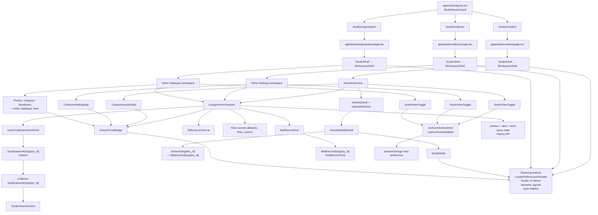

# AURORA · Archive Component Map

**Release:** AURORA Release 1 · Phase 1  
**Audit type:** Production implementation map  
**Snapshot:** 18 July 2026  
**Scope:** Current working tree, including the uncommitted Living Archive foundation  
**Constraint:** Documentation only; no production code, route, API, schema, permission, or persistence changes

---

## Purpose

This document maps the current implementation behind:

- Creative Works,
- Collector Holdings,
- Organisation Catalogue,
- Archive and legacy Gallery presentation,
- Ledger presentation,
- artwork cards and detail surfaces,
- selection, filtering, sorting, search, and pagination,
- image loading,
- mobile behavior,
- keyboard and assistive-technology behavior.

It records what exists. It does not prescribe a redesign.

---

## Audit boundary

The component map follows the runtime path from each canonical Studio route through shared workspace chrome, catalogue presentation, work activation, detail destination, and shared primitives.

Included:

- components that render or control the three target collections,
- components that own their data, section, view, selection, and detail state,
- detail and stewardship components directly reached from those collections,
- shared archive, trust, search, modal, navigation, and image behavior,
- legacy Gallery components still active or retained beside Archive.

Referenced but not exhaustively decomposed:

- registration forms,
- ownership and value filing internals,
- public Registry record internals,
- certificate document generation,
- unrelated Studio sections.

---

# Dependency diagram



---

## Role-specific runtime trees

### Creative Works

```text
/studio/creative
└── app/studio/layout.tsx
    └── StudioRouteGuard
        └── app/studio/creative/page.tsx
            └── StudioShell
                └── WorkspaceShell
                    ├── StudioMobileSectionSwitcher
                    └── ArtworksSection
                        ├── StudioSearchRow
                        ├── artwork filter <select>
                        ├── StudioViewToggle
                        │   └── ArchiveViewSwitcher
                        ├── Archive
                        │   └── LivingArchiveViewport
                        │       ├── ArtworkTrustBadge
                        │       ├── Open work
                        │       ├── Attest authorship
                        │       └── Record value
                        ├── Ledger
                        │   └── CreativeArtworkSlab[]
                        └── empty registration state

Selection/detail
ArtworksSection.onArtworkClick
└── creative page: artworkDetail + selectedArtwork
    ├── concurrent value / ownership / provenance queries
    └── ArtworkDetailModal
        └── ModalShell
```

### Collector Holdings

```text
/studio/collector
└── app/studio/layout.tsx
    └── StudioRouteGuard
        └── app/studio/collector/page.tsx
            └── StudioShell
                └── WorkspaceShell
                    ├── portfolio lifecycle filter
                    ├── activity / value sort
                    ├── StudioViewToggle
                    │   └── ArchiveViewSwitcher
                    ├── Archive
                    │   └── LivingArchiveViewport
                    │       ├── ArtworkTrustBadge
                    │       └── collector artwork href
                    └── Ledger
                        └── CollectorHoldingSlab[]

Detail
studioCollectorArtworkHref
└── /studio/artwork/[registry_id]
    └── permanent redirect
        └── /collector-studio/artwork/[registry_id]
            └── StudioArtworkClient
```

### Organisation Catalogue

```text
/studio/organisation
└── app/studio/layout.tsx
    └── StudioRouteGuard
        └── app/studio/organisation/page.tsx
            └── StudioShell
                └── WorkspaceShell
                    ├── StudioViewToggle
                    │   └── ArchiveViewSwitcher
                    ├── Archive
                    │   └── LivingArchiveViewport
                    │       ├── ArtworkTrustBadge
                    │       ├── Verify record
                    │       ├── Issue certificate
                    │       ├── Invite artist to authenticate
                    │       └── field record href
                    └── Ledger
                        ├── PriorityQueueSection
                        ├── RecordIntegritySection
                        ├── RecordReadinessSection
                        └── inline registered-work rows

Detail
fieldRecordHref
└── /field/record/[registry_id]
    └── FieldRecordView
```

---

# Shared framework components

## `app/studio/layout.tsx` and `StudioRouteGuard`

**Paths**

- `app/studio/layout.tsx`
- `components/Studio/StudioRouteGuard.tsx`
- `lib/studio-route-access.ts`

**Purpose**

Central authentication, onboarding, actor-role, and role-path enforcement for canonical Studio routes.

**Props / contract**

- Layout receives route children.
- Guard supplies authenticated user context through `useStudioGuardUser`.

**Dependencies and shared components**

- Supabase session and actor profile.
- onboarding state,
- role access rules,
- deferred router utilities.

**State ownership**

- Guard owns route-readiness and authenticated actor context.
- Role pages own all archive data and presentation state.

**Query ownership**

- Session and actor-role queries.
- No artwork queries.

**Performance concerns**

- Every target route waits for guard resolution.
- Some descendant detail routes repeat session/role checks instead of consuming guard context.
- An unresolved guard redirects to sign-in after its eight-second timeout.

**Accessibility concerns**

- Loading and redirect states must keep meaningful status output.

**Potential reuse**

- Canonical guard for all future Studio archive routes.

---

## `StudioShell`

**Path:** `components/Studio/StudioShell.tsx`

**Purpose**

Role-aware adapter over `WorkspaceShell`. Builds navigation, default activity, footer, sign-out behavior, and telemetry for artist, collector, and organisation workspaces.

**Props**

- Required: `role`, `userId`, `children`, `activeId`.
- Navigation: `onSelect`, optional `navItems`, role-specific navigation flags, `navigateOnSectionSelect`.
- Presentation: atmosphere, light chrome, transition state.
- Optional activity/footer overrides.

**Dependencies and shared components**

- `WorkspaceShell`,
- role navigation builders in `lib/studio-nav`,
- `WorkspaceSidebarActivityFeed`,
- locale provider,
- telemetry,
- sign-out utilities.

**State ownership**

- Does not own active section.
- Derives navigation and activity presentation.
- Route page supplies `activeId` and section mutation.

**Query ownership**

- Default sidebar activity component can issue activity queries.
- No catalogue query.

**Performance concerns**

- Sidebar activity can load beside catalogue work.
- Navigation and default activity are recomputed through memoized role adapters.

**Accessibility concerns**

- Delegates desktop and mobile navigation semantics.
- Section changes are tracked but heading focus remains page-owned.

**Potential reuse**

- High. It is the stable role/workspace boundary for all three archive surfaces.

---

## `WorkspaceShell`

**Path:** `components/Studio/WorkspaceShell.tsx`

**Purpose**

Shared desktop sidebar, mobile section switcher, main content frame, footer, activity region, and sign-out.

**Props**

- `navItems`, `activeId`, `onSelect`,
- `sidebarFooter`, optional activity and heading,
- `onSignOut`,
- atmosphere, tone, transition state,
- `children`.

**Dependencies and shared components**

- `StudioMobileSectionSwitcher`,
- route pathname,
- Registry catalogue tooltip,
- Field record explorer href,
- workspace style tokens.

**State ownership**

- Sign-out busy state is local to its button.
- Section state remains in role pages.

**Query ownership**

- None directly.

**Performance concerns**

- `children` are wrapped in a keyed container, so changing section remounts the active content subtree.
- Shell transition classes apply to complete section content.

**Accessibility concerns**

- Route links use `aria-current`.
- In-page desktop section buttons do not expose current state.
- Section remount does not move focus to the new heading.
- Active navigation currently uses a cobalt-tinted generic selection surface, although cobalt is canonically a registration signal.

**Potential reuse**

- High. Keep as workspace chrome, separate from archive controller state.

---

## `StudioMobileSectionSwitcher`

**Path:** `components/Studio/StudioMobileSectionSwitcher.tsx`

**Purpose**

Mobile bottom-sheet navigation between role-specific Studio sections.

**Props**

- section array (`id`, label, optional href and attention dot),
- active section ID,
- selection callback,
- chrome tone.

**Dependencies and shared components**

- portal rendering,
- pathname,
- locale provider,
- Studio v2 surfaces.

**State ownership**

- Local open/closed and mounted state.
- Parent owns active section.

**Query ownership**

- None.

**Performance concerns**

- Portal mounts only when open.
- Locks document scrolling while open.

**Accessibility concerns**

- Provides dialog role, label, Escape handling, close control, and 44px trigger.
- Does not fully contain focus or restore focus to the trigger.

**Potential reuse**

- Useful mobile shell pattern, not an archive navigation controller.

---

## `StudioViewToggle`

**Path:** `components/Studio/StudioViewToggle.tsx`

**Purpose**

Typed Ledger ↔ Archive presentation control and compatibility layer for legacy Gallery preferences.

**Props**

- current `mode`,
- `onChange`,
- group label,
- localized Ledger and Archive labels.

**Dependencies and shared components**

- `ArchiveViewSwitcher`,
- `normalizeArchivePresentationMode`,
- browser History API.

**State ownership**

- Controlled component.
- Wrapper updates `?view=`.
- Switching to Ledger removes `work`.

**Query ownership**

- No data query.

**Performance concerns**

- Negligible.

**Accessibility concerns**

- Delegates complete radio-group behavior to `ArchiveViewSwitcher`.

**Potential reuse**

- High across any paired operational/editorial collection presentation.

---

## `ArchiveViewSwitcher` and `useArchiveViewMode`

**Path:** `components/Studio/ArchiveViewSwitcher.tsx`

**Purpose**

Generic accessible presentation radio group plus session persistence.

**Props**

- Switcher: label, current mode, change callback, option array.
- Hook: storage key, fallback, valid IDs, optional migration function.

**Dependencies and shared components**

- React state/effects/refs,
- `sessionStorage`,
- URL `view` query,
- `popstate`.

**State ownership**

- Hook owns resolved mode and readiness.
- URL value takes precedence over storage.
- Legacy `gallery` normalizes to `archive`.

**Query ownership**

- Browser state only; no network.

**Performance concerns**

- Mode is hydration-gated to prevent rendering a persisted wrong view.
- Generic callers should provide stable `validIds` and migration references.

**Accessibility concerns**

- Correct `radiogroup` / `radio` semantics.
- Roving `tabIndex`.
- Arrow, Home, and End keys update selection and focus.

**Potential reuse**

- High. It is the canonical view-persistence primitive.

---

## `LivingArchiveViewport`

**Path:** `components/Studio/LivingArchiveViewport.tsx`

**Purpose**

Shared artwork-dominant horizontal viewport with one active work, partially visible adjacent works, bounded rendering, touch/trackpad/wheel navigation, keyboard movement, query state, and progressive metadata/actions.

**Props**

- `items`,
- `ariaLabel`,
- `emptyLabel`,
- role-specific `sectionQueryValue`,
- optional `onActiveChange`.

**Item contract**

- stable `id`,
- optional canonical `registryId`,
- title and optional creator,
- Registry state node,
- medium and year,
- image URL,
- either `href` or `onOpen`,
- open label,
- role-owned action node.

**Dependencies and shared components**

- Next `Link` and router,
- locale provider,
- `archiveImageIntent`,
- `resolveArchiveActiveIndex`,
- Living Archive performance budgets,
- Studio v2 styles.

**State ownership**

- active index,
- measured item extent,
- failed image keys,
- live-region announcement,
- item/scroller refs,
- virtual-window and history bookkeeping.
- Runtime has no separate selected/open state; page-owned detail selection remains independent of the active index.

**Query ownership**

- No network query.
- Writes `section`, `view=archive`, and focused `work` to the current URL.
- Reads initial `work`.
- Responds to browser `popstate`.

**Performance concerns**

- Mounts all items up to 17; larger sets use a moving 17-item window.
- Assumes uniform item width for spacer geometry.
- Route pages still transfer complete collections before windowing.
- Parent pages recreate item objects and action nodes during render.
- Raw images lack intrinsic dimensions and responsive source sets.
- Manual prefetch is not Save-Data or connection aware.
- Horizontal runtime windowing is separate from the tested vertical-grid window helper.
- Breakpoint-derived prefetch radius is read from `matchMedia` without subscribing to later viewport changes.

**Accessibility concerns**

- Named list, roving focus, positional semantics, visible focus, live announcements.
- Arrow, Home, End, Page Up, and Page Down supported.
- Active actions meet 44px targets.
- Focusable `listitem` has activation behavior without native button/link semantics.
- Active image alternative repeats adjacent visible title.
- Unknown `work` values are not currently announced as unavailable.
- Mandatory snapping and wheel interception can reduce control for some magnification or motor users.

**Potential reuse**

- High. Already shared by all three target catalogues.
- Future reuse should keep role-specific actions and detail destinations outside the component.

---

## `lib/living-archive.ts`

**Path:** `lib/living-archive.ts`

**Purpose**

Pure headless contracts for presentation-mode migration, ordered identity, active/selected state, movement commands, virtual windows, image intent, deep links, and performance budgets.

**Inputs / outputs**

- Stable artwork identity arrays.
- Reducer actions.
- Keyboard commands.
- Viewport dimensions and scroll offsets.
- image position/focus facts.
- URL search parameters.

**Dependencies**

- None outside TypeScript and web-standard `URLSearchParams`.

**State ownership**

- Owns no runtime state; exports deterministic constructors and reducers.

**Query ownership**

- None.

**Performance concerns**

- ID lookup uses linear array operations, acceptable at current documented 10,000-item target but not indexed.
- Uniform-grid virtualization is not the horizontal viewport implementation.

**Accessibility concerns**

- Command model is presentation neutral.
- Runtime components determine actual semantics and focus behavior.

**Potential reuse**

- High as the testable archive domain layer.
- Current runtime uses only part of the available reducer/query model.

---

## `ArtworkTrustBadge`

**Path:** `components/Registry/ArtworkTrustBadge.tsx`

**Purpose**

Canonical textual trust state for filed, self-attested, and verified work.

**Props**

- verification status,
- class override,
- tooltip visibility,
- optional verified pulse.

**Dependencies and shared components**

- `lib/artwork-trust-tier.ts`,
- locale provider,
- `InfoTooltip`.

**State ownership / query ownership**

- Stateless; no query.

**Performance concerns**

- Negligible.

**Accessibility concerns**

- State is textual rather than color-only.
- Tooltip availability varies by surface.
- Pulse must remain reduced-motion safe.

**Potential reuse**

- High. Used across Archive, Ledger, and detail surfaces.

---

## `StudioSearchRow`

**Path:** `components/Dashboard/studioListPrimitives.tsx`

**Purpose**

Shared responsive search field with optional filter/action column.

**Props**

- query value and change callback,
- placeholder,
- optional aside content,
- light/dark tone.

**Dependencies**

- Studio v2 style primitives.

**State ownership**

- Fully controlled by parent page.

**Query ownership**

- None; parent performs client filtering.

**Performance concerns**

- Emits every keystroke; no debounce.

**Accessibility concerns**

- Search icon is decorative.
- Input has no persistent programmatic label; placeholder is its accessible name in current use.

**Potential reuse**

- High for Studio lists, but the accessible-name contract should be explicit before broader archive reuse.

---

## `ArchiveGalleryGrid` and `GalleryTile`

**Path:** `components/Studio/ArchiveGalleryGrid.tsx`

**Purpose**

Legacy responsive thumbnail-grid presentation supporting a native link or button tile.

**Props**

- item array: ID, title, subtitle, metadata, image, optional href/click/badge,
- optional empty label.

**Dependencies**

- locale provider,
- Studio v2 scope,
- Next `Link`.

**State / query ownership**

- Stateless; no query.

**Current usage**

- Active in Creative Certificates.
- Wrapped by `CollectorHoldingsGallery`; that adapter is retained but no current Holdings caller uses it.
- No longer renders the three target Archive collections.

**Performance concerns**

- Renders every item.
- Lazy raw images, no dimensions/srcset/sizes.
- Every item receives stagger/reveal styling.

**Accessibility concerns**

- Native Link/button semantics are stronger than focusable list-item simulation.
- Images are empty-alt because adjacent text names the work.
- No explicit focus-visible treatment.

**Potential reuse**

- Useful compact index or fallback renderer.
- Not a substitute for the active-work Archive viewport.

---

## `ModalShell`

**Path:** `components/ui/ModalShell.tsx`

**Purpose**

Shared portal dialog shell for Creative detail and consequential Studio forms.

**Props**

- `isOpen`, `onClose`, children,
- panel/inner/overlay/close class overrides,
- tone and v2/legacy variant,
- optional accessible label.

**Dependencies**

- React portal,
- Studio/workspace modal styles.

**State ownership**

- Client-mounted state is derived through external-store hydration.
- Captures previous focus and document overflow.

**Query ownership**

- None.

**Performance concerns**

- Portal exists only while open.
- Nested scroll containers can increase paint and interaction complexity.

**Accessibility concerns**

- Initial focus, Escape, Tab containment, focus restoration, dialog role, and body scroll lock are implemented.
- Background content is not made inert.
- Most callers rely on a generic default accessible name.
- Nested modals can compete over body overflow and focus restoration.

**Potential reuse**

- High for modal detail/filing surfaces, with stronger title/description and nesting contracts.

---

# Creative Works components

## `app/studio/creative/page.tsx`

**Purpose**

Creative Studio route and current orchestration owner for Works, Certificates, Ownership, governance, insights, registration, value filing, and related modals.

**Props**

- Next page component; no external component props.
- Consumes guarded user context.

**Dependencies and shared components**

- `StudioShell`,
- `ArtworksSection`,
- `CertificatesSection`,
- `OwnershipSection`,
- registration/value/detail/certificate/representation modals,
- Supabase browser client,
- ownership/value/certificate/representation helpers,
- Studio navigation and locale providers.

**State ownership**

- Complete artwork array.
- Active section and transition state.
- Shared search query.
- Works, Certificates, and Ownership filters.
- selected artwork and detail artwork.
- value, ownership, and provenance histories.
- canonical holders, transfer sets, sale state, certificate derivation, activity, metrics.
- all filing/modal form state.
- `artworkDetail` and `selectedArtwork` duplicate one mutable artwork row for preview and history/Ownership concerns.

**Query ownership**

- Full `artwork_read_model` catalogue query ordered by creation date descending.
- Canonical ownership, transfers, acquisitions, completed sales, value events, provenance, representation, activity, claims, metrics.
- Selected-work value/ownership/provenance queries.

**Performance concerns**

- Large client component and broad initial query fan-out.
- Artwork retrieval uses `select("*")` with no projection, limit, range, cursor, or server-side search.
- Complete catalogue is transferred; no data pagination.
- Several inactive-section datasets load at initial route entry.
- Search filters complete arrays on each keystroke.
- Recent work parallelizes independent initial requests, removes duplicate certificate/transferred requests, and guards stale catalogue/history writes.
- Obsolete selected-work requests are ignored through generation checks but are not aborted.
- A catalogue failure can clear artworks while previously derived enrichment maps remain populated.

**Accessibility concerns**

- Route-owned modal selection is not itself URL-addressable.
- Cleared chronology can temporarily appear as a genuine empty history while a new selection loads.
- Toast behavior and some strings remain legacy/hardcoded.
- Section changes do not move focus.

**Potential reuse**

- Low as a component.
- High-value extraction candidates are typed catalogue adapters, query snapshots, and a role-neutral archive controller.

---

## `ArtworksSection`

**Path:** `components/Dashboard/ArtworksSection.tsx`

**Purpose**

Creative Works composition: heading, search/filter controls, persisted view switch, Archive mapping, Ledger mapping, no-match and registration-empty states.

**Props**

- controlled search and Works filter,
- register callback,
- filtered artwork array and total count,
- work-open and value-filing callbacks,
- optional creator/institution/viewer context,
- canonical holder and sale maps,
- optional self-attestation callback.
- Artwork rows are typed as `any[]`; required read-model fields remain implicit.
- `canonicalHolders` and `representingInstitutionName` are accepted but not consumed by the section.

**Dependencies and shared components**

- `LivingArchiveViewport`,
- `CreativeArtworkSlab`,
- `StudioViewToggle`,
- `StudioSearchRow`,
- `ArtworkTrustBadge`,
- value eligibility and trust-tier helpers,
- locale and Studio v2 styles.

**State ownership**

- Owns persisted Archive/Ledger mode and readiness through `useStudioViewMode`.
- Parent owns collection/filter/selection/business state.

**Query ownership**

- None.

**Performance concerns**

- Maps filtered rows into new Archive item objects and React action nodes each render.
- Ledger renders the complete filtered collection.
- Archive bounds mounted items but not parent data volume.

**Accessibility concerns**

- Filter has an explicit screen-reader label.
- Search does not.
- Archive actions are separate from card activation.
- Ledger retains nested interactive semantics.

**Potential reuse**

- Creative-specific orchestrator.
- Archive item adaptation can be extracted without changing its public behavior.

---

## `CreativeArtworkSlab`

**Path:** `components/Studio/CreativeArtworkSlab.tsx`

**Purpose**

Dense Ledger row for authored work: trust, certificate class, pricing, eligibility, attestation, valuation, and detail activation.

**Props**

- title, medium, year, Registry ID, image,
- verification and pricing state,
- sale/artist-primary/value eligibility,
- disabled-reason message key,
- open, attestation, and value callbacks.

**Dependencies**

- trust badge and trust-tier helpers,
- semantic event stamps,
- locale provider,
- Studio v2 styles.

**State / query ownership**

- Stateless; no query.

**Performance concerns**

- Every filtered work mounts.
- Raw thumbnail has no loading or responsive sizing.
- Reveal/hover styling applies to complete Ledger.
- Per-row stagger delay continues to grow with the item index.

**Accessibility concerns**

- Outer `article role="button"` contains real action buttons.
- Enter/Space activation is custom.
- Nested interaction is ambiguous for keyboard and screen-reader users.

**Potential reuse**

- Useful Creative Ledger renderer after interaction semantics are separated.

---

## `ArtworkDetailModal`

**Path:** `components/Dashboard/ArtworkDetailModal.tsx`

**Purpose**

Creative-only artwork preview with dominant image, trust, identity, metadata, valuation phase, and immutable value chronology.

**Props**

- selected artwork,
- close callback,
- value history,
- viewer ID,
- completed-sale and value-filing eligibility.

**Dependencies and shared components**

- `ModalShell`,
- `ArtworkTrustBadge`,
- value lifecycle/formatting helpers,
- immutable value badge,
- semantic valuation dot,
- locale provider.

**State ownership**

- Stateless.
- Creative page owns selection and history.

**Query ownership**

- None.

**Performance concerns**

- Raw full-size image without responsive source policy.
- Internal chronology can add a nested scroll region.

**Accessibility concerns**

- Dialog is named with the work title.
- Shared shell traps/restores focus.
- Image uses the title as alternative text.
- Hardcoded English remains in some tooltip/correction copy.

**Potential reuse**

- Reusable as an interim Creative detail renderer.
- Not currently a cross-role detail component.

---

## `RegisterModal` and `AddValueEventModal`

**Paths**

- `components/Dashboard/RegisterModal.tsx`
- `components/Dashboard/AddValueEventModal.tsx`

**Purpose**

Existing stewardship actions reached from Works:

- create a canonical artwork filing,
- append a permitted value event.

**Props**

- Controlled form values, loading state, close/change/submit callbacks.
- Role/context variants.

**Dependencies**

- `ModalShell`,
- locale and filing primitives,
- existing RPC/mutation callbacks owned by the Creative page.

**State ownership**

- Forms are primarily page-controlled.

**Query ownership**

- Page performs existing RPC/storage operations; modal components do not own schema logic.

**Performance concerns**

- Registration image upload is direct and does not resize/compress client-side.

**Accessibility concerns**

- Inherits shared modal focus behavior.
- Form labels and error associations vary by field.
- `AddValueEventModal` does not supply a specific dialog name and receives the shared generic fallback.

**Potential reuse**

- Existing filing surfaces must remain independent of Archive navigation state.

---

# Collector Holdings components

## `app/studio/collector/page.tsx`

**Purpose**

Collector Studio route and owner of current, pending, and transferred holdings; lifecycle filter; sorting; Archive/Ledger presentation; attention signals; metrics.

**Props**

- Next page component; consumes guarded user.

**Dependencies and shared components**

- `StudioShell`,
- `LivingArchiveViewport`,
- `CollectorHoldingSlab`,
- `StudioViewToggle`,
- pending acquisition and ownership helpers,
- certificate status loader,
- Supabase browser client,
- telemetry and locale providers.

**State ownership**

- current holdings,
- pending acquisitions,
- transferred holdings,
- artist-name and certificate maps,
- ownership and attention state,
- active section,
- lifecycle filter,
- activity/value sort,
- Archive/Ledger mode,
- insights and metrics.

**Query ownership**

- pending-acquisition API,
- owned and transferred artwork resolution,
- artwork/read-model data,
- artist names,
- certificate public status,
- ownership/value signals and metrics.

**Filtering / sorting**

- Lifecycle filter: current, pending, sold/transferred.
- Sort: recent activity or value.
- No title/creator/Registry search.

**Pagination**

- None. Complete derived collection is held client-side.

**Performance concerns**

- Archive bounds DOM/media, not data acquisition.
- Several supporting maps are loaded before page readiness.
- Sort and filter are client-side.

**Accessibility concerns**

- Native filter and sort controls.
- Sort buttons communicate active state visually with underline but not `aria-pressed`.
- Pending-acquisition copy includes hardcoded English.

**Potential reuse**

- Low as a monolithic page.
- Holdings adapter and query snapshot are reusable extraction boundaries.

---

## `CollectorHoldingSlab`

**Path:** `components/Studio/CollectorHoldingSlab.tsx`

**Purpose**

Link-backed Collector Ledger row with artwork identity, creator, trust, certificate, ownership continuity, transfer count, and attention state.

**Props**

- detail href,
- title, artist, Registry ID, image,
- verification/certificate facts,
- ownership label/class,
- transfer count,
- pending-transfer and verification flags.

**Dependencies**

- Next `Link`,
- `ArtworkTrustBadge`,
- trust/certificate helpers,
- locale provider,
- Studio v2 styles.

**State / query ownership**

- Stateless; no query.

**Performance concerns**

- Complete Ledger mounts.
- Raw thumbnail is hidden on phone but may still download.
- No lazy/responsive image policy.

**Accessibility concerns**

- Entire row is one native link; stronger semantics than Creative Ledger.
- Empty-alt thumbnail is accompanied by visible title.
- Caller may supply `href="#"` for an unavailable destination.

**Potential reuse**

- Good Collector Ledger primitive.

---

## `CollectorHoldingsGallery`

**Path:** `components/Studio/CollectorHoldingsGallery.tsx`

**Purpose**

Legacy adapter from Collector holding rows into `ArchiveGalleryGrid`.

**Props**

- Collector gallery item array: ID, href, title, artist, Registry ID, image, trust, pending state.

**Dependencies**

- `ArchiveGalleryGrid`,
- `ArtworkTrustBadge`,
- locale provider.

**State / query ownership**

- Stateless; no query.

**Current usage**

- Retained in the codebase.
- Current Collector Works uses `LivingArchiveViewport`; no active caller was found.

**Performance / accessibility concerns**

- Inherits full-grid rendering and raw-image limitations.
- Native link semantics are sound.

**Potential reuse**

- Rollback/compact-index adapter only; otherwise parallel implementation debt.

---

## Collector detail route and `StudioArtworkClient`

**Paths**

- `app/collector-studio/artwork/[registry_id]/page.tsx`
- `components/Studio/StudioArtworkClient.tsx`
- `next.config.ts` redirect from `/studio/artwork/[registry_id]`

**Purpose**

Authenticated Collector holding detail with artwork metadata, ownership/value history, certificate state, verification controls, and sale/transfer filing.

**Props**

- Route supplies `registryId`.
- Client component accepts that Registry ID only.

**Dependencies and shared components**

- Supabase browser client,
- auth/role checks,
- `ArtworkTrustBadge`,
- ownership canonical/status helpers,
- `OwnershipVerificationControls`,
- `StudioSaleTransferModal`,
- semantic toast and consequence feedback,
- Field and Studio href helpers.

**State ownership**

- loading/not-found/user/profile,
- artwork and creator,
- ownership/value/certificate rows,
- owner status,
- sale modal and toast.

**Query ownership**

- artwork by Registry ID,
- creator,
- ownership events,
- value events,
- certificate public-status RPC,
- complete collector-owned ID resolution.

**Performance concerns**

- Detail refresh runs artwork, creator, ownership, value, and certificate requests largely sequentially.
- Route repeats auth/role work outside canonical `StudioShell`.
- Compatibility redirect adds a route hop.

**Accessibility concerns**

- Uses route-level headings and native controls.
- Some labels/status copy are hardcoded English.
- Raw image delivery remains.

**Potential reuse**

- Collector-specific detail controller.
- Canonical ownership/value/certificate loading could be shared with future archive detail adapters.

---

# Organisation Catalogue components

## `app/studio/organisation/page.tsx`

**Purpose**

Organisation Studio route and owner of roster, Catalogue, invitations, representation, verification, record readiness/integrity, opportunities, metrics, and registration.

**Props**

- Next page component; consumes guarded user.

**Dependencies and shared components**

- `StudioShell`,
- `LivingArchiveViewport`,
- `StudioViewToggle`,
- `PriorityQueueSection`,
- `RecordIntegritySection`,
- `RecordReadinessSection`,
- verification/authentication/register modals,
- Field href helpers,
- Supabase browser client,
- gallery/representation/priority helpers.

**State ownership**

- organisation identity/membership,
- complete artist roster and artwork catalogue,
- invitations and authentication invitations,
- verification and certificate state,
- representation and amendments,
- readiness/integrity maps,
- active section,
- Archive/Ledger mode,
- modal targets and busy state,
- metrics and insights.

**Query ownership**

- membership and organisation,
- artists and artworks,
- invitations and confirmations,
- representation,
- ownership/value/verification/certificate/listing data,
- metrics and insights.

**Filtering / sorting / search**

- No Catalogue search.
- No Catalogue artist/trust/year filter.
- No user-facing Catalogue sort.
- Query order and operational priority helpers determine presentation.

**Pagination**

- None for the registered Catalogue.
- Some operational queues cap their visible items.

**Performance concerns**

- Broadest route query fan-out.
- Complete roster/catalogue and operational context load into one client page.
- Archive windowing does not reduce network/query cost.

**Accessibility concerns**

- Archive actions are native buttons/links.
- Inline Ledger rows are primarily links with separate action buttons.
- Many compact 10–11px status labels.
- Section changes do not move focus.

**Potential reuse**

- Low as a page.
- Organisation archive adapter and operational query snapshot are valuable extraction boundaries.

---

## Organisation Archive item adapter

**Location:** Inline mapping inside `app/studio/organisation/page.tsx`

**Purpose**

Maps organisation artwork rows to the shared `LivingArchiveViewport` contract.

**Inputs**

- artwork row,
- linked/catalogued artist name,
- trust status,
- certificate and artist-authentication maps,
- verification/certificate/authentication callbacks.

**Dependencies**

- `ArtworkTrustBadge`,
- `fieldRecordHref`,
- verification and certificate action functions,
- artist authentication invitation state.

**State / query ownership**

- Stateless mapping.
- All facts and callbacks come from the route page.

**Performance concerns**

- Recreates item/action React nodes on page render.
- Repeated inline adaptation across roles prevents common memoization/testing.

**Accessibility concerns**

- Actions are visible only for the active work.
- Verification, certificate issuance, and authentication remain explicit controls.

**Potential reuse**

- High if extracted as a typed Organisation adapter while retaining page-owned permissions and mutations.

---

## Organisation Ledger composition

**Locations**

- Inline Catalogue branch in `app/studio/organisation/page.tsx`
- `components/gallery/PriorityQueueSection.tsx`
- `components/gallery/RecordIntegritySection.tsx`
- `components/gallery/RecordReadinessSection.tsx`

**Purpose**

Operational Catalogue view:

- prioritize incomplete or consequential records,
- expose integrity/verification/certificate actions,
- summarize readiness,
- list registered works.

**Props**

- Artwork arrays and derived ownership/value/verification/certificate maps.
- Organisation verification state.
- roster, verify, and issue-certificate callbacks.

**Dependencies**

- gallery priority/integrity/readiness helpers,
- semantic signal helpers,
- Studio content slabs,
- Field record links.

**State ownership**

- Presentational components are controlled.
- Route owns all source and busy state.

**Query ownership**

- None inside sections; route owns queries.

**Performance concerns**

- Multiple derived scans over complete artwork arrays.
- Registered-work list is unpaginated, though internally scroll-bounded.

**Accessibility concerns**

- Consequential actions are explicit buttons.
- Dense status copy and compact targets require continued review.
- Inline image thumbnails use raw `` and empty alternatives.

**Potential reuse**

- Operational sections are reusable within Organisation workflows.
- They are not generic Archive card primitives.

---

## Organisation detail and filing modals

**Paths**

- `components/gallery/GalleryVerifyAttestationModal.tsx`
- `components/gallery/ArtworkAuthenticationInviteModal.tsx`
- `components/Dashboard/RegisterModal.tsx`
- public detail: `app/field/record/[registry_id]/page.tsx` and `components/Field/FieldRecordView.tsx`

**Purpose**

- Verify or review artwork attestation.
- Invite an artist to authenticate a catalogued work.
- Register a work.
- Open the canonical public Field record.

**Props**

- Selected work/artist/organisation context.
- Controlled form state and callbacks.
- Busy/error/outcome state.

**Dependencies**

- Existing RPC/API/permission boundaries,
- `ModalShell`,
- Field record loaders and Registry presentation primitives.

**State ownership**

- Organisation page owns selected targets and mutation state.
- Public Field detail is route/server-loader owned.

**Query ownership**

- Organisation page/API handlers own verification/invitation writes.
- Field route owns canonical public projection.

**Performance concerns**

- Opening public detail leaves Studio context.
- Modal data is mostly already available from route state.

**Accessibility concerns**

- Inherits shared modal behavior.
- Public route provides document-level heading semantics.

**Potential reuse**

- Keep role-specific filing controls outside generic Archive state.

---

# Selection and detail ownership

## Selection models

### Archive active work

Owned by `LivingArchiveViewport`.

- Stable identity is preserved through reorder/filter where possible.
- URL `work` represents the active Registry ID.
- Pointer selection can create a history entry.
- scroll and keyboard movement replace current query state.
- only one work exposes actions.

### Creative selected/detail work

Owned by `app/studio/creative/page.tsx`.

- `artworkDetail` controls `ArtworkDetailModal`.
- `selectedArtwork` also supports ownership/history operations.
- Opening from Archive or Ledger sets both.
- Modal open state is memory-only and distinct from Archive active-work URL state.
- Value, ownership, and provenance are fetched although the preview currently displays only value chronology.
- Back traverses Archive cursor entries rather than reliably expressing “close detail.”

### Collector selected work

Route-owned.

- Archive and Ledger navigate to a Registry-ID route.
- Detail component reloads the selected work and associated chronology.

### Organisation selected work

Split by intent.

- Open record navigates to the public Field route.
- Verification and artist-authentication targets remain local modal state.

---

# Image loading map

## `LivingArchiveViewport`

- Active image: eager, high fetch priority, async decode.
- Adjacent images: mounted and manually prefetched.
- Distant virtual items: image omitted.
- Error/missing image: neutral archival fallback.
- Failure key includes work ID and image URL.
- No intrinsic dimensions, `srcset`, `sizes`, or image transformation.

## Ledger cards

- `CreativeArtworkSlab`: raw thumbnail, no explicit lazy policy, hidden below `sm`.
- `CollectorHoldingSlab`: raw thumbnail, no explicit lazy policy, hidden below `sm`.
- Organisation inline row: raw 40px thumbnail.

## Detail

- `ArtworkDetailModal`: raw large image.
- `StudioArtworkClient`: raw detail image.
- Field/Registry detail has separate hero image implementation.

## Legacy Gallery

- `ArchiveGalleryGrid`: raw square image with `loading="lazy"`.

## Shared concerns

- CSS aspect frames reduce visible shift but do not provide intrinsic dimensions.
- Hidden responsive thumbnails may still be requested.
- No consistent responsive source sizing.
- Prefetch is not connection-aware.
- Browser decoded-image memory cannot be actively enforced.

---

# Filtering, sorting, search, and pagination

## Creative

**Search**

- Controlled `searchQuery`.
- Case-insensitive title substring only.
- Shared page query is also used by Certificates and Ownership.

**Filter**

- all,
- filed,
- self-attested,
- verified,
- priced,
- unpriced.

**Sort**

- No user-facing sort.
- Source query orders newest-created first.

**Pagination**

- None.
- Archive bounds DOM to a moving window.
- Ledger renders all filtered rows.

## Collector

**Search**

- None in Holdings.

**Filter**

- current,
- pending,
- sold/transferred.

**Sort**

- activity/recency,
- value.

**Pagination**

- None.

## Organisation

**Search**

- None in Catalogue.

**Filter**

- No direct user Catalogue filter.
- Operational sections derive priority/readiness/integrity subsets.

**Sort**

- No user-facing Catalogue sort.

**Pagination**

- None.
- Some operational sections cap visible items.

## Shared conclusion

Archive virtualization is a rendering safeguard, not data pagination. Every role page currently owns and loads its complete collection.

---

# Mobile layout map

## Workspace level

- `WorkspaceShell` removes the desktop sidebar below `lg`.
- `StudioMobileSectionSwitcher` provides section navigation.
- Main content uses progressively wider padding.
- Safe-area insets are used by shell and modal surfaces.

## Archive

- Horizontal native scrolling and CSS snap.
- Work width leaves adjacent content visible.
- Artwork occupies the upper/dominant region.
- Metadata/actions form a bottom paper surface.
- Actions meet 44px minimum targets.
- Browser pinch zoom is not disabled.

## Ledger

- Slabs stack vertically.
- Creative and Collector thumbnails disappear below `sm`.
- Metadata/actions wrap or stack.

## Detail

- Creative uses a viewport-constrained modal with internal scrolling.
- Collector uses a dedicated responsive page.
- Organisation uses public Field detail or bottom/modal filing surfaces.

---

# Keyboard and screen-reader map

## Archive viewport

- One roving `tabIndex=0` work.
- Left/Up: previous.
- Right/Down: next.
- Home/End: boundaries.
- Page Up/Page Down: three-work jump.
- Enter/Space: open callback or route.
- Live announcement includes title and position.
- `aria-posinset` / `aria-setsize`.
- active actions become available after selection.

## View switch

- Radio-group semantics.
- Arrow, Home, End.
- Roving focus.

## Ledger

- Creative slab custom Enter/Space plus nested buttons.
- Collector slab native link.
- Organisation rows use native links/buttons.

## Detail

- `ModalShell` moves focus to Close, traps Tab, closes on Escape, and restores previous focus.
- Public/dedicated detail routes use normal document navigation.

## Remaining concerns

- Search input lacks explicit programmatic label.
- Creative Ledger nested interaction.
- Section changes do not focus headings.
- Mobile section sheet lacks complete focus containment/restoration.
- Modal background is not inert.
- Archive list-item activation is not represented by native button/link role.
- Some tiny metadata and hardcoded English remain.

---

# State and query ownership summary

## Shared framework owns

- Archive/Ledger mode readiness and session persistence.
- Archive active item, virtual window, image errors, history query state.
- Workspace chrome and mobile section-sheet open state.
- Modal focus lifecycle.

## Creative page owns

- catalogue and all supporting Registry facts,
- search/filter,
- section,
- detail selection and histories,
- filing forms/actions.

## Collector page owns

- holdings lifecycle collections,
- filter/sort,
- section,
- attention/certificate/ownership maps.

## Organisation page owns

- catalogue, roster, invitations, representation,
- readiness/integrity/verification/certificate facts,
- section, view, and filing targets.

## Detail components own

- Creative modal: no data state.
- Collector detail client: all detail data and mutation state.
- Organisation public Field route: canonical public detail loader.

---

# Performance audit summary

## Existing safeguards

- Hydration-gated view preference.
- Legacy Gallery → Archive migration.
- Bounded Archive DOM window.
- focused-neighbor image intent and prefetch.
- active identity preservation after reorder/filter.
- stale selected-history and overlapping Creative catalogue guards.
- parallelized Creative history and initial supporting queries.
- reduced duplicate Creative certificate/transferred queries.
- reduced-motion-safe interaction.

## Current bottlenecks

1. All role pages load complete collections.
2. Creative and Organisation are large client orchestration components.
3. Organisation has the broadest query fan-out.
4. Collector detail repeats auth and sequential detail queries.
5. Raw image delivery lacks responsive variants and intrinsic dimensions.
6. Ledger presentations remain unbounded.
7. Search has no debounce.
8. Archive item adapters are recreated inline.
9. No component-level performance or interaction test harness exists.

---

# Accessibility audit summary

## Existing strengths

- Textual trust states.
- Complete view-toggle keyboard model.
- Archive roving focus and positional announcements.
- visible focus ring.
- 44px active actions.
- reduced-motion handling.
- modal initial focus, Escape, trap, and restoration.
- native links/buttons in Collector and most Organisation actions.

## Current concerns

1. Creative Ledger has nested interactive semantics.
2. Archive activation is attached to a focusable list item rather than a native control.
3. Search lacks an explicit accessible label.
4. section changes do not move/announce focus.
5. mobile section dialog focus lifecycle is incomplete.
6. modal background is not isolated.
7. image alternative-text policy varies by surface.
8. compact mono metadata can challenge readability.
9. no automated component/axe coverage exists.

---

# Reuse map

## Strong shared primitives

- `StudioShell`
- `WorkspaceShell`
- `StudioViewToggle`
- `ArchiveViewSwitcher`
- `LivingArchiveViewport`
- `ArtworkTrustBadge`
- `ModalShell`
- `lib/living-archive.ts`
- locale and semantic-signal helpers

## Role-specific components worth retaining

- `ArtworksSection`
- `CreativeArtworkSlab`
- `CollectorHoldingSlab`
- `StudioArtworkClient`
- Organisation priority/integrity/readiness sections
- role-specific verification, certificate, transfer, and invitation controls

## Parallel or legacy paths

- `ArchiveGalleryGrid` remains active for Certificates.
- `CollectorHoldingsGallery` is retained without a current target-surface caller.
- Organisation Ledger uses bespoke rows rather than a shared slab.
- `WorkspaceRecordCard` belongs to Ownership rather than the target Archive path.
- Three route pages perform inline Archive item adaptation.

## Potential next reuse boundary

Without changing presentation, data, or permissions, the clearest future seam is:

```text
route-owned canonical data
→ role-specific typed Archive adapter
→ shared Archive controller
→ LivingArchiveViewport
→ role-owned detail and stewardship callbacks
```

This is an audit observation, not a Phase 1 implementation proposal.

---

# File index

## Routes and pages

- `app/studio/layout.tsx`
- `app/studio/creative/page.tsx`
- `app/studio/collector/page.tsx`
- `app/studio/organisation/page.tsx`
- `app/collector-studio/artwork/[registry_id]/page.tsx`
- `app/field/record/[registry_id]/page.tsx`

## Workspace and navigation

- `components/Studio/StudioRouteGuard.tsx`
- `components/Studio/StudioShell.tsx`
- `components/Studio/WorkspaceShell.tsx`
- `components/Studio/StudioMobileSectionSwitcher.tsx`
- `components/Studio/StudioViewToggle.tsx`
- `components/Studio/ArchiveViewSwitcher.tsx`
- `lib/studio-nav/`

## Archive and cards

- `components/Studio/LivingArchiveViewport.tsx`
- `lib/living-archive.ts`
- `lib/living-archive.test.ts`
- `components/Studio/ArchiveGalleryGrid.tsx`
- `components/Studio/CollectorHoldingsGallery.tsx`
- `components/Studio/CreativeArtworkSlab.tsx`
- `components/Studio/CollectorHoldingSlab.tsx`
- `components/Studio/WorkspaceRecordCard.tsx`
- `components/Registry/ArtworkTrustBadge.tsx`
- `lib/artwork-trust-tier.ts`

## Creative composition and detail

- `components/Dashboard/ArtworksSection.tsx`
- `components/Dashboard/ArtworkDetailModal.tsx`
- `components/Dashboard/RegisterModal.tsx`
- `components/Dashboard/AddValueEventModal.tsx`
- `components/Dashboard/studioListPrimitives.tsx`

## Collector detail

- `components/Studio/StudioArtworkClient.tsx`
- `components/Registry/OwnershipVerificationControls.tsx`
- `components/Studio/StudioSaleTransferModal.tsx`

## Organisation operations and detail

- `components/gallery/PriorityQueueSection.tsx`
- `components/gallery/RecordIntegritySection.tsx`
- `components/gallery/RecordReadinessSection.tsx`
- `components/gallery/GalleryVerifyAttestationModal.tsx`
- `components/gallery/ArtworkAuthenticationInviteModal.tsx`
- `components/Field/FieldRecordView.tsx`

## Shared primitives

- `components/ui/ModalShell.tsx`
- `components/providers/LocalePreferencesProvider.tsx`
- `lib/locale-messages.ts`
- `lib/field-nav/hrefs.ts`
- `styles/studio-v2.ts`
- `styles/rrowm-v2.ts`
- `lib/registry-semantic-signals.ts`

---

# Audit conclusion

The current implementation has a real shared Archive presentation layer, not three unrelated visual experiments. The strongest common boundaries are workspace chrome, mode persistence, the horizontal viewport, trust presentation, modal behavior, and the pure Living Archive core.

The principal architecture remains route-owned:

- each role page acquires and derives its full collection,
- each role maps source rows into Archive items,
- each role retains a distinct detail destination,
- retrieval controls and scale behavior differ,
- Archive bounds rendering but not query volume.

That separation is partly intentional. Registry actions, permissions, and detail meaning differ by role. The reusable foundation should therefore continue to standardize navigation, focus, image intent, and presentation contracts without making the Archive the owner of canonical Registry state.

---

# Final Archive validation

## Validation basis

Creative Works is the reference implementation because it currently has the widest local interaction set: an in-place detail modal, title search, trust/value filters, authored-work stewardship actions, and both shared Archive and role-specific Ledger renderers.

Collector and Organisation should not copy Creative where their Registry relationship differs. Convergence is valid only where the same behavior has the same meaning.

---

# Collector Holdings validation

## Current information hierarchy

1. Archive rail and Holdings heading.
2. Ownership-lifecycle filter and Archive/Ledger mode.
3. Activity/value order control.
4. Pending-acquisition filings requiring acknowledgement.
5. Current filtered collection.
6. Trust, ownership continuity, certificate, and attention metadata.
7. Dedicated holding detail and transfer/sale operations.

The dominant entity is a work the collector holds, is receiving, or formerly held. Authorship is descriptive; ownership lifecycle determines inclusion and action.

## Current navigation model

- `/studio/collector` is the canonical workspace route.
- Holdings is the in-page `works` section.
- Local section state is primed from `?section=works` and reacts to `popstate`.
- Normal section clicks do not consistently write section state back to the URL.
- Archive/Ledger mode is persisted in session storage and represented by `?view=`.
- Archive active work is represented by `?work=`.
- Current holding open path:

```text
studioCollectorArtworkHref()
→ /studio/artwork/[registry_id]
→ permanent compatibility redirect
→ /collector-studio/artwork/[registry_id]
→ StudioArtworkClient
```

- Pending holdings may navigate to acceptance or Registry ledger routes.

The dedicated detail route supports Collector workflow depth, but it leaves the canonical Studio shell and incurs a redirect.

## Current artwork/card presentation

**Archive**

- Shared `LivingArchiveViewport`.
- Artwork, title, creator, trust or pending state, and Registry ID.
- Current holdings use Collector detail hrefs.
- Pending holdings use receipt or ledger destinations.
- Medium and year are not currently passed into Collector Archive items.

**Ledger**

- `CollectorHoldingSlab`.
- One native linked row.
- Adds certificate state, ownership continuity, transfer count, pending-sale attention, and verification attention.

**Pending acquisition**

- A separate filing list appears before the collection.
- Shows image, title, Registry ID, transfer status, Confirm receipt, and optional Open deal.
- This is workflow state, not merely another trust badge.

## Metadata requirements

Universal:

- stable artwork ID,
- Registry ID,
- title,
- creator,
- image,
- trust state,
- medium and year where available.

Collector-specific:

- current, pending, or transferred lifecycle,
- canonical ownership state,
- pending transfer/sale state,
- ownership transfer count,
- certificate live/revoked state,
- latest activity,
- comparable value for sorting,
- receipt/deal destination.

## Primary actions

- Current holding: open authenticated holding detail.
- Pending acquisition: confirm receipt.
- Empty holdings: claim ownership.

These are ownership operations. They must not be replaced by Creative filing actions or Organisation verification actions.

## Secondary actions

- Open related deal.
- Browse the public Registry.
- Inspect canonical Registry ledger.
- Enter sale/transfer workflow from detail.
- Resolve verification/certificate attention in detail.

## Filtering

- Current.
- Pending.
- Sold/transferred.

Filter state is local and is not deep-linked or persisted. Pending rows are transformed from a separate acquisition source, not the same relation as owned or transferred holdings.

Pending acquisitions currently appear as a separate operational list whenever any exist and can also enter the filtered Archive/Ledger result as ghost rows. The role adapter must define one deliberate rule: pending as a facet, a separate queue, or both with clearly distinct purposes.

## Sorting

- Recent activity.
- Value.

Sort state is local and is not deep-linked or persisted. The selected sort button is currently expressed visually but not with `aria-pressed`.

## Search

No Holdings search exists. A future shared retrieval control should support title, creator, and Registry ID while retaining the Collector ownership query boundary.

## Selection model

- Browse selection is the Archive active work.
- Open selection is route navigation.
- No Collector modal-selection state exists.
- Pending records may open an operational acceptance destination instead of artwork detail.

This demonstrates why open behavior belongs in a role adapter.

## Empty states

`CollectorHoldingsEmptyState` provides:

- primary Claim ownership,
- secondary Browse Registry.

The Attention section has separate no-holdings and no-attention states. Filtered emptiness currently falls through to the global collection-empty state, so an empty pending/sold filter can show acquisition-oriented guidance.

## Loading states

- Route loading uses `RouteLoadingShell`.
- Load failure has a dedicated full-page state.
- View preference uses a toggle placeholder.
- Collection presentation uses a 31rem skeleton until mode readiness.
- Supporting queries are folded into the route’s broad readiness boundary.

There is no incremental collection loading, page loading, or stale-data presentation.

## Mobile behaviour

- Shared Studio mobile section switcher.
- Filter and view controls wrap.
- Archive remains horizontal and snap-aligned.
- Ledger thumbnails disappear below `sm`.
- Pending-acquisition cards stack vertically; their actions use 40px minimum heights.
- Dedicated detail is a responsive page rather than a modal.

## Accessibility

Strengths:

- native lifecycle select,
- native linked Ledger rows,
- shared Archive keyboard and announcement behavior,
- explicit pending-acquisition links,
- institutional empty-state copy.

Concerns:

- selected sort mode lacks programmatic state,
- pending actions are below the Archive’s 44px target,
- hardcoded English remains in pending filing copy,
- `href="#"` is possible when no destination exists,
- section focus/mobile sheet issues remain shared,
- Archive list-item activation semantics remain shared.

## Performance considerations

- Complete owned, transferred, and pending collections load before render.
- Artist, certificate, ownership, value, and attention maps load client-side.
- Sorting and filtering are in memory.
- Archive bounds DOM/media, not query size.
- Ledger mounts the complete filtered list.
- Detail reloads auth, artwork, creator, ownership, value, and certificate facts.
- Compatibility redirect adds one navigation hop.

---

# Organisation Catalogue validation

## Current information hierarchy

1. Catalogue rail, heading, and institutional context.
2. Archive/Ledger presentation and Register work.
3. Archive: work, creator-on-file, trust state, identity, authorised actions.
4. Ledger:
   - priority queue,
   - record integrity,
   - record readiness,
   - registered works index.
5. Public Field record destination.
6. Verification, certification, representation, and artist-authentication workflows.

Organisation Ledger is an operational command surface, not only a compact Archive presentation.

## Current navigation model

- `/studio/organisation` is the canonical workspace route.
- Catalogue is the in-page `catalogue` section.
- Local state is primed from `?section=catalogue` and reacts to `popstate`.
- Normal section clicks do not consistently write section state back to the URL.
- Archive/Ledger mode is persisted and represented by `?view=`.
- Archive active work is represented by `?work=`.
- Open work uses `fieldRecordHref()` and leaves Studio for the public Field record.
- Verification, certificate, artist-authentication invitation, and registration remain local workflows.

The public record destination is semantically sound. Institutional actions must stay in authenticated Organisation context.

## Current artwork/card presentation

**Archive**

- Shared `LivingArchiveViewport`.
- Artwork, title, linked or catalogue artist, trust state, medium, year, and Registry ID.
- Public Field record link.
- Active work may expose Verify record, Issue certificate, or Invite artist to authenticate.

**Ledger**

- `PriorityQueueSection`, capped at eight visible actions.
- `RecordIntegritySection`, listing non-complete records.
- `RecordReadinessSection`, listing non-ready records.
- Registered works in a bounded vertical scroller.
- Small image, title, Registry ID, artist, authentication state, trust, and invitation action.

Ledger intentionally has more operational breadth than Archive.

## Metadata requirements

Universal:

- stable artwork ID,
- Registry ID,
- title,
- creator or artist on file,
- image,
- trust state,
- medium,
- year.

Organisation-specific:

- filing organisation,
- linked artist versus catalogue artist,
- pending artist email,
- organisation verification state,
- institution verification event,
- certificate live/revoked state,
- ownership/value chronology completeness,
- artist-attestation need,
- authentication invitation state,
- readiness and integrity reasons,
- roster/representation relationship,
- current actor permission.

Operational reason codes should not be forced into the universal artwork summary.

## Primary actions

- Open canonical Field record.
- Register work.
- Verify record when authorised and outstanding.
- Issue certificate after verification when no live certificate exists.
- Invite artist to authenticate when needed.

## Secondary actions

- Move to roster.
- Inspect public artist profile.
- Manage representation.
- Review invitations.
- Inspect readiness/integrity reason.
- Open the relevant operational section.

## Filtering

No user-facing Catalogue filter exists.

Ledger derives priority, non-complete integrity, and non-ready subsets. These are Registry consequence views, not presentation filters, and should remain Organisation-specific.

## Sorting

No user-facing Catalogue sort exists.

- Base artwork query is newest-created first.
- Priority applies `gallery-priority-engine`.
- Integrity and readiness order incomplete/attention records before complete/ready.

## Search

No Catalogue search exists. Future retrieval should cover title, creator/catalogue artist, and Registry ID while preserving institutional membership scope.

## Selection model

- Browse selection: Archive active work.
- Open selection: public Field route.
- Action selection: local verification/authentication target state.
- Certificate issuance can execute directly from a work.

Active work, public detail, and consequential action target are three distinct states and must not collapse into one generic `selectedArtwork`.

## Empty states

- Archive uses the localized Catalogue empty label.
- Ledger registered-work slab uses a localized empty message.
- Priority/integrity/readiness omit themselves when no artwork exists.
- Register work remains available.
- Roster has a separate administrator/member-aware empty state.

Catalogue empty guidance is less developed than Collector claim/browse and Creative registration states.

## Loading states

- Route loading uses `RouteLoadingShell`.
- Missing organisation membership has a dedicated state.
- View readiness uses toggle and 31rem collection placeholders.
- No incremental query or collection-page state exists.
- Broad readiness waits for membership, roster, Catalogue, invitations, representation, integrity, verification, certificate, listing, metric, and insight context.

## Mobile behaviour

- Shared Studio mobile section switcher.
- Heading, Register work, and view controls wrap.
- Archive remains horizontal.
- Active actions wrap below metadata with 44px targets.
- Ledger operational rows stack actions below text.
- Registered works retain a bounded internal scroller.
- Density remains higher than Creative and Collector.

## Accessibility

Strengths:

- native links/buttons for institutional actions,
- shared Archive keyboard/announcement model,
- textual status and reason copy,
- 44px Archive actions,
- public detail uses route/document semantics.

Concerns:

- frequent 10–11px metadata,
- some Ledger action buttons are below 44px,
- warning glyph text is not hidden from assistive technology,
- registered-work links can fall back to `#`,
- bounded internal scrolling adds another keyboard/zoom region,
- shared section/mobile/Archive semantic concerns remain.

## Performance considerations

- Broadest route-owned query fan-out.
- Complete roster and Catalogue load client-side.
- Membership, invitations, confirmations, representation, ownership, value, verification, certificates, listings, metrics, and insights share one page boundary.
- Readiness, integrity, and priority each derive across complete arrays.
- Archive items/actions are recreated inline.
- Ledger rows are scroll-bounded but not paginated.
- Raw images remain throughout.

---

# Cross-role convergence

## Information hierarchy comparison

All three roles can share this order:

1. collection identity,
2. retrieval and presentation controls,
3. artwork-dominant active work,
4. concise editorial metadata,
5. Registry/trust state,
6. role-authorised primary action,
7. secondary detail or operational context.

The Registry consequence hierarchy must remain role-specific:

```text
Creative
authored work
→ editorial identity
→ trust / value state
→ authorship and valuation filings
→ chronology/detail

Collector
held or transferring work
→ editorial identity
→ ownership lifecycle
→ receipt / holding detail / transfer
→ ownership and value chronology

Organisation
catalogued work
→ editorial identity
→ institutional integrity/readiness
→ verification / certificate / artist authentication
→ canonical public record
```

The artwork is universal. The consequence hierarchy is not.

## Shared behaviour

- Archive/Ledger presentation choice.
- Legacy Gallery preference migration.
- One active Archive work.
- Stable-ID navigation through filtered or reordered collections.
- Keyboard, pointer, trackpad, and touch movement.
- Adjacent-work image intent.
- Textual trust state.
- Empty, single, and large collection handling.
- Reduced motion.
- Active-work URL state.
- Focus restoration by stable identity.
- Neutral missing/error image fallback.
- Role-provided primary action.
- Registry ID as public identity.

## Role-specific behaviour

**Creative**

- authored catalogue inclusion persists beyond sale,
- registration,
- self-attestation,
- value filing,
- in-place preview,
- trust/value filtering,
- title search.

**Collector**

- canonical owned-holdings inclusion,
- pending receipt,
- current/pending/transferred lifecycle,
- activity/value sorting,
- sale/transfer workflow,
- authenticated dedicated detail.

**Organisation**

- organisation/roster/filing inclusion,
- verification,
- certificate issuance,
- artist-authentication invitation,
- readiness/integrity/priority derivation,
- public Field detail,
- operational Ledger sections.

## Components that should become shared

- presentation-mode switch,
- Archive controller,
- Archive viewport and rail,
- active artwork frame,
- image intent and fallback,
- metadata contract and default editorial renderer,
- live position announcement,
- URL/history codec interface,
- retrieval-control shell,
- empty/loading/error slot contracts,
- stable-ID virtual collection model,
- trust badge,
- focus restoration helper.

Shared does not mean visually identical. Existing RC1 primitives and role slots remain available.

## Components that should remain role-specific

- `CreativeArtworkSlab`,
- Creative preview and chronology,
- Creative registration, attestation, and value filing,
- `CollectorHoldingSlab`,
- pending-acquisition filing cards,
- Collector authenticated detail,
- receipt, sale, and transfer workflows,
- Organisation priority/integrity/readiness sections,
- Organisation registered-work Ledger,
- verification, certificate, artist-authentication, and representation workflows,
- public Field record,
- Exhibition interpretation and sequence controls.

## State that can be unified

Engine-owned:

- ordered stable IDs,
- active ID,
- input modality,
- visible/rendered window,
- browse/open-transition mode,
- focus return ID,
- presentation mode,
- restoration anchor,
- image failure state scoped to current item/source,
- live-announcement state.

Shared retrieval shape, role-owned values:

- search string,
- filter tokens,
- sort token,
- page/cursor,
- total/has-more,
- loading/error/stale state.

Must remain role/page-owned:

- canonical source rows,
- permissions,
- selected filing target,
- modal/form state,
- Registry mutations,
- action busy/error/outcome state,
- role-specific detail data.

## Queries that can be reused

Reusable building blocks:

- minimal artwork summary projection,
- batched creator-name resolution,
- batched trust/certificate summary,
- batched latest ownership/value/activity summary,
- Registry-ID lookup,
- page/cursor result contract,
- stale request and cancellation utility,
- public image metadata/variant lookup.

Root collection queries must remain separate:

- Creative: authored works regardless of owner.
- Collector: canonical owned, pending receipt, and historical transferred holdings.
- Organisation: filed, represented, or catalogued works in institutional scope.
- Public Registry: publicly visible canonical records.
- Exhibition: explicit curatorial membership and sequence.

The engine may consume a common result. It must not own one universal Supabase query.

## Actions that differ

| Action family | Creative | Collector | Organisation |
|---|---|---|---|
| Open | In-place preview and canonical exit | Authenticated holding detail | Public Field record |
| Add work | Register authored work | Claim ownership, not authorship | Register under organisation authority |
| Authorship | Self-attest | Read-only | Invite artist to authenticate |
| Ownership | Inspect | Confirm receipt; sell/transfer | Inspect completeness |
| Value | File permitted value event | Inspect/use in transfer workflow | Inspect readiness/value presence |
| Verification | Observe state | Resolve through detail where available | Verify record |
| Certificate | Observe/download | Observe/download | Issue when authorised |
| Correction | Forward-file | Forward-file | Forward-file/institutional review |

---

# Convergence matrix

Classification is by capability ownership. A universal capability can still receive role-specific labels, options, and handlers.

| Capability | Universal | Creative only | Collector only | Organisation only |
|---|---:|---:|---:|---:|
| Stable artwork identity | Yes | — | — | — |
| Registry ID public identity | Yes | — | — | — |
| Archive/Ledger presentation | Yes | — | — | — |
| Persisted presentation preference | Yes | — | — | — |
| Legacy Gallery migration | Yes | — | — | — |
| Active artwork cursor | Yes | — | — | — |
| Active-work deep link | Yes | — | — | — |
| Open selection distinct from active | Yes | — | — | — |
| Stable-ID focus restoration | Yes | — | — | — |
| Keyboard navigation | Yes | — | — | — |
| Pointer, wheel, trackpad, touch | Yes | — | — | — |
| Reduced-motion policy | Yes | — | — | — |
| Bounded DOM rendering | Yes | — | — | — |
| Image loading/prefetch intent | Yes | — | — | — |
| Responsive image contract | Yes | — | — | — |
| Missing/error image fallback | Yes | — | — | — |
| Title | Yes | — | — | — |
| Creator display | Yes | — | — | — |
| Medium/year metadata | Yes | — | — | — |
| Trust state | Yes | — | — | — |
| Position announcement | Yes | — | — | — |
| Retrieval-control shell | Yes | — | — | — |
| Search-state contract | Yes | — | — | — |
| Filter-state contract | Yes | — | — | — |
| Sort-state contract | Yes | — | — | — |
| Cursor/page-state contract | Yes | — | — | — |
| Loading/error/empty slot contract | Yes | — | — | — |
| Role action slot | Yes | — | — | — |
| Detail-destination adapter | Yes | — | — | — |
| Authored catalogue membership | — | Yes | — | — |
| Current title search | — | Yes | — | — |
| Trust/value filters | — | Yes | — | — |
| Register authored work | — | Yes | — | — |
| Self-attest authorship | — | Yes | — | — |
| Record value from collection | — | Yes | — | — |
| Creative preview modal | — | Yes | — | — |
| Owned-holdings membership | — | — | Yes | — |
| Pending receipt collection | — | — | Yes | — |
| Lifecycle filter | — | — | Yes | — |
| Activity/value sort | — | — | Yes | — |
| Confirm receipt | — | — | Yes | — |
| Open deal | — | — | Yes | — |
| Authenticated holding detail | — | — | Yes | — |
| Sell/transfer workflow | — | — | Yes | — |
| Organisation Catalogue membership | — | — | — | Yes |
| Register institutional work | — | — | — | Yes |
| Verify record | — | — | — | Yes |
| Issue certificate | — | — | — | Yes |
| Invite artist to authenticate | — | — | — | Yes |
| Priority queue | — | — | — | Yes |
| Integrity assessment | — | — | — | Yes |
| Readiness assessment | — | — | — | Yes |
| Representation/roster operations | — | — | — | Yes |
| Public Field current destination | — | — | — | Yes |

## Matrix interpretation

“Universal” means the engine owns the behavior or contract. It does not mean every role exposes it immediately.

- Search state can be universal while only Creative currently renders search.
- The action slot is universal while each action is role-specific.
- Open selection is universal while modal versus route behavior is role-specific.
- Page/cursor state is universal while every role retains its own server query.

---

# Archive Engine architecture

## Direct answer

One Archive Engine can power Creative Works, Collector Holdings, Organisation Catalogue, a future Public Registry, and future Exhibitions **provided “engine” means a shared behavioral/rendering kernel, not a universal page, query, card, action model, or detail route.**

A monolithic component would compromise the architecture by conflating:

- authorship with ownership,
- ownership with institutional custody,
- public visibility with authenticated authority,
- active browsing with consequential selection,
- canonical Registry order with curatorial order,
- distinct detail destinations.

## Architectural principles

1. Stable artwork identity is universal.
2. Canonical Registry facts enter the engine as read-only summary data.
3. Collection membership is role-owned.
4. Permission and mutation logic never enters the renderer.
5. Active browsing and opened detail are separate states.
6. URL semantics are supplied through a route adapter.
7. Ledger remains a sibling presentation.
8. Public and authenticated surfaces may share the engine without sharing queries.
9. Exhibition order is curatorial state and never rewrites Registry chronology.
10. Corrections and filings continue through existing role workflows.

## Dependency direction

```text
role route / server boundary
└── role-specific collection query
    └── canonical role data + resolved permissions
        └── ArchiveRoleAdapter
            ├── toArchiveRecordSummary()
            ├── metadataFor()
            ├── actionsFor()
            ├── detailTargetFor()
            ├── retrievalDefinition
            └── locationCodec
                └── ArchiveEngine
                    ├── useArchiveController
                    ├── useArchiveLocation
                    ├── useArchiveImageIntent
                    ├── ArchiveViewport
                    ├── ArchiveActiveWork
                    ├── ArchiveMetadata
                    ├── ArchiveActions
                    ├── ArchiveLiveRegion
                    └── Archive loading/empty/error slots

Ledger sibling
└── role-specific Ledger renderer
    └── same role query snapshot where appropriate
```

## Shared domain contracts

### `ArchiveRecordSummary`

Minimum engine-readable record:

```ts
type ArchiveRecordSummary = {
  id: string;
  kind: "work";
  registryId: string | null;
  title: string;
  creator: string | null;
  medium: string | null;
  year: string | number | null;
  image: {
    url: string | null;
    width?: number | null;
    height?: number | null;
    alt?: string | null;
    variants?: Array<{ url: string; width: number }>;
  };
  trustTier: "filed" | "self_attested" | "verified";
};
```

This contract deliberately contains no ownership, permission, readiness, invitation, or action fields.

`id` is the stable source key. `registryId` is the canonical external locator when one exists. Items without a Registry ID require a route-approved opaque locator or must be declared non-addressable. Duplicate Registry IDs in one source are an integrity error, not “first match wins.”

### `ArchiveRoleAdapter`

```ts
type ArchiveRoleAdapter<Source, Filter, Sort> = {
  key: "creative" | "collector" | "organisation" | "public" | "exhibition";
  toSummary(source: Source): ArchiveRecordSummary;
  metadata(source: Source): ArchiveMetadataEntry[];
  actions(source: Source): ArchiveActionDescriptor[];
  detailTarget(source: Source): ArchiveDetailTarget | null;
  retrieval: ArchiveRetrievalDefinition<Filter, Sort>;
  location: ArchiveLocationCodec;
};
```

Descriptors contain labels, availability, and callbacks/targets supplied by the role page. They do not grant permission; permission is resolved before data reaches the engine.

## Shared components

Engine components:

- `ArchiveEngineProvider` — optional scoped controller context.
- `ArchiveViewport` — virtualized collection surface.
- `ArchiveActiveWork` — active artwork frame.
- `ArchiveImage` — variants, dimensions, intent, decode, fallback.
- `ArchiveMetadata` — default editorial and role metadata.
- `ArchiveActions` — ordered role action slot with target-size rules.
- `ArchiveNavigator` — previous/next/index controls where needed.
- `ArchiveLiveRegion` — position and state announcements.
- `ArchiveViewSwitcher` — persisted Ledger/Archive choice.
- `ArchiveRetrievalControls` — accessible shell for role-provided controls.
- `ArchiveResultState` — typed initial loading, stale loading, empty, filtered-empty, unauthorized scope, partial enrichment failure, fatal failure, and retry slots; not universal copy.

Outside the engine:

- Studio shell/navigation,
- role Ledger renderers,
- modal/page/Field detail,
- filing and mutation modals,
- Organisation operational sections,
- public Registry policy,
- Exhibition interpretation and chronology.

The controller must support renderer adapters. One state machine may drive the horizontal Studio viewport, an independent phone renderer, a public grid/index, or an Exhibition programme without treating one 17-item horizontal window as universal layout.

## Shared hooks

### `useArchiveController`

Owns:

- ordered IDs,
- active ID,
- visible/rendered range,
- modality,
- browse/open-transition mode,
- focus return ID,
- restoration anchor,
- movement commands.

It should use `livingArchiveReducer` rather than reproducing reducer behavior in the viewport.

### `useArchiveLocation`

Consumes a role codec and manages:

- initial URL hydration,
- active-work replacement,
- explicit-open history push,
- close/back semantics,
- invalid or deauthorized ID normalization,
- `popstate`,
- restoration after detail return.

### `useArchivePresentationMode`

Retains current:

- persisted preference,
- URL override,
- Gallery migration,
- hydration readiness.

### `useArchiveImageIntent`

Owns:

- active/neighbor priority,
- responsive prefetch radius,
- Save-Data/effective-connection policy,
- cancellation,
- bounded decoded-image intent,
- failed source versioning.

### `useArchiveRetrievalState`

Provides generic search/filter/sort/page/loading state, but issues no universal query. Each role binds it to its own authorized source.

### `useArchiveFocusReturn`

Restores by stable ID after modal close, route return, refresh, filter, or sort. If virtualized out, the controller first restores the work into the rendered window.

## Shared state

```ts
type ArchiveEngineState = {
  orderedIds: string[];
  activeId: string | null;
  openId: string | null;
  mode: "browse" | "opening" | "returning";
  presentation: "archive" | "ledger";
  modality: "keyboard" | "pointer" | "touch" | "programmatic";
  visibleRange: { start: number; end: number };
  returnFocusId: string | null;
  restorationAnchor: {
    id: string | null;
    alignment: "start" | "center" | "end";
    fractionalOffset?: number;
  };
  queryFingerprint: string;
  snapshotVersion?: string;
};
```

`openId` represents explicit detail selection only. It is not inferred because scrolling made a work active. Role action targets and form state are deliberately absent.

## Role adapters

### Creative

- Membership: authored catalogue.
- Metadata: title, creator, trust, medium, year, value phase.
- Retrieval: title/Registry/metadata search; trust/value filters.
- Open: preview modal with canonical public exit.
- Actions: self-attest, record value, register.
- Ledger: Creative-specific authored-work slab.

### Collector

- Membership: current holdings, pending receipt, historical transferred.
- Metadata: editorial facts plus ownership lifecycle, certificate, transfer count.
- Retrieval: lifecycle filter, activity/value sort, future title/creator/Registry search.
- Open: authenticated detail or pending receipt destination.
- Actions: confirm receipt, open deal, sale/transfer.
- Ledger: `CollectorHoldingSlab`.

### Organisation

- Membership: organisation-filed or represented Catalogue scope.
- Metadata: artist on file, trust, editorial facts, readiness/integrity summaries.
- Retrieval: future title/artist/Registry search and role operational filters.
- Open: public Field record.
- Actions: verify, issue certificate, invite artist.
- Ledger: priority/integrity/readiness and registered-work index.

### Public Registry

- Membership: public visibility policy.
- Metadata: public canonical facts only.
- Retrieval: server search/filter/sort/pagination.
- Open: canonical public record.
- Actions: non-mutating navigation unless an external authenticated context supplies one.

Private ownership, value, invitation, and permission data must not enter this adapter.

### Exhibition

- Membership and order: explicit curatorial list.
- Metadata: canonical summary plus separately sourced interpretation.
- Open: exhibition context and optional canonical record exit.
- Actions: sequence navigation and canonical record.

Curatorial narrative/order remain separate from append-only Registry chronology.

The current product records an exhibition as append-only provenance through `components/Studio/Deals/RecordExhibitionModal.tsx` and `app/api/deals/[id]/execution/exhibition/route.ts`; that provenance event is not a collection-membership model. A future Exhibition Archive therefore requires its own programme identity, venue/dates, participating-work membership, visibility, filing authority, and curatorial order.

## Routing strategy

The engine accepts an `ArchiveLocationCodec`; it does not hardcode `section=artworks`.

### Collection location

The role codec owns:

- base pathname,
- section value,
- valid presentation modes,
- retrieval serialization policy,
- public/private identifier policy.

### Active cursor

- `work=<registry-id>` represents active browsing.
- Cursor movement uses `history.replaceState`.
- Scrolling must not create a long Back-stack.
- Unknown, filtered-out, or unauthorized IDs are removed or normalized.

### Explicit detail

**In-place detail**

- Explicit open pushes one history entry.
- `detail=<registry-id>` represents the opened record.
- Close uses Back when engine-created; otherwise removes `detail`.
- Suitable for Creative.

**Dedicated detail route**

- Adapter supplies the route.
- History state preserves originating collection URL and active ID.
- Back restores collection and focus.
- Suitable for Collector, Organisation, Public Registry, and many Exhibitions.

The engine must not force one strategy.

### Section and view

- Section changes use the role codec and update URL state.
- `view=archive|ledger` remains shared.
- Ledger removes Archive-only cursor/detail parameters.
- Search/filter/sort may be URL-backed when a role enables shareable retrieval state.

## Selection strategy

Four interface concepts are mandatory:

1. **Hovered** — temporary visual affordance only.
2. **Active** — centered/focused work.
3. **Open** — explicitly activated detail.
4. **Action target** — work involved in a consequential filing.

Canonical Registry state is independent of all four.

Rules:

- Scroll/arrow movement changes Active only.
- Enter, Space, or Open work changes Open.
- A filing control sets role-owned Action target.
- Closing detail clears Open and restores Active/focus.
- Completing/cancelling an action returns to the originating work.
- Filtering preserves Active by ID when valid, otherwise resolves deterministically.
- Filtering never transfers an open/action state to another work.
- Restoration is valid only when its query/order fingerprint matches.
- Selection stores identity, not stale source-row objects.

## Deep-link strategy

- Registry ID is external deep-link identity.
- Internal ID remains the render key where needed.
- Adapter resolves Registry ID to internal ID.
- Deep links wait for authorized query resolution before invalidity.
- Unauthorized IDs degrade to the collection without existence disclosure.
- Public URLs contain only public identifiers.
- Detail and active-cursor links are distinct.
- Raw pixel position is not canonical; stable ID plus alignment is.
- Public discovery/detail remains `/field/record/[registry_id]`; authoritative chronology remains `/registry/[registry_id]/ledger`.
- Same-origin return state may preserve Studio context; arbitrary return URLs are never accepted.

## Query architecture

```text
role-specific membership query
→ minimal paged artwork projection
→ authorized batched enrichments
→ role adapter
→ Archive page snapshot
→ engine
```

Shared result:

```ts
type ArchivePage<T> = {
  items: T[];
  nextCursor: string | null;
  total?: number;
  snapshotVersion?: string;
};
```

Rules:

- no `select("*")` for collection retrieval,
- stable server sort plus cursor,
- server filtering/search at scale,
- batch page enrichment,
- cancellation plus stale-generation protection,
- permission before client delivery,
- Ledger and Archive share a role snapshot where requirements overlap,
- Organisation global operational summaries may require a separate query.

The last separation is intentional: a priority queue cannot be correctly derived from only the visible Catalogue page.

The current public record explorer does not prove scalable server pagination: `lib/fetch-record-explorer-list.ts` enriches and filters candidates before slicing a page. Public Registry adoption requires server-side visibility, filtering, counting, and bounded retrieval.

---

# Implementation order

No implementation is part of this audit. This order minimizes semantic and behavioral regression.

## 0. Characterize current semantics

- Inclusion rules for authored, owned, pending, transferred, and institutional work.
- Action availability and permission outcomes.
- Current detail destinations.
- Archive/Ledger preference migration.
- Active/open/action-target distinction.
- Back behavior and focus restoration.

## 1. Introduce contracts without changing rendering

- `ArchiveRecordSummary`.
- `ArchiveRoleAdapter`.
- `ArchiveLocationCodec`.
- typed Creative, Collector, and Organisation source adapters.
- remove `any` at adapter boundaries.

## 2. Connect the headless controller

- Move active/window/modality/return state into `useArchiveController`.
- Make viewport a renderer of controller state.
- Consolidate keyboard and virtual-window rules with `lib/living-archive.ts`.
- Preserve current visual output.

## 3. Separate active and open selection

- normalize URL meanings,
- replace on browse,
- push on explicit open,
- restore focus by ID,
- remove invalid/deauthorized deep links.

## 4. Adopt role adapters

1. Creative, exposing the modal-selection mismatch.
2. Collector, testing dedicated detail and pending receipt.
3. Organisation, testing multiple actions and operational Ledger boundaries.

## 5. Standardize image delivery

- dimensions and aspect ratio,
- responsive variants and `sizes`,
- connection-aware prefetch,
- bounded failure/prefetch state,
- shared fallback.

## 6. Add paged role snapshots

- minimal projections,
- server search/filter/sort,
- cursor pagination,
- batched enrichments,
- separate Organisation global operational summaries.

## 7. Harden accessibility

- native control semantics for opening,
- remove nested Ledger interactions,
- explicit retrieval labels,
- route/section heading focus,
- mobile sheet focus lifecycle,
- modal background isolation,
- 44px role actions.

## 8. Prove extension boundaries

- Public Registry adapter with public-only data.
- Exhibition adapter with curatorial membership/order and canonical summaries.
- Neither extension should require changing existing role adapter contracts.

---

# Risk register

| Risk | Likelihood | Impact | Required mitigation |
|---|---|---|---|
| Universal query leaks role/private data | Medium | Critical | Keep membership/permission queries role-owned; test public projections |
| Authorship, ownership, and custody collapse into one status | Medium | Critical | Keep role adapters and canonical domain helpers separate |
| Active remains conflated with detail | High | High | Separate active, open, and action target before further history work |
| Back stack fills during scroll | High | Medium | Replace cursor moves; push only explicit open/navigation |
| Deep link discloses unauthorized existence | Medium | Critical | Resolve at authorized boundary and normalize silently |
| Engine absorbs mutation permissions | Medium | Critical | Pass pre-authorized callbacks/descriptors; keep writes outside engine |
| Organisation priority is wrong under paging | High | High | Query global operational summaries separately |
| Pending Collector rows appear owned | Medium | High | Preserve pending source type and adapter branch |
| Sold work disappears from Creative authorship | Low | Critical | Test authored membership independently of ownership |
| Exhibition order rewrites Registry chronology | Medium | Critical | Keep curatorial sequence outside Registry chronology |
| Runtime diverges from tested headless core | High | High | Use one controller/state-transition implementation |
| Raw images defeat Archive performance | High | High | Shared responsive image contract before scale rollout |
| Ledger loses role operations | Medium | High | Keep role renderers and parity tests |
| Focus return fails after virtualization | High | Medium | Restore item into window before focus |
| One detail pattern is forced on all roles | Medium | High | Adapter-defined detail target and codec |
| Retrieval overfits Creative | Medium | Medium | Generic state, role-defined values and query binding |
| Large client pages negate windowing | High | High | Paged snapshots and server retrieval |
| Mobile remains compressed desktop | Medium | Medium | Permit responsive renderer strategy with shared controller |
| Generic active color misuses Registry signal | Medium | Medium | Keep focus chrome neutral; reserve event color for Registry meaning |

---

# Final acceptance criteria

## Shared Engine

- Supports empty, 1, 10, 100, 1,000, and 10,000-item identity sets.
- Rendered DOM stays bounded.
- Active identity survives reorder, filter, page append, and refresh where valid.
- Active, open, and action target remain distinct.
- Keyboard, pointer, trackpad, touch, and reduced-motion behavior are complete.
- URL behavior is codec-driven and section-safe.
- Cursor movement does not pollute browser history.
- Explicit detail open/close has deterministic Back behavior.
- Focus returns by stable ID after modal close or route return.
- Invalid/unauthorized links do not disclose records.
- Missing and duplicate canonical locators resolve deterministically as explicit source-integrity/addressability states.
- Ledger remains available and unaffected.

## Data and performance

- No universal membership query spans roles.
- Collection retrieval uses explicit projections.
- Large collections use server cursor pagination.
- Search/filter/sort move server-side when scale requires.
- Enrichments are batched.
- Stale requests are cancelled or ignored.
- Organisation global priority/integrity remains correct under paging.
- Public Registry retrieval and canonical detail remain server-addressable and progressively enhanced.
- Responsive image variants prevent avoidable shift and over-fetch.
- Neighbor prefetch respects network/data policy.
- Interaction remains within Living Archive performance budgets.

## Accessibility

- Open behavior has native or equivalent control semantics.
- Roving focus and announcements remain correct under virtualization.
- Retrieval controls have persistent programmatic names.
- Primary actions meet 44px targets.
- Modal and mobile-sheet focus/background are contained.
- Section changes establish an announced heading target.
- Archive remains operable at 200% zoom and with magnification without mandatory-snap or wheel traps.
- Status is not communicated by color alone.
- Event colors retain canonical Registry meaning.
- Keyboard, focus, history, and accessibility tests cover every adapter.

## Creative

- Sold works remain in authored catalogue.
- Search/filter and Ledger remain.
- Attestation, registration, and value permissions remain unchanged.
- Detail chronology has explicit loading/error/empty states.
- Canonical record exits remain available.

## Collector

- Holdings follow canonical ownership.
- Pending receipt is not represented as completed ownership.
- Lifecycle filter and activity/value sort remain.
- Receipt, deal, sale, and transfer authority remains unchanged.
- Dedicated detail return restores Archive state/focus.

## Organisation

- Catalogue remains institution-scoped.
- Verification, certificate, authentication, registration, roster, and representation rules remain unchanged.
- Priority, integrity, and readiness remain globally correct.
- Public Field remains canonical detail destination.
- Operational Ledger is not reduced to a card list.

## Future Public Registry

- Uses public-only projections and routes.
- Shares controller, viewport, image, metadata, and location contracts.
- Cannot receive authenticated actions or private chronology through an adapter.
- Uses genuinely bounded server filtering/counting rather than full-candidate enrichment followed by array slicing.

## Future Exhibitions

- Uses explicit curatorial membership/order.
- Keeps interpretation separate from canonical facts.
- Never edits or reorders append-only Registry chronology.
- Links included public work to its canonical record.
- Does not treat the existing exhibition provenance event as programme membership.

---

# Final conclusion

One Archive Engine is viable and desirable for:

- identity,
- navigation,
- selection semantics,
- focus,
- virtualization,
- image intent,
- responsive presentation,
- history/deep-link contracts,
- retrieval-state contracts,
- accessible announcements.

Separation is mandatory for:

- collection membership,
- query and permission boundaries,
- role metadata derivation,
- action availability and mutation,
- detail destination,
- Ledger operations,
- public visibility,
- institutional readiness/integrity,
- curatorial sequence and interpretation.

With those boundaries, a shared engine does not compromise Registry semantics. Without them, “one engine” becomes one overloaded product surface and is architecturally unsound.
