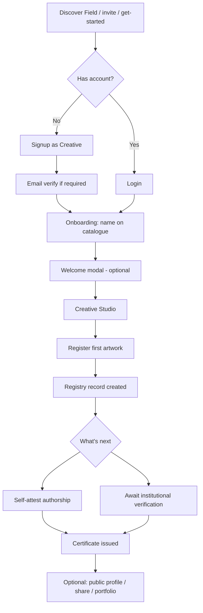
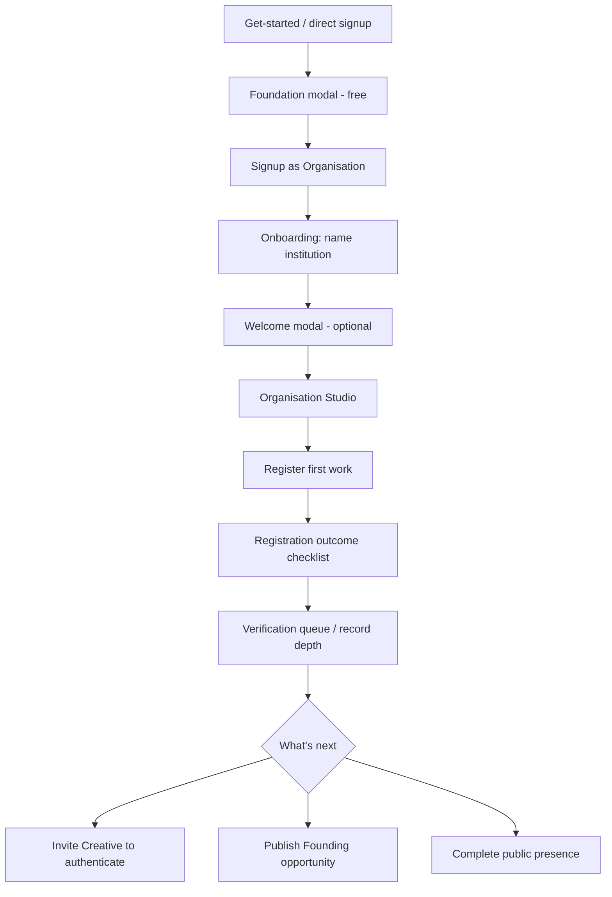
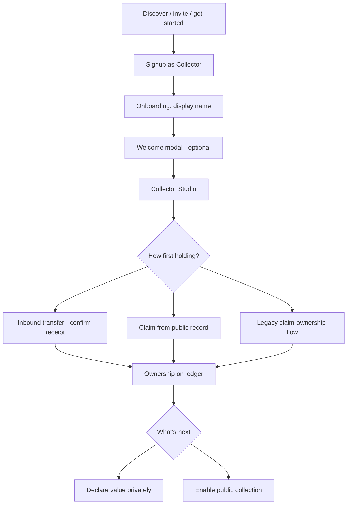
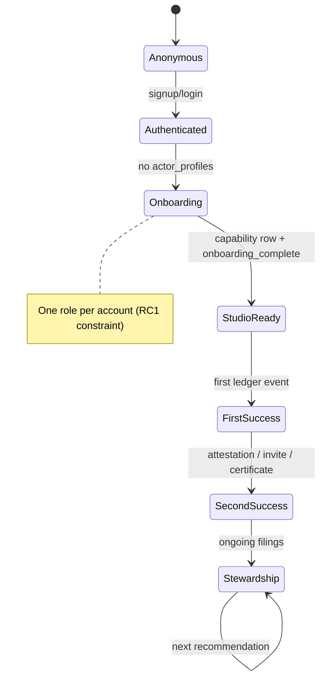

# Founding Registry Experience Blueprint

**Document status:** DRAFT — Sprint 7A Phase 0  
**Effective:** July 2026  
**Authority:** [Product Blueprint v1.1](./product-blueprint-v1.1.md) (APPROVED), [Phase 1 Scope Freeze](./phase-1-freeze.md) (FROZEN), [Product Language Freeze](./product-language-freeze.md) (FROZEN)  
**Scope:** Product design and UX architecture only — **no implementation in this document**

---

## Executive summary

RC1 is complete. Day Zero has reset the application layer. Every record, organisation, and profile created from this point is **real registry history**.

Sprint 7A is not about large new features. It is about making the **first meaningful interactions** feel as intentional as museum accession: calm, prestigious, and permanently consequential — not SaaS onboarding.

**Current state (post–Day Zero audit):**

| Strength | Gap |
|----------|-----|
| Institutional empty-state primitive (`ExperienceEmptyState`) | No unified **“What’s next”** system — users face multi-CTA heroes and passive copy |
| Clear role-based studio homes (`/studio/creative`, `/studio/organisation`, `/studio/collector`) | **Collector** first-holding path exists but is not surfaced from studio empty states |
| Post-registration outcomes for Creative and Organisation | Creative outcome banner only visible on Artworks tab; certificate path unclear |
| 4-step welcome modals per role | Welcome ends passively; does not deep-link to first success action |
| Organisation Foundation tier now free (Sprint 7A pricing reposition) | **Founding Registry Programme** exists only in ops docs — no in-product framing |
| Field explorers with `/get-started` CTAs (Creatives, Organisations, Records) | Field **Opportunities** empty has no participant CTA at Day Zero |

**Sprint 7A objective:** Design and ship the **minimum experience layer** so a founding participant never wonders *“What do I do next?”* — one screen, one question, one primary action.

---

## Design philosophy

### What we are designing for

| Influence | What we borrow |
|-----------|----------------|
| **Apple onboarding** | One decision per screen; confidence through restraint |
| **Notion / Linear onboarding** | Progressive disclosure; workspace appears only when ready |
| **Museum accession** | Filing language; permanence; no undo anxiety |
| **Institutional archive** | Chronology is append-only; records matter |

### What we are not designing

- Feature tours, checklists with gamified progress bars, or “complete your profile 60%” meters
- Social feeds, follower counts, or engagement loops
- Dashboards with six equal-weight CTAs
- Urgency copy (“Get started now!”, “Don’t miss out”)

### RC1 design language (unchanged)

- **Surfaces:** `v2-surface-paper`, filing sheets, mono metadata rails, serif display headlines
- **Terminology:** Creative · Organisation · Collector (public); `artist` / `gallery` internal only where frozen
- **Semantic colour:** registry events only — not decorative state colour
- **Motion:** slow reveal, ledger append — no bounce or slide gimmicks

---

## Experience principles

1. **One screen, one question** — each view answers exactly one user question.
2. **One primary action** — secondary actions are visually subordinate or behind disclosure.
3. **Progressive disclosure** — public profile, team, opportunities, and upgrades come **after** first success.
4. **Filing, not form-filling** — language of accession, chronology, and record — not “setup wizard”.
5. **Permanence** — success states acknowledge that something **entered the ledger**.
6. **Gentle recommendation** — at most **one** “What’s next” suggestion at a time.
7. **Empty is institutional** — empty states explain what the archive will contain and the **single** filing step to begin.
8. **Exit is honourable** — users can dismiss guidance without penalty; the record remains.

---

## Success definitions

### First Success — smallest meaningful achievement

| Role | First Success | Measurable signal |
|------|---------------|-------------------|
| **Creative** | One work **filed** on the Registry with a Registry ID | `artworks` row; `registrationOutcome` shown |
| **Organisation** | One canonical record **filed** on behalf of the institution | `GalleryRegistrationOutcome`; public record exists |
| **Collector** | One **ownership** event on the ledger (claim confirmed or transfer received) | `ownership_events` / claim accepted |

### Second Success — natural follow-on

| Role | Second Success |
|------|----------------|
| **Creative** | **Self-attestation** or institutional verification path initiated → certificate eligible |
| **Organisation** | Artist authentication invitation sent **or** institution attestation recorded |
| **Collector** | Custody record visible in Works with provenance context |

### Long-term Stewardship — without pressure

| Role | Stewardship loop |
|------|------------------|
| **Creative** | Register further works; deepen attestations; manage visibility in Account |
| **Organisation** | Roster growth; opportunity publishing; verification queue as daily rhythm |
| **Collector** | Confirm transfers; declare values privately; optional public collection |

Stewardship surfaces should **recommend one next filing**, not a task grid.

---

## Journey maps

### 1. Creative journey



**Invitation variants:**

- **Gallery roster invite** → signup with `invite_token` → representation on file → may file via institution before self-registration
- **Artwork authentication invite** → `/authenticate-record` → signup as Creative → return to authorship review

### 2. Organisation journey



**Operator path (Day Zero):** same journey — first Organisation is RROWM itself; first opportunity is Founding Registry Programme.

### 3. Collector journey



---

## “What’s next” system (design)

### Problem

Studio heroes expose multiple primary-weight actions (Register · Certificates · Ownership · Invitations). Welcome modals end with **Get started** but do not route anywhere. Post-registration outcomes offer several CTAs of equal visual weight.

### Proposal: `NextFilingRecommendation` (conceptual)

A **single** recommendation slot per studio home, below hero or replacing hero secondary clutter.

| Priority logic (example) | Recommendation copy | Primary CTA |
|--------------------------|----------------------|-------------|
| No works filed | “File your first work on the Registry.” | Register artwork |
| Work filed, not attested | “Deepen this record with authorship attestation.” | Attest authorship |
| Attested, no certificate yet | “Certificate issues when verification completes.” | View record |
| Certificate issued | “Your certificate is on file.” | View certificate |
| Org: no catalogue | “File the first canonical record for your institution.” | Register a work |
| Org: work filed, artist unlinked | “Invite the Creative to authenticate this record.” | Send invitation |
| Collector: no holdings | “Confirm a transfer or claim a work from the Registry.” | Browse Registry / Claim |
| Collector: holding, pending transfer | “A stewardship transfer awaits your confirmation.” | Confirm receipt |
| Profile incomplete (optional) | “Complete your public presence when ready.” | Account |

**Rules:**

- Never show more than **one** recommendation
- Dismissible for session; reappears only when state changes
- Uses registry semantic motion (`ledger-append`) on appearance
- No numeric progress (“Step 2 of 5”)

### Where it lives

| Surface | Placement |
|---------|-----------|
| `/studio/creative` | Below `ArtistWorkspaceHero`; supersedes redundant empty hero preview hint |
| `/studio/organisation` | Below `GalleryInstitutionalHero`; aligns with `GalleryRegistrationOutcome` |
| `/studio/collector` | Replaces passive overview empty; links to claim or transfer |

---

## Screen inventory

Each row is one **user-visible step**. Fields: **Q** = question the user has; **A** = how the UI answers it.

### Entry & authentication

| Screen | Route / component | Purpose | Primary action | Secondary | Q → A |
|--------|-------------------|---------|----------------|-----------|-------|
| Get started | `/get-started` `GetStartedView` | Choose participation path | Role card CTA | Sign in | *Which path is mine?* → Three equal cards, one line each |
| Org plans | `GalleryPricingModal` | Confirm free Foundation tier | Create organisation | Sign in | *Does this cost money?* → **Free** + no payment copy |
| Signup | `/signup` `SignupClient` | Create auth account | Create profile | Sign in | *What am I joining as?* → Role in subtitle |
| Signup complete | `/signup/complete` | Post-verify session | Auto-redirect | — | *Did it work?* → Redirect to onboarding |
| Login | `/login` `LoginClient` | Return access | Sign in | Forgot password | *Where do I go?* → `resolvePostAuthRedirectPath` |

**Success:** session established. **Empty:** n/a. **Error:** invalid credentials message. **Loading:** submitting state on button. **Exit:** get-started, marketing.

**Friction:** email verification leaves user outside app with no progress indicator.

---

### Onboarding (shared)

| Screen | Purpose | Primary action | Secondary |
|--------|---------|----------------|-----------|
| Role selection | Choose participation model | Pick Artist / Collector / Gallery row | — |
| Creative profile | Name on catalogue | Continue to studio | — |
| Collector profile | Name on records | Continue to collection | — |
| Organisation profile | Name institution | Continue to institutional studio | — |

| State | Creative | Collector | Organisation |
|-------|----------|-----------|--------------|
| **Success** | Redirect `/studio/creative` + welcome flag | `/studio/collector` | `/studio/organisation` |
| **Empty** | n/a (form) | n/a | n/a |
| **Error** | RPC / validation message | same | unique slug → silent redirect to studio (friction) |
| **Loading** | Saving… | Saving… | Saving… |
| **Exit** | Login gate if no session | same | `?focus=gallery` deep link |

**Q → A:** *What happens next?* → CTA names destination studio explicitly.

**Copy recommendations:**

- Unify **Creative** (not “Artist”) in onboarding role card title — align with Product Language Freeze
- Organisation subtitle already states free infrastructure — keep
- Move hardcoded onboarding strings into `locale-messages` for i18n parity

---

### Welcome modal (post-onboarding)

| Screen | `IntroModal` + `intro-content.tsx` | Purpose | Primary action |
|--------|-----------------------------------|---------|----------------|
| 4-step intro per role | Orient to studio capabilities | **Get started** (final step) |

| State | Behaviour |
|-------|-----------|
| **Success** | `localStorage` mark — not shown again |
| **Empty** | n/a |
| **Error** | n/a |
| **Loading** | n/a |

**Friction:** Final CTA is passive. **Recommendation:** Final step primary action should mirror **First Success** CTA (Register artwork / Register a work / Browse Registry to claim).

---

### Creative Studio — first filing path

| Screen | Purpose | Primary action | Secondary |
|--------|---------|----------------|-----------|
| Studio home | Command surface for catalogue | Register artwork | Section nav |
| Register modal | File new work | Submit filing | Cancel |
| Post-registration outcome | Acknowledge ledger append | View public record | Dismiss |
| Artworks empty | No works yet | Register artwork | — |
| Certificates empty | No certs yet | **Should be:** Attest / verify — **currently:** Register artwork (wrong) |
| Ownership empty | No events | Register artwork | — |

| State | Detail |
|-------|--------|
| **Success** | `studio.register.outcome.*` — “Work filed on the Registry” |
| **Empty** | `studio.artworks.emptyTitle` — “No represented works on file yet” |
| **Error** | Toast / modal validation |
| **Loading** | Register modal submitting |
| **Exit** | Field, Account, Registry public |

**Q → A:** *Is this permanent?* → Outcome copy references Registry ID and open chronology.

**Friction:**

1. Outcome banner only when `activeSection === "Artworks"` but register CTA on Studio tab — user misses success
2. Certificates empty CTA misaligned with section purpose
3. No explicit certificate timeline in outcome (self-attest → certificate)

---

### Organisation Studio — first filing path

| Screen | Purpose | Primary action | Secondary |
|--------|---------|----------------|-----------|
| Studio home | Institutional command | Register a work | Invitations, catalogue |
| No gallery profile | Recovery if onboarding incomplete | Continue to gallery onboarding | — |
| Register modal (gallery variant) | Institution filing | Submit | Cancel |
| Registration outcome | 3-step checklist | View public record | Send auth invitation |
| Catalogue empty | No works | Register a work (hero/nav — not inline in empty copy) | — |
| Roster empty | No artists | Go to Invitations | — |
| Opportunities empty | No briefs | New opportunity (if verified) | — |

| State | Detail |
|-------|--------|
| **Success** | `GalleryRegistrationOutcome` — steps 1–3 |
| **Empty** | `gallery.catalogue.empty` — passive text |
| **Error** | Image required for org filing (stricter than Creative) |
| **Loading** | Saving / filing |
| **Exit** | Field org presence, Account |

**Friction:** Image required for org but not creative self-registration — intentional but needs copy explanation. Admin-only invite on hero.

---

### Collector Studio — first holding path

| Screen | Purpose | Primary action | Secondary |
|--------|---------|----------------|-----------|
| Studio home | Custody workspace | **View works** (weak) | Attention, Account |
| Works empty | No holdings | **None today** | — |
| Overview empty | No holdings | **None** | — |
| Pending acquisition | Transfer inbound | Confirm receipt | Open deal |
| Claim flow | Manual claim | `/collector-studio/claim-ownership` | Search registry |

| State | Detail |
|-------|--------|
| **Success** | Work appears in Works list |
| **Empty** | `collector.works.emptyTitle` — passive; locale has unused claim link copy |
| **Error** | Claim ineligible message |
| **Loading** | Confirm receipt processing |

**Friction (critical):** No CTA from studio empty to Registry browse or claim flow despite `collector.works.emptyPrefix/Link/Suffix` in locale. Hero primary is “View works” when empty — dead end.

---

### Field (public discovery)

| Explorer | Day Zero empty | CTA today | Recommended |
|----------|----------------|-----------|-------------|
| Creatives | No public profiles | Take part → `/get-started` | Keep |
| Organisations | No public orgs | Take part | Keep |
| Records | No records | Take part | Keep |
| Opportunities | No published briefs | **None** | Add institutional framing or “Take part” |

---

## State diagram — participant lifecycle



---

## Empty states — audit & recommendations

| Location | Current message | Issue | Recommendation |
|----------|-----------------|-------|----------------|
| Creative Artworks | “No represented works on file yet” | Good | Add single **Register artwork** — already present |
| Creative Certificates | Points to register | Wrong intent | **Attest authorship** or link to filed work |
| Creative Ownership | Points to register | OK pre-first-work | After first work, point to transfer/deal |
| Collector Works | Passive body | No CTA | Wire `emptyPrefix/Link/Suffix` → Registry explorer |
| Collector Overview | Passive | No CTA | Mirror Works recommendation |
| Org Catalogue | Passive paragraph | CTA elsewhere | Inline **Register a work** in empty slab |
| Org Record depth | Passive | OK | Link to verification queue when items pending |
| Field Opportunities | Message only | Dead end | “Take part” or “Publish a programme” (org-only secondary) |
| Deals / Rights | Passive | Low priority | Single link to register work or new deal |

**Primitive gap:** `ExperienceSubtleHint` exists but is unused — candidate for **What’s next** secondary hints.

---

## Completion states — audit & recommendations

| Moment | Current | Recommendation |
|--------|---------|----------------|
| Onboarding complete | Redirect + welcome modal | Skip modal if user arrives with invite deep-link task |
| First artwork (Creative) | Outcome banner | Show on **all** sections until dismissed; add **Attest authorship** CTA |
| First artwork (Org) | `GalleryRegistrationOutcome` | Strong — reduce parallel CTAs to one primary + disclosure |
| Self-attest toast | Ephemeral | Optional filing acknowledgement slab (mono rail) |
| Certificate issued | Notification + activity | Dedicated **Certificate filed** acknowledgement once per work |
| Welcome modal complete | Get started | Replace with role-specific **first success** CTA |

---

## Onboarding copy — recommendations

| Area | Current | Recommended direction |
|------|---------|----------------------|
| Role card “Artist” | Artist | **Creative** (public label) |
| get-started collector | “Browse the public catalogue…” | Add “Confirm stewardship when a work transfers to you” |
| Signup subtitle | Generic studio line | Role-specific one sentence filing purpose |
| Onboarding gallery | Free infrastructure stated | Keep — aligns with Sprint 7A pricing |
| Welcome step 2–3 | Promises auto certificate | Add “after attestation or verification” qualifier |
| Email pending | Check your email | Add “Return to this browser to continue filing” |

---

## CTA audit — intentionality

| CTA | Location | Verdict |
|-----|----------|---------|
| Register artwork | Creative hero | **Primary** — keep |
| View works | Collector hero when empty | **Wrong primary** — change to **Find a record** or **Confirm receipt** when pending |
| Create organisation | Get-started / modal | **Primary** — keep |
| Continue as Creative/Collector | Get-started | **Primary** — keep |
| Get started | Welcome modal | **Too vague** — replace with first-success action |
| Register artwork | Certificates empty | **Wrong** — fix |
| New opportunity | Org opportunities | **Secondary** until first work filed |
| New deal | Deals empty | OK for stewardship phase |

**Rule going forward:** Every CTA must complete the sentence: *“This button files ___ on the Registry.”* If it cannot, it is navigation chrome — style it subordinate.

---

## Friction inventory (prioritised)

| # | Friction | Severity | Role |
|---|----------|----------|------|
| F1 | Collector empty studio has no path to first holding | **Critical** | Collector |
| F2 | Creative registration outcome hidden off Studio tab | **High** | Creative |
| F3 | Certificates empty CTA misleads | **High** | Creative |
| F4 | No “What’s next” single recommendation | **High** | All |
| F5 | Welcome modal ends passively | **Medium** | All |
| F6 | Field Opportunities Day Zero dead end | **Medium** | Public |
| F7 | Founding Registry not framed in product | **Medium** | Operator / Creative |
| F8 | Onboarding copy hardcoded English | **Medium** | i18n |
| F9 | Org filing requires image; Creative does not — unexplained | **Low** | Organisation |
| F10 | Single-role model blocks org+creative same user | **Known** | Operator — defer multi-role |

---

## Simplifications (no visual redesign)

1. **Collapse hero secondaries** into one **What’s next** slot until first success.
2. **Wire existing locale keys** (`collector.works.emptyLink`) — copy already written.
3. **Move registration outcome** to studio-level toast/slab visible from any section.
4. **Final welcome step** CTA = first success action (reuse existing handlers).
5. **Field Opportunities empty** — reuse explorer pattern (`Take part` link).
6. **Defer** profile completeness prompts until after second success.
7. **Unify** Creative naming in onboarding only — no route changes.

---

## Sprint 7A implementation roadmap

### Phase 0 — This document ✅

Blueprint only. No code.

### Phase 1 — Quick wins (1–2 weeks) ✅ 7A.1

| ID | Deliverable | Addresses | Status |
|----|-------------|-----------|--------|
| 7A-1 | Wire Collector works empty → Registry claim link | F1 | ✅ |
| 7A-2 | Fix Certificates empty CTA → attest / view filed works | F3 | ✅ |
| 7A-3 | Show Creative `registrationOutcome` globally in studio | F2 | ✅ |
| 7A-4 | Welcome modal final CTA → role-specific first action | F5 | ✅ |
| 7A-5 | Field Opportunities empty → `/get-started` | F6 | ✅ |
| 7A-6 | Onboarding role label Creative (copy only) | Language freeze | ✅ |

### Phase 2 — Voice & Status (7A.2) ✅ editorial only

| ID | Deliverable | Status |
|----|-------------|--------|
| 7A-2A | `registry-voice.md` style guide | ✅ |
| 7A-2B | Registry Status concept | ✅ |
| 7A-2C | Registry Moments framework | ✅ |
| 7A-2D | Locale language audit | ✅ |

### Phase 2b — Registry Principles (7A.3) ✅ editorial only

| ID | Deliverable | Status |
|----|-------------|--------|
| 7A-3A | `registry-principles.md` constitutional reference | ✅ |
| 7A-3B | Platform review per principle | ✅ |
| 7A-3C | Registry Evaluation Framework | ✅ |

### Phase 3 — Registry Status UI & voice pass (2–3 weeks)

| ID | Deliverable | Addresses |
|----|-------------|-----------|
| 7A-7 | Registry Status UI + role logic (single contextual line) | F4 |
| 7A-8 | Integrate on three studio homes | F4 |
| 7A-9 | Certificate issued acknowledgement slab | Completion |
| 7A-10 | Creative outcome: add **Attest authorship** CTA | Second success |
| 7A-11 | EN locale voice pass (P1–P3 audit items) | Voice |

### Phase 4 — Founding Registry framing (1 week, copy + Field)

| ID | Deliverable | Addresses |
|----|-------------|-----------|
| 7A-12 | Founding Registry Programme copy on Field opportunity detail | F7 |
| 7A-13 | Operator checklist → in-product banner (org studio only, dismissible) | F7 |
| 7A-14 | Invite email / signup path smoke test documentation | Ops |
| 7A-15 | DE/FR/JA voice parity | i18n |

### Deferred (post-7A)

| Item | Reason |
|------|--------|
| Multi-role identity | Architecture sprint — see Sprint 6E audit |
| Practice taxonomy onboarding | Phase 2B+ |
| Gamified onboarding checklist | Violates principles |
| Dashboard redesign | Out of scope |

---

## Future opportunities (not Sprint 7A)

- Stewardship digest email (monthly chronology summary)
- Public presence wizard after second success
- Organisation team invites after first verification
- Field programme templates for cohort operators
- Certificate share card (OG image) as optional third success

---

## Launch readiness checklist

### Operator (Day Zero complete → Founding Registry live)

- [ ] Organisation created through normal onboarding
- [ ] Creative profile created (second role or second account per RC1 constraint)
- [ ] First artwork registered — Registry ID is real
- [ ] Self-attestation or verification path verified
- [ ] Certificate issuance observed on ledger
- [ ] Founding Registry `field_brief` published
- [ ] Field `/field/opportunities` shows programme
- [ ] First invitation sent and completed end-to-end
- [ ] Public record visible on `/field/record/[id]`
- [ ] Collector claim or transfer path tested once

### Experience quality gates

- [ ] Each role reaches **First Success** in &lt; 15 minutes (operator walkthrough)
- [ ] No studio home presents more than **one** primary CTA
- [ ] Every empty state answers *what will appear here* and *one filing action*
- [ ] Post-registration states include **What’s next**
- [ ] No purchase language on Organisation path
- [ ] Copy uses Creative / Organisation / Collector on user-facing surfaces
- [ ] Welcome modal can be dismissed without blocking filing

### Regression

- [ ] `StudioRouteGuard` still routes incomplete users to onboarding
- [ ] Invite flows (`invite_token`, artwork auth) still resolve post-auth
- [ ] Registry chronology append-only semantics unchanged
- [ ] Certificate trigger on verification unchanged

---

## Appendix — file reference map

| Domain | Key files |
|--------|-----------|
| Entry | `components/get-started/GetStartedView.tsx`, `GalleryPricingModal.tsx` |
| Auth | `app/signup/SignupClient.tsx`, `app/login/LoginClient.tsx`, `lib/post-auth-redirect.ts` |
| Onboarding | `app/onboarding/OnboardingClient.tsx`, `lib/onboarding.ts` |
| Welcome | `components/ui/IntroModal.tsx`, `components/ui/intro-content.tsx` |
| Creative studio | `app/studio/creative/page.tsx`, `ArtistWorkspaceHero.tsx`, `ArtworksSection.tsx` |
| Organisation studio | `app/studio/organisation/page.tsx`, `GalleryRegistrationOutcome.tsx` |
| Collector studio | `app/studio/collector/page.tsx`, `CollectorWorkspaceOverview.tsx` |
| Empty primitive | `components/ui/ExperienceEmptyState.tsx` |
| Field explorers | `components/Field/*ExplorerContent.tsx` |
| Copy | `lib/locale-messages.ts` |
| Principles | `docs/v2/registry-principles.md` |
| Voice | `docs/v2/registry-voice.md` |
| Ops | `docs/operations/DAY_ZERO_CHECKLIST.md` |

---

## Sprint 7A.1 — Experience Refinement

**Status:** Implemented (Phase 1 quick wins only). No database or route changes.

### Implemented improvements

| ID | Deliverable | Change |
|----|-------------|--------|
| 7A-1 | Collector empty states | `CollectorHoldingsEmptyState` — explanation + **Claim ownership** primary + **Browse registry** secondary on hero (when empty), overview, works, attention (no holdings), and activity preview |
| 7A-2 | Certificates empty CTA | When filed works exist but no certificates: **Attest authorship** → Artworks section; when no works: **Register artwork** |
| 7A-3 | Creative registration outcome | Filing acknowledgement slab visible on **all** studio sections until dismissed |
| 7A-4 | Welcome modal final CTA | Role-specific first action: Register artwork / Claim ownership / Register a work (replaces vague “Get started”) |
| 7A-5 | Field Opportunities empty | Day Zero empty state links to **Take part** (`/get-started`) |
| 7A-6 | Onboarding Creative label | Role card **Artist** → **Creative**; founding cohort line in role step subtitle |
| P4 | Founding Registry wording | Subtle first-cohort line in onboarding; collector get-started copy mentions stewardship confirmation |
| P5 | CTA audit (touched surfaces) | Collector hero, certificates empty, welcome final step, opportunities empty |

**New / updated files:** `components/Studio/CollectorHoldingsEmptyState.tsx`, locale keys under `collector.empty.*`, `studio.certificates.empty*`, `collector.attention.emptyNoHoldings*`.

### Completion language — candidate patterns (P6, not finalised in UI)

Platform voice to be chosen in a follow-up pass. Candidates centred on Registry filing semantics:

1. **“Filing recorded on the Registry.”** — neutral ledger append acknowledgement
2. **“Work on file — Registry ID issued.”** — emphasises persistent record creation
3. **“Entry appended to the chronology.”** — append-only semantics
4. **“Record filed — open the public ledger.”** — bridges private studio → public record
5. **“Authorship attestation received.”** — second-success moment (self-attest)
6. **“Verification recorded — certificate eligible.”** — pre-certificate state
7. **“Certificate issued to the ledger.”** — certification event (future 7A-9)
8. **“Custody recorded on the Registry.”** — collector transfer / claim complete
9. **“Transfer confirmed — provenance extended.”** — ownership chain language
10. **“Representation filed under your Organisation.”** — org registration outcome variant

**Avoid in final copy:** Success, Done, Completed, Awesome, Great job.

### Remaining opportunities

| Area | Gap |
|------|-----|
| F4 | No **What’s next** recommendation component (deferred Phase 2) |
| Creative outcome | No **Attest authorship** CTA on registration slab yet (7A-10) |
| Certificate issued | No dedicated acknowledgement slab after verification tier change (7A-9) |
| Org catalogue empty | Passive copy — inline register CTA still optional |
| Onboarding i18n | Role step copy still hardcoded English in `OnboardingClient.tsx` |
| Intro modal mid-step | “Next” retained for stepper navigation (acceptable) |
| `studio.register.outcome.dismiss` | Generic dismiss label — revisit with chosen completion voice |

### Recommendations for Sprint 7A.2

1. **7A-7 / 7A-8** — `NextFilingRecommendation` on three studio homes (single primary “what’s next” slot).
2. **7A-10** — Add **Attest authorship** secondary on Creative registration outcome when work is filed but unverified.
3. **7A-9** — Certificate-issued acknowledgement slab (one per work, mono rail, no modal).
4. **Onboarding i18n** — Move role-step and founding cohort strings into `locale-messages.ts`.
5. **Org catalogue empty** — Inline **Register a work** in empty slab (hero CTA exists but section is passive).
6. **Voice pass** — Apply chosen completion pattern from P6 candidates across outcome slabs, toasts, and dismiss labels.

---

## Sprint 7A.2 — Registry Voice & Registry Status

**Status:** Editorial definition complete. **No code, UI, or locale changes.**

**Deliverable:** [`docs/v2/registry-voice.md`](./registry-voice.md) — platform editorial style guide.

### Registry Voice — summary

RROWM copy should read as **cultural infrastructure** (archive, accession system, trusted registry) — not SaaS, project management, or social product.

| Pillar | Rule |
|--------|------|
| **Mission** | Every sentence reinforces permanence, trust, stewardship |
| **Tone** | Calm registrar — factual, understated, never celebratory |
| **Verbs** | Register, file, attest, verify, confirm receipt — not upload, submit, complete |
| **State words** | On file, awaiting attestation, requires verification — not success, done, incomplete |
| **CTAs** | One verb + one registry object — not Continue, Get started, Submit |
| **Avoid** | Exclamation marks, emojis, gamification, portfolio-as-product, dashboard |

Full specification: preferred/avoided vocabulary table, grammar, capitalisation, and per-domain language (ownership, verification, certificate, invitation, error, loading, empty state) in `registry-voice.md`.

### Registry Status — concept

**Not a recommendation engine.** One contextual sentence on each **Studio home** describing the highest-priority registry state for that role.

| Property | Value |
|----------|-------|
| **Appears** | Studio workspace section; when a ranked filing/response is pending OR first-filing empty state |
| **Disappears** | Condition clears; superseded by higher-priority event; hidden when registration outcome slab visible |
| **Max length** | One sentence ≤ 120 characters; optional mono ID line |
| **Primary action** | One button only — must file something on the Registry |
| **Examples** | Creative: *“One work is awaiting attestation.”* · Org: *“Three records require verification.”* · Collector: *“No holdings have yet been recorded.”* |

Interaction: static text, semantic colour only for registry events, no modal, no progress bar. Full rules in `registry-voice.md` Part B.

### Registry Moments — concept

Language framework for consequential ledger events (registration, certificate issued, custody confirmed, organisation established, etc.).

**Eight patterns** defined — rail label + serif title + body + Registry ID + primary/secondary actions. Toast = minimal form; slab = full form.

Model copy already in product: `studio.register.outcome.*`, `studio.toast.selfAttested`, `gallery.toast.certificateFiled`.

**Anti-patterns:** Success, Done, Congratulations, exclamation marks, emojis.

Full moment catalogue in `registry-voice.md` Part C.

### Language audit — prioritised fixes (no code yet)

| Priority | Cluster | Example keys |
|----------|---------|--------------|
| **P1** | SaaS progress language | `gallery.status.complete`, `gallery.status.incomplete`, `verifySuccess`, `landing.portfolio.title` |
| **P2** | Terminology drift | Artist→Creative, Gallery→Organisation, Profile→presence, Workspace→Studio |
| **P3** | Generic async copy | `Loading…`, `Processing…`, `Submit claim` |
| **P4** | Marketing / Field | Explorer branding — acceptable on Field; tighten Studio |

~80–120 EN locale keys estimated for voice pass. Hardcoded onboarding and intro strings flagged.

### Prioritised implementation roadmap (post-7A.2)

| Sprint | Deliverable | Depends on |
|--------|-------------|------------|
| **7A.4** | EN locale voice pass (P1–P3) | Principles + Voice accepted |
| **7A.4** | Registry Status UI (Studio home only) | Principles + status rules |
| **7A.4** | Registry Moments — slab/toast alignment | Moment patterns chosen |
| **7A.5** | Registry Status logic refinement | Status UI |
| **7A.5** | Attest CTA on registration outcome slab | 7A-10 from 7A.1 backlog |
| **7A.5** | Certificate-issued acknowledgement slab | 7A-9 from 7A.1 backlog |
| **7A.6** | DE/FR/JA voice parity | EN lock |
| **7A.6** | Onboarding + intro i18n migration | Locale keys defined |

**Explicitly deferred:** Recommendation carousel, gamified checklist, dashboard redesign, route/namespace renames (`gallery.*` → `organisation.*`).

---

## Sprint 7A.3 — Registry Principles

**Status:** Constitutional document complete. **No code, UI, or locale changes.**

**Deliverable:** [`docs/v2/registry-principles.md`](./registry-principles.md) — highest-level product reference.

### Registry Principles — summary

Twelve principles define how every future decision is evaluated:

| # | Principle |
|---|-----------|
| 1 | **The Record Comes First** |
| 2 | **Trust Is Earned Through Evidence** |
| 3 | **Stewardship Is Continuous** |
| 4 | **Documentation Creates Value** |
| 5 | **Publication Is Optional** |
| 6 | **Individuals and Institutions Share One Registry** |
| 7 | **Calm Builds Trust** |
| 8 | **Reduce Cognitive Load** |
| 9 | **History Over Activity** |
| 10 | **Capability Over Complexity** |
| 11 | **Consistency Creates Confidence** |
| 12 | **Longevity Before Novelty** |

Each principle includes: why it exists, product implications, examples, anti-patterns, and platform review (strengths / inconsistencies / opportunities).

### Reference hierarchy

```
Registry Principles          docs/v2/registry-principles.md     ← constitutional
        ↓
Registry Voice               docs/v2/registry-voice.md
        ↓
Experience Blueprint         docs/v2/founding-registry-experience-blueprint.md
        ↓
Design System                docs/rc1-design-system-freeze.md
        ↓
Implementation               code · schema · routes
```

**Conflict resolution:** Principles prevail over Voice, Blueprint, Design System, and implementation. Lower documents must be revised to align — not the reverse.

### Registry Evaluation Framework

Short checklist for accepting features (full version in `registry-principles.md`):

- Does it strengthen the record?
- Does it reduce ambiguity?
- Does it improve trust?
- Does it respect stewardship?
- Does it preserve institutional tone?
- Does it reduce cognitive load?
- Does it fit the Registry Voice?
- Does it fit the Design System?
- Does it avoid unnecessary complexity?
- Does it privilege history over activity?
- Is publication optional?
- Does it serve one Registry for all roles?

Exceptions require naming the principle in tension and documented review.

### Future governance process

| Event | Action |
|-------|--------|
| **New feature proposal** | Complete Registry Evaluation Framework checklist before spec |
| **Copy change (material)** | Check Registry Voice *and* Principles 1, 4, 7, 11 |
| **UI / visual change** | Check Design System *and* Principles 7, 8, 11 |
| **Schema / ledger change** | Check Principles 1, 2, 3, 10, 12 — architecture review required |
| **Sprint close (7A+)** | Note principle inconsistencies discovered; queue alignment — do not silently drift |
| **Annual / post-major-sprint** | Principle review: update strengths/inconsistencies in `registry-principles.md` |
| **Exception** | Log in sprint notes or `docs/v2/DOCUMENT_GOVERNANCE.md` with time bound |

---

## Document governance

| Property | Value |
|----------|-------|
| Status | **DRAFT** — Sprint 7A.3 principles defined; 7A.1–7A.2 editorial complete |
| Implementation | 7A.4 locale pass + Registry Status UI not started |
| Supersedes | Ad-hoc onboarding notes in ops docs for **experience** questions only |
| Constitutional authority | `docs/v2/registry-principles.md` |
| Voice authority | `docs/v2/registry-voice.md` |
| Next review | After principles accepted — begin 7A.4 implementation |

---

*The Registry is empty. Every filing from this point forward is history. Sprint 7A makes that first filing feel as consequential as it is.*
