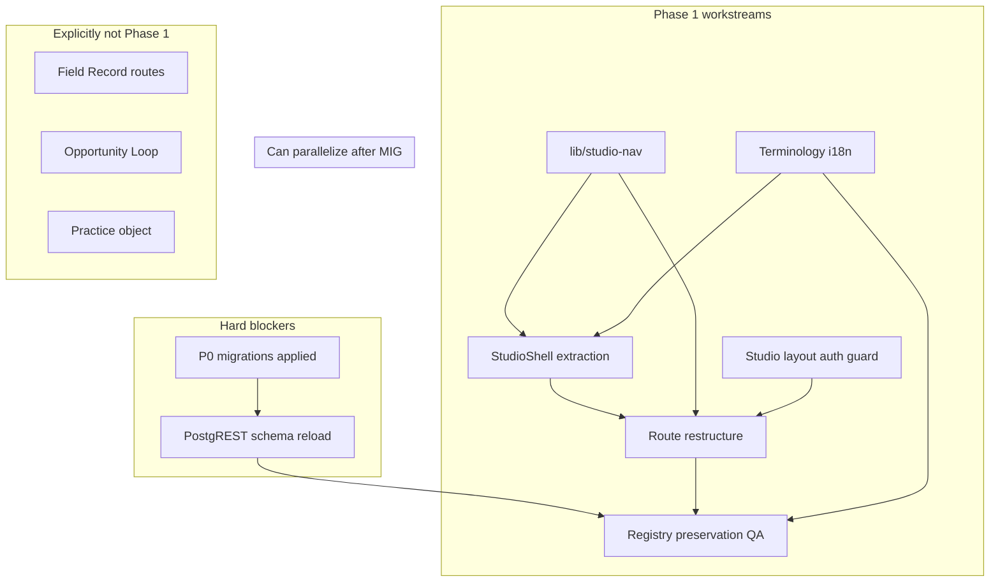

# Phase 1 Implementation Specification  
## V2 Studio Foundation

**Document status:** LOCKED  
**Frozen:** 31 May 2026  
**Authority:** Product Blueprint v1.1 (APPROVED)  
**Change control:** Scope and acceptance criteria require explicit unlock before modification  
**Phase:** V2 Studio Foundation only  
**Document type:** Technical implementation specification (no code)  
**Horizon:** First shippable V2 increment — internal architecture + routes + copy; **no Field Opportunity, Practice, Sector, Project, Brief, or Programme work**

---

## 1. Purpose and boundaries

### 1.1 Objective

Deliver a **unified Studio layer** so all authenticated participant workspaces share one shell, one navigation model, one terminology layer, and canonical routes — while **zero changes** to registry ledger behaviour, RPC contracts, or RLS semantics.

### 1.2 In scope

| Workstream | Deliverable |
|------------|-------------|
| **StudioShell extraction** | Single shell component tree replacing duplicated `WorkspaceShell` + three `*WorkspaceShellLayout` patterns |
| **Terminology layer** | Product copy: Creative / Organisation / Collector (DB roles unchanged: `artist`, `gallery`, `collector`) |
| **Route restructuring** | Canonical `/studio/*` routes with 301 redirects from legacy paths |
| **Navigation architecture** | Central nav registry per role; Personal Archive + footer links consistent |
| **Registry preservation testing** | Repeatable smoke + replay gate before/after Phase 1 |
| **Migration dependencies** | P0 migrations applied; personal archive + lifecycle + hardening live on target env |

### 1.3 Explicitly out of scope

- Field Explorer / Field Record routes (Phase 2)
- Field Opportunities, Briefs, Projects, Programmes
- Practice object, Sector taxonomy, capabilities
- `/api/registry/*` or `/api/studio/*` namespace migration (optional follow-up)
- Database schema changes for V3
- Removing `SignedInCatalogueShellLayout` from `/registry` (Phase 2)
- Teams, collaborations, patron, API product

### 1.4 Registry preservation rule

**No Phase 1 task may:**

- Alter `ownership_events`, `value_events`, `verification_events`, or certificate RPC logic
- Change RLS policies on ledger tables
- Rename database roles or profile tables
- Remove or bypass existing RPCs for register, verify, issue certificate, provenance, representation

UI refactors may **call the same RPCs and APIs** as today.

---

## 2. Technical specification

### 2.1 StudioShell extraction

#### 2.1.1 Current state (baseline)

| Pattern | Location | Issue |
|---------|----------|-------|
| Inline `WorkspaceShell` | `app/studio/page.tsx`, `app/collector-studio/page.tsx`, `app/institutional-studio-dashboard/page.tsx` | ~3 implementations; nav/activity duplicated |
| Role layouts | `ArtistWorkspaceShellLayout`, `CollectorWorkspaceShellLayout`, `GalleryWorkspaceShellLayout` | Used by `/account`, `/personal-archive`, `/registry` layout |
| Core chrome | `components/Studio/WorkspaceShell.tsx` | Shared primitive — keep as base or fold into StudioShell |

Supporting pieces already present (preserve or fold in):

- `components/Studio/WorkspaceSidebarActivityFeed.tsx`
- `hooks/useAccountActivityFeed.ts`
- `lib/personal-archive-nav.ts` → `appendPersonalArchiveNavItem`

#### 2.1.2 Target architecture

```
StudioShell (new orchestrator)
├── WorkspaceShell (layout primitive — sidebar, mobile tabs, footer slot, activity slot)
├── StudioNavConfig (role → nav items)
├── StudioSidebarActivity (unified activity feed)
├── StudioShellFooter (Account + public gallery link — label TBD Phase 2)
└── Props: role, userId, activeNavId | activeSection, children, footer extras
```

**Role-specific page content** remains in route pages (dashboard sections); **chrome** moves to `StudioShell`.

#### 2.1.3 Extraction tasks

| ID | Task | Detail |
|----|------|--------|
| SS-1 | Create `StudioShell` component | Accept `role: 'artist' \| 'collector' \| 'gallery'`, `userId`, nav state, atmosphere overrides |
| SS-2 | Create `lib/studio-nav/` module | Export nav configs + section IDs + navigate helpers (consolidate existing `*-workspace-nav.ts`) |
| SS-3 | Refactor `ArtistWorkspaceShellLayout` → thin wrapper over `StudioShell` | Preserve props: `activeSection`, `activeNavId`, `accountActive`, `catalogueActive`, `saleSignalCount` |
| SS-4 | Same for Collector and Gallery layouts | Collector: `activityHeading`, footer extra (public collection link) |
| SS-5 | Refactor three main dashboard pages to use `StudioShell` | Remove inline `WorkspaceShell` + duplicate nav `useMemo` blocks |
| SS-6 | Unify activity feed | All shells use `WorkspaceSidebarActivityFeed`; collector main page may keep `CollectorStudioActivityPreview` **only** on dashboard workspace section OR migrate sidebar to unified feed (product decision: **sidebar unified**; main workspace section may retain rich preview) |
| SS-7 | Preserve section navigation | `sessionStorage` keys and `consumePending*Section` behaviour unchanged in logic; update **target paths** to new `/studio/*` routes (see §2.3) |
| SS-8 | Preserve atmosphere classes | Creative: `rrowm-grad-*` per section; Organisation/Collector: `ds-workspace-environment`; silver for certificates/ownership sections |

#### 2.1.4 Files touched (expected)

| Action | Path |
|--------|------|
| Create | `components/Studio/StudioShell.tsx` |
| Create | `lib/studio-nav/index.ts`, `creative-nav.ts`, `collector-nav.ts`, `organisation-nav.ts` |
| Modify | `components/Studio/ArtistWorkspaceShellLayout.tsx` |
| Modify | `components/Studio/CollectorWorkspaceShellLayout.tsx` |
| Modify | `components/Studio/GalleryWorkspaceShellLayout.tsx` |
| Modify | `app/studio/page.tsx` (shrink — shell only via layout or wrapper) |
| Modify | `app/collector-studio/page.tsx` |
| Modify | `app/institutional-studio-dashboard/page.tsx` |
| Deprecate (later delete) | Duplicate nav construction in pages once migrated |
| Keep | `components/Studio/WorkspaceShell.tsx` as layout primitive |

#### 2.1.5 Non-goals (StudioShell)

- Do not split `app/studio/page.tsx` section content into separate routes in Phase 1 (still single page + in-page sections)
- Do not change modal, form, or RPC logic inside dashboard sections

---

### 2.2 Creative / Organisation / Collector terminology layer

#### 2.2.1 Principle

**Presentation layer only.** All `actor_profiles.role` checks, Supabase queries, and RPCs continue to use `artist`, `gallery`, `collector`.

#### 2.2.2 Terminology map

| DB / code role | Product term (EN) | Legacy UI term | Phase 1 target |
|----------------|-------------------|----------------|----------------|
| `artist` | **Creative** | Artist, My studio | “Creative” in nav headers where role label shown; section names unchanged (Artworks, Records, …) |
| `gallery` | **Organisation** | Gallery, Institutional studio | “Organisation” in chrome; keep “gallery” only where legally/technically required (e.g. verified gallery) |
| `collector` | **Collector** | Collector studio | Unchanged |

#### 2.2.3 i18n strategy

| ID | Task |
|----|------|
| TM-1 | Add new message keys under `studio.role.*` or `ecosystem.role.*`: `creative`, `organisation`, `collector` |
| TM-2 | Update **chrome strings** only: header studio link, get-started role cards (subtitle), welcome modals, account page role banner, signup role labels where user-facing |
| TM-3 | Update `nav.stewardship` / header context — e.g. “My studio” may become “Studio” or “Creative Studio” per Experience Spec |
| TM-4 | **Do not rename** internal section keys (`studio.nav.artworks`, etc.) |
| TM-5 | Localize DE/FR/JA for new role chrome strings (extend existing locale pattern) |
| TM-6 | Add `lib/studio-terminology.ts` helper: `productRoleLabel(role, t)` — single mapping function for UI |

#### 2.2.4 Copy guardrails

- Avoid “Artist account” in new strings → “Creative account”
- Avoid “Gallery dashboard” → “Organisation Studio”
- Registry copy unchanged: “Registry record”, “Verified on file”, etc.
- Do not introduce “Practice” or “Sector” strings in Phase 1

#### 2.2.5 Files touched (expected)

| Path |
|------|
| `lib/locale-messages.ts` |
| `lib/studio-terminology.ts` (new) |
| `components/Header.tsx` |
| `components/get-started/GetStartedView.tsx` |
| `app/signup/SignupClient.tsx` |
| `components/ui/intro-content.tsx` (welcome modals) |
| `app/account/page.tsx` (role display only) |

---

### 2.3 Route restructuring

#### 2.3.1 Canonical routes (Phase 1 target)

| Role | Canonical route | Legacy route(s) |
|------|-----------------|-----------------|
| Creative | `/studio/creative` | `/studio`, `/dashboard` if any |
| Collector | `/studio/collector` | `/collector-studio` |
| Organisation | `/studio/organisation` | `/institutional-studio-dashboard` |
| Account (all roles) | `/studio/account` | `/account` |
| Personal Archive (all) | `/studio/archive` | `/personal-archive` |

**Legacy paths:** implement **Next.js permanent redirects (308/301)** — not client-only redirects.

#### 2.3.2 Route implementation approach

| ID | Task |
|----|------|
| RT-1 | Create route entries: `app/studio/creative/page.tsx` — re-export or move content from `app/studio/page.tsx` |
| RT-2 | `app/studio/collector/page.tsx` ← `app/collector-studio/page.tsx` |
| RT-3 | `app/studio/organisation/page.tsx` ← `app/institutional-studio-dashboard/page.tsx` |
| RT-4 | `app/studio/account/page.tsx` ← `app/account/page.tsx` |
| RT-5 | `app/studio/archive/page.tsx` ← `app/personal-archive/page.tsx` |
| RT-6 | Add `next.config` redirects OR `app/studio/page.tsx` redirect to `/studio/creative`, etc. |
| RT-7 | Update `homePathForRole()` in `lib/onboarding.ts` |
| RT-8 | Update `resolvePostAuthRedirectPath` fallbacks |
| RT-9 | Update `components/Header.tsx` studio href + active state detection |
| RT-10 | Update login `next` defaults (`LOGIN_NEXT`, invite flows) |
| RT-11 | Update `navigateToStudioSection` / collector / gallery section helpers to push **new base paths** |
| RT-12 | Update shell layout sign-out `next` query params |
| RT-13 | Grep repo for hardcoded legacy paths; update internal links |

#### 2.3.3 Auth guard (required for new routes)

| ID | Task |
|----|------|
| AG-1 | Add `app/studio/layout.tsx` server or client guard: session required → `/login?next=<current>` |
| AG-2 | Role mismatch redirect: collector on `/studio/creative` → `/studio/collector` (preserve existing page-level logic, centralize if possible) |
| AG-3 | Onboarding incomplete → `/onboarding` (reuse `getOnboardingRedirectPath`) |
| AG-4 | **Do not** add guard to public routes (`/registry`, `/artwork`, marketing) |

#### 2.3.4 Paths explicitly unchanged in Phase 1

| Path | Reason |
|------|--------|
| `/registry`, `/registry/[id]`, `/artwork/[id]`, `/verify/[id]` | Field Phase 2 |
| `/onboarding`, `/login`, `/signup` | Pre-Studio |
| `/admin`, `/internal/*` | Ops |
| `/artist/[slug]`, `/institutional-studio/[slug]`, `/collector-studio/[slug]` | Public profiles — Field Phase 2 |

---

### 2.4 Navigation architecture

#### 2.4.1 Central nav registry

**Module:** `lib/studio-nav/`

| Export | Purpose |
|--------|---------|
| `CREATIVE_NAV_SECTIONS` | Section IDs + label keys + dot rules (passed from page data) |
| `COLLECTOR_NAV_SECTIONS` | workspace, works, attention |
| `ORGANISATION_NAV_SECTIONS` | studio, record-depth, roster, catalogue, verification, invitations |
| `PERSONAL_ARCHIVE_NAV_ITEM` | From `personal-archive-nav.ts` — merge here |
| `buildCreativeNavItems(t, flags)` | Returns `WorkspaceNavItem[]` |
| `buildCollectorNavItems(t, flags)` | Same |
| `buildOrganisationNavItems(t, flags)` | Same |
| `appendPersonalArchiveNavItem` | Moved or re-exported |
| Section navigation helpers | Refactor from `studio-workspace-nav.ts`, `collector-workspace-nav.ts`, `gallery-workspace-nav.ts` |

#### 2.4.2 Nav item types (unchanged contract)

```typescript
// Conceptual — no implementation
WorkspaceNavItem {
  id: string
  label: string
  href?: string          // Personal Archive, external
  showDot?: boolean      // attention flags
}
```

#### 2.4.3 Navigation rules (Experience Spec aligned)

| Rule | Implementation |
|------|----------------|
| Max ~7 primary items + Personal Archive | Enforced in nav builders |
| Personal Archive always last nav item | `appendPersonalArchiveNavItem` |
| Footer: Account + Browse public gallery | `WorkspaceShellFooterLinks` — link targets `/studio/account`, `/registry` (Field label update optional Phase 2) |
| Active state | `activeNavId` for routes; `activeSection` for in-page sections |
| Mobile | Same items as sidebar — horizontal tabs in `WorkspaceShell` |
| Session section memory | Update storage keys only if base path changes break consumption — prefer **keep keys**, change navigate target URL |

#### 2.4.4 Role-specific nav (frozen content — no new items)

**Creative (`/studio/creative`):** Studio, Artworks, Records, Certificates, Ownership, Personal Archive  

**Collector (`/studio/collector`):** Workspace, Works, Attention, Personal Archive  

**Organisation (`/studio/organisation`):** Overview, Record depth, Artists (roster), Works (catalogue), Verification, Invitations, Personal Archive  

#### 2.4.5 Cross-route navigation

When user on `/studio/account` or `/studio/archive` or signed-in `/registry`:

- Shell shows full role nav; `activeNavId` = `personal-archive` or footer `accountActive`
- Section clicks → `navigateTo*Section(router)` → new canonical dashboard path + sessionStorage section

---

### 2.5 Registry preservation testing

#### 2.5.1 Test layers

| Layer | Tool / method | When |
|-------|---------------|------|
| **Automated DB validation** | `npm run validate:system` | Before Phase 1 merge; after deploy to staging |
| **Historical replay** | `npm run validate:replay` | Sample artwork IDs on staging |
| **Manual smoke checklist** | §4 QA checklist | Each PR touching studio pages; pre-prod |
| **Typecheck** | `npx tsc --noEmit` | CI |
| **Lint** | `npm run lint` | CI |

#### 2.5.2 Registry smoke scenarios (must pass unchanged)

| ID | Scenario | Touchpoint |
|----|----------|------------|
| RP-1 | Creative registers artwork | RegisterModal → `register_artwork_atomic` |
| RP-2 | Organisation files catalogue work | RegisterModal gallery → `/api/representation/register-institution-artwork` |
| RP-3 | Organisation verifies work | `gallery_verify_artwork` |
| RP-4 | Issue certificate (authorized user) | `/api/issue-certificate` |
| RP-5 | Collector ownership claim | `/api/collector/ownership-claim` |
| RP-6 | Provenance transfer accept | `/api/provenance-transfer/accept` |
| RP-7 | Artist confirms representation | `/api/representation/artist-confirm` |
| RP-8 | Gallery roster invite accept | `/api/invite/accept` |
| RP-9 | Personal archive add/remove/list | `/api/personal-archive` (requires migration) |
| RP-10 | Public explorer list | `/registry` verified filter |
| RP-11 | Public record page loads | `/registry/[id]` or `/artwork/[id]` |
| RP-12 | Certificate public status RPC | Explorer badges |
| RP-13 | Account deactivate / export request | `/api/account/*` |
| RP-14 | Ownership sale signal / resolve | Studio Ownership section |

#### 2.5.3 Regression focus for Phase 1

Highest risk areas:

1. **`app/studio/page.tsx` refactor** — ownership claims, representation, register modal  
2. **Route changes breaking `next=` deep links** — login, invites, email links  
3. **`sessionStorage` section navigation** after base URL change  
4. **Role redirect logic** moved to layout — wrong role landing on wrong studio  

**Required:** Run RP-1 through RP-8 on staging after Phase 1 deploy before production.

#### 2.5.4 Baseline capture (pre-Phase 1)

| Artifact | Owner |
|----------|-------|
| Screenshot set of three dashboards + account + archive | QA |
| List of 3–5 staging `registry_id`s for replay | Engineering |
| `validate:system` JSON output archived | Engineering |
| Record of applied migration versions on staging/prod | Migration stream |

---

### 2.6 Migration dependencies

Phase 1 **does not ship new migrations** except those already in repo awaiting apply. Phase 1 **depends** on them being live on the target environment.

#### 2.6.1 Required migrations (apply before Phase 1 QA on that env)

| Migration | Purpose | Blocks |
|-----------|---------|--------|
| `20260531120000_account_lifecycle.sql` | Account status, export, deletion | Account page QA RP-13 |
| `20260531140000_registry_integrity_hardening.sql` | Ledger hardening | RP-5, RP-6, integrity |
| `20260531150000_registry_audit_followup.sql` | Cert RLS, dispute stake, invite RPC | RP-4, RP-8 |
| `20260531160000_personal_archive.sql` | `artwork_archives` + RPCs | RP-9 |
| `20260531160100_personal_archive_postgrest_reload.sql` | PostgREST cache | RP-9 API visibility |

#### 2.6.2 Strongly recommended (parallel track — not Phase 1 code)

| Item | Purpose |
|------|---------|
| Baseline DDL migration for core registry tables | Reproducible staging |
| `register_artwork_atomic` in repo | RP-1 on fresh DB |
| Manual apply doc | `supabase/manual/apply_personal_archive.sql` for prod if CLI unavailable |

#### 2.6.3 Phase 1 verification queries (post-apply)

Run on target Supabase project:

```sql
-- Existence checks (conceptual — run in SQL Editor)
select to_regclass('public.artwork_archives');
select to_regclass('public.account_audit_log');
-- RPC smoke
select public.get_artwork_archive_count('00000000-0000-0000-0000-000000000001'::uuid);
```

PostgREST probe (from deployment doc):

- `GET /rest/v1/artwork_archives?select=id&limit=1` → HTTP 200 (not PGRST205)

#### 2.6.4 Deploy ordering

```
1. Apply migrations (P0 list) on staging
2. notify pgrst / reload schema
3. Run validate:system + registry smoke RP-1–RP-9
4. Deploy Phase 1 app to staging
5. Re-run full smoke + redirect checks
6. Production migrations → production deploy
```

---

## 3. Acceptance criteria

Phase 1 is **done** when all criteria below pass on **staging**, then **production**.

### 3.1 StudioShell

| # | Criterion |
|---|-----------|
| AC-S1 | Single `StudioShell` used by all three dashboard routes and three role layout wrappers |
| AC-S2 | No duplicate `navItems` `useMemo` in dashboard page files (nav from `lib/studio-nav`) |
| AC-S3 | Personal Archive appears in sidebar on all role dashboards |
| AC-S4 | Sidebar activity uses unified feed component on account/archive/registry signed-in layouts |
| AC-S5 | Collector dashboard sidebar uses unified feed (rich preview on main workspace section optional) |
| AC-S6 | Section atmosphere (silver for certificates/ownership) unchanged visually |
| AC-S7 | Mobile tab bar matches desktop nav items |

### 3.2 Terminology

| # | Criterion |
|---|-----------|
| AC-T1 | No new user-facing strings say “Artist account” or “Gallery dashboard” in updated chrome |
| AC-T2 | Header/get-started/account show Creative / Organisation / Collector where role is displayed |
| AC-T3 | Database roles and API payloads still use `artist`, `gallery`, `collector` — verified by network inspection |
| AC-T4 | DE/FR/JA include translations for new role chrome keys (fallback to EN acceptable only for non-user-facing dev keys) |

### 3.3 Routes

| # | Criterion |
|---|-----------|
| AC-R1 | `/studio/creative`, `/studio/collector`, `/studio/organisation`, `/studio/account`, `/studio/archive` render correctly when authenticated |
| AC-R2 | Legacy URLs redirect permanently to canonical URLs |
| AC-R3 | `homePathForRole` returns new paths |
| AC-R4 | Post-login redirect lands on correct `/studio/{role}` |
| AC-R5 | Unauthenticated access to `/studio/*` redirects to login with preserved `next` |
| AC-R6 | Wrong role cannot access another role’s studio (redirect to own home) |
| AC-R7 | Onboarding incomplete users redirected to `/onboarding` from `/studio/*` |

### 3.4 Navigation

| # | Criterion |
|---|-----------|
| AC-N1 | Section navigation from account/archive returns to correct dashboard section on new base URL |
| AC-N2 | Personal Archive highlights correctly from all shells |
| AC-N3 | Account footer link active on `/studio/account` |
| AC-N4 | Sign-out and sign-in round-trip preserves intended return path |

### 3.5 Registry preservation

| # | Criterion |
|---|-----------|
| AC-P1 | All scenarios RP-1 through RP-14 pass on staging post-deploy |
| AC-P2 | `validate:system` reports pass |
| AC-P3 | No new console errors on RPC calls during smoke |
| AC-P4 | Public `/registry` and record pages unchanged in behaviour (URLs may still be legacy) |

### 3.6 Migrations

| # | Criterion |
|---|-----------|
| AC-M1 | All five required migrations applied on production before prod Phase 1 deploy |
| AC-M2 | Personal archive API returns 200/503 with clear message — not PGRST205 |
| AC-M3 | Account lifecycle APIs functional (status, export request) |

---

## 4. QA checklist

### 4.1 Pre-merge (developer)

- [ ] `npx tsc --noEmit` passes  
- [ ] `npm run lint` passes  
- [ ] No hardcoded `/studio` without considering `/studio/creative`  
- [ ] Grep: legacy paths updated or redirected  
- [ ] StudioShell renders for all three roles locally  
- [ ] Personal archive nav visible on all dashboards  

### 4.2 Staging — Studio chrome

- [ ] Creative: all 5 sections load; dots appear when representation/ownership signals present  
- [ ] Collector: workspace, works, attention sections  
- [ ] Organisation: all 6 sections; invite/verification dots  
- [ ] Account page in shell; profile save works  
- [ ] Archive page in shell; list/load/archive/remove (if migration applied)  
- [ ] Signed-in `/registry` still shows role shell (unchanged Phase 1)  
- [ ] Activity feed shows translated events after an ownership/certificate action  
- [ ] Mobile: tab bar scrolls; all items reachable  

### 4.3 Staging — Terminology

- [ ] Header studio link label appropriate for role  
- [ ] Get-started shows Creative / Organisation / Collector  
- [ ] Signup role labels updated  
- [ ] Welcome modal role text updated  
- [ ] Account page role banner uses new terms  

### 4.4 Staging — Routes & redirects

| From | To |
|------|-----|
| `/studio` | `/studio/creative` |
| `/collector-studio` | `/studio/collector` |
| `/institutional-studio-dashboard` | `/studio/organisation` |
| `/account` | `/studio/account` |
| `/personal-archive` | `/studio/archive` |

- [ ] Each redirect is one hop, permanent  
- [ ] Login `?next=/studio/creative` works  
- [ ] Login `?next=/collector-studio` redirects to canonical after auth  
- [ ] Invite flows land on correct studio after completion  
- [ ] Sign-out from each studio returns to login with correct `next`  

### 4.5 Staging — Registry smoke (RP-1–RP-14)

- [ ] RP-1 Register artwork (Creative)  
- [ ] RP-2 Institution register  
- [ ] RP-3 Gallery verify  
- [ ] RP-4 Issue certificate  
- [ ] RP-5 Collector claim  
- [ ] RP-6 Provenance accept  
- [ ] RP-7 Representation confirm  
- [ ] RP-8 Gallery invite accept  
- [ ] RP-9 Personal archive  
- [ ] RP-10 Explorer  
- [ ] RP-11 Public record  
- [ ] RP-12 Cert badges  
- [ ] RP-13 Account export/deactivate smoke  
- [ ] RP-14 Ownership sale signal visible when applicable  

### 4.6 Staging — Automated

- [ ] `npm run validate:system` pass (with env vars documented)  
- [ ] `npm run validate:replay` pass on sample IDs  
- [ ] CI green  

### 4.7 Production deploy gate

- [ ] Migrations applied (AC-M1)  
- [ ] PostgREST schema current  
- [ ] Smoke subset RP-1, RP-2, RP-4, RP-9, RP-10 on prod  
- [ ] Redirect spot-check on prod URLs  
- [ ] Rollback plan documented (revert app only — migrations forward-only)  

---

## 5. Dependency map



### 5.1 Workstream dependencies

| Workstream | Depends on | Blocks |
|------------|------------|--------|
| **P0 migrations** | Supabase access | RP-9, RP-13, archive QA |
| **lib/studio-nav** | None | StudioShell, route section helpers |
| **StudioShell** | lib/studio-nav, activity feed component | Dashboard page refactor |
| **Terminology** | None (parallel) | AC-T*, final QA |
| **Route restructure** | StudioShell, `homePathForRole`, nav helpers | Redirect QA |
| **Auth guard** | Route structure (`app/studio/layout.tsx`) | AC-R5–R7 |
| **Registry QA** | Migrations + staging deploy | Production deploy |

### 5.2 Recommended execution order

| Step | Stream | Duration hint |
|------|--------|---------------|
| 1 | Apply P0 migrations staging + prod | 1–2 days |
| 2 | `lib/studio-nav` + StudioShell (no route change yet) | 3–5 days |
| 3 | Refactor three dashboards + layouts to StudioShell | 3–5 days |
| 4 | Terminology i18n pass | 2 days (parallel with 2–3) |
| 5 | `/studio/*` routes + redirects + onboarding/header updates | 2–3 days |
| 6 | Auth guard on `app/studio/layout.tsx` | 1 day |
| 7 | Full registry smoke + validate:system | 2 days |
| 8 | Production deploy | 1 day |

### 5.3 Risk dependencies

| Risk | Mitigation | Owner |
|------|------------|-------|
| `studio/page.tsx` refactor breaks ownership | Incremental PR; RP-5/RP-14 each PR | Frontend |
| Migration not on prod | Block prod deploy on AC-M1 | Migration |
| Broken deep links | Redirect legacy + grep `next=` | Routing |
| Terminology confusion with DB | Document in PR; AC-T3 | Product |

---

## 6. Deliverables summary

| Deliverable | Artifact |
|-------------|----------|
| StudioShell | `components/Studio/StudioShell.tsx` + refactored layouts/pages |
| Nav architecture | `lib/studio-nav/*` |
| Terminology | `lib/studio-terminology.ts` + locale keys |
| Routes | `app/studio/**` + redirects + updated `onboarding.ts`, `Header.tsx` |
| Auth | `app/studio/layout.tsx` guard |
| QA | Checklist §4 + RP-1–RP-14 results logged |
| Migrations | Applied + verified per §2.6 |

---

## 7. Phase 2 handoff (not in scope — context only)

After Phase 1 sign-off, next specification:

- Field Record routes (`/field/explorer`, `/field/record/[id]`)  
- Remove Studio shell from public `/registry` browse  
- Footer label “Field Explorer”  

No Phase 2 work begins until Phase 1 acceptance criteria §3 are signed off on production.

---

*This specification implements Blueprint v1.1 §V2 Studio Foundation only. Opportunity Loop, Practice, Sector, Project, Brief, and Programme remain frozen out until a separate Phase 3 specification.*