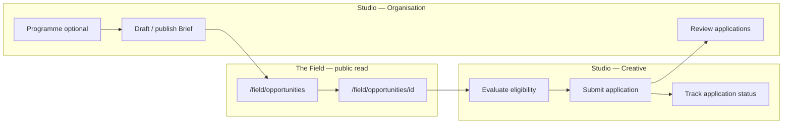

# Phase 2C PR1 — Opportunity Loop Implementation Plan

**Document status:** IMPLEMENTATION SOURCE OF TRUTH  
**Effective:** 31 May 2026  
**Branch:** `pr/phase2c-foundation`  
**Authority (highest → lowest):** [Phase 2 Blueprint — The Field](./phase-2-the-field-blueprint.md) (DRAFT) → [Phase 2 Architecture Decisions](./phase-2-architecture-decisions.md) (DRAFT) → [Phase 2C Opportunity Layer Blueprint](./phase-2c-opportunity-layer-blueprint.md) (DRAFT v0.3) → [Phase 2C Founder Decisions Freeze](./phase-2c-founder-decisions-freeze.md) (FROZEN per founder sign-off) → [Phase 2C Opportunity Layer Spec](./phase-2c-opportunity-layer-spec.md) (LOCKED per founder sign-off) → [DOCUMENT_GOVERNANCE.md](./DOCUMENT_GOVERNANCE.md)

**Predecessor:** Phase 2B Field Discovery — `checkpoint-phase2b-field-discovery` (recommended)

**Supersedes for implementation:** [phase-2c-pr1-plan.md](./phase-2c-pr1-plan.md) (P2C-4, SUPERSEDED). Founder resolutions in §Founder resolutions (v1.1).

**Constraints for this document:** No database schema. No migrations. No code. No API definitions. No file lists. No engineering task breakdown.

---

## 1. Objective

### 1.1 PR1 goal

Deliver the **first complete Opportunity Loop slice** through apply and org review — stopping before award, commission, and notifications:

```
Organisation → publish Opportunity (Brief)
Creative     → discover Opportunity on Field
Creative     → evaluate eligibility (deterministic rules)
Creative     → apply (Studio)
Organisation → review applications (Studio)
```

**PR1 north star:**

> A verified Organisation can publish an Opportunity to Field; a Creative can discover it through explainable filters, see deterministic eligibility and registry-evidence context, apply from Studio, and track submission; Organisation staff can review applications with the same registry-evidence context — **without** awards, commissions, notifications, collaboration runtime, or commerce.

### 1.2 Strategic alignment

PR1 implements **matching marketplace slice 1** (Creative ↔ Organisation) from the frozen package:

- **Opportunity** is the primary public product term; **Brief** is the publishable implementation unit.
- **Registry-backed trust** is visible at apply and review (AC-RE*).
- **Rule-based eligibility** — not algorithmic ranking (AC-MT*, AC-SC5).
- **Sector** + **practice** + **verification** + **participation mode** compose eligibility (founder freeze §6a).

### 1.3 Explicit PR1 non-goals

No awards, commissions, inbox/email notifications, Creative-originated publish, collaboration runtime, payments, messaging, recommendations, popularity signals, or Registry filing.

---

## 2. Opportunity Loop

### 2.1 Loop slice delivered in PR1



### 2.2 Terminus

PR1 ends at **submitted / under review / shortlisted / rejected / withdrawn** application states. The lifecycle state **accepted** (which leads to award) is **out of scope** until **PR2** (founder freeze §12).

### 2.3 Objects in PR1

| Object | PR1 role |
|--------|----------|
| **Opportunity** (taxonomy) | Public language; kinds on Brief type enum |
| **Programme** | Optional container — season/cohort framing |
| **Brief** | Primary published unit |
| **Application** | Creative response + org review queue |
| Award | **Excluded** |
| Commission | **Excluded** |
| Project / Record | **Excluded** (2D) |

---

## 3. Route Architecture

### 3.1 New Field routes (PR1)

| Route | Purpose | Auth |
|-------|---------|------|
| `/field/opportunities` | Opportunities index — cards, filters, explainable sort | Anonymous read |
| `/field/opportunities/[id]` | Opportunity detail — matching surface; apply CTA routes to Studio | Anonymous read; apply state auth-gated |
| `/field/programmes/[slug]` | Programme hub — linked published briefs | Anonymous read |

**Canonical vocabulary:** `/field/opportunities` — not `/field/open-calls` as primary namespace (founder freeze §8). Optional redirect alias is engineering convenience only.

### 3.2 Studio surfaces (PR1)

| Surface | Actor | Purpose |
|---------|-------|---------|
| Organisation workspace | Org admin/staff | Programme + Brief CRUD; publish/withdraw; application review queue |
| Creative workspace | Authenticated Creative | Sector declaration; eligible-opportunities surfacing; apply flow; my applications |

Apply **must not** execute on Field — AC-BR8, AC-AP1, AC-SR2.

### 3.3 Routes unchanged

2B explorers (`/field/explorer/*`), record/creative/org/collector presence URLs, Registry-primary record URLs — **no regression** (AC-GN4, AC-SR3).

### 3.4 Routes explicitly not added in PR1

| Route | Reason |
|-------|--------|
| `/field/commissions/[id]` | Commission object excluded |
| `/field/open-calls` (as primary) | Superseded by `/field/opportunities` |
| Global ranked `/field/search` | Rejected per 2B/2C — opportunities use dedicated filter vocabulary |
| Collaboration / team formation publish routes | AC-CB3 — 2D |

### 3.5 Field chrome

No Studio sidebar on Field (2A rule). No Field Registry mutations (AC-SR1).

---

## 4. Opportunity Publishing

### 4.1 Originator model (frozen)

**Organisation only** in PR1 (founder freeze §1a). Gallery publishing on behalf of represented Creatives does not change originator semantics.

### 4.2 Programme (optional)

| Capability | Spec binding |
|------------|--------------|
| Create, edit, draft, publish, archive | AC-PG1 |
| Standalone briefs without programme | AC-PG2 |
| Cannot publish empty programme | Founder freeze §2 |
| Public page lists published briefs only | AC-PG3 |
| Archive hides from discovery | AC-PG4 |
| Link to org profile when public | AC-PG5 |

### 4.3 Brief / Opportunity publish

Organisation admin/staff configure and publish **Brief** as the Opportunity unit.

| Field / control | Requirement |
|-----------------|-------------|
| **Opportunity kind** (brief type) | Open call, residency/award, direct commission, production partner search — AC-BR2 |
| **Sector** | Single required value from closed taxonomy — AC-SC1, AC-BR9 |
| **Practices required** | Closed 2B practice vocabulary on brief |
| **Participation mode** | Open (default verified public), roster-only, invite-only, direct — AC-BR3 |
| **Registry outcome expectation** | Plain copy on publish — AC-VT3 |
| **Application window** | Closing date when applicable — used in Field filters and open/closed status (blueprint discovery filters; spec §6.2) |
| **Eligibility rules** | Derived from participation mode + practice + sector rules — not a separate user-defined rules engine |

**Publishing gates:**

| Gate | Rule |
|------|------|
| Role | Org admin/staff |
| Verification | Verified org required for public opportunities listing — AC-BR7 |
| Subscription | Does **not** block first public publish — founder freeze §3 |
| Registry-outcome-required briefs | Verified org regardless of mode |

**Withdraw:** Removes from discovery; audit retained — AC-BR5.

### 4.4 Direct commission briefs in PR1

Direct commission briefs may be **published** in PR1. **Not** on public index. Named Creative sees party detail in Studio. **No** apply CTA. **No** award — AC-BR6 deferred to **PR2**.

### 4.5 Cultural presentation on publish

Published copy must satisfy AC-CP1–AC-CP5 (opportunity vocabulary, programme-as-season, production partner search language, registry outcome framing, no popularity signals).

---

## 5. Opportunity Discovery

### 5.1 Index (`/field/opportunities`)

| Capability | Rule |
|------------|------|
| Opportunity cards | Title, org context, sector, kind, practices, closing/open status — **no** application counts |
| Filters (AND composition) | Sector, practice, organisation, programme, opportunity kind, closing date window, verified org toggle — AC-OC2 |
| Sort | Closing date, published date, title — AC-OC6 |
| Search | Optional text `q` — title, org name, programme name, public description; AND with facets; no relevance ranking — AC-OC8 |

### 5.2 Detail (`/field/opportunities/[id]`)

Matching surface ordering (AC-OC7, AC-BR4):

1. Org verification + publisher footprint  
2. Sector, practices required  
3. Registry outcome expectation  
4. Programme context (if any)  
5. Scope, timeline, application window  
6. Apply CTA (auth-gated eligible Creative only — AC-AP7, AC-BR8)

### 5.3 Programme hub (`/field/programmes/[slug]`)

Season/cohort framing — AC-CP2. Lists published briefs with links to opportunity detail — AC-PG3.

### 5.4 Explorer IA

Add **Opportunities** entry to Field hub — Records remain default tab (founder freeze §6, AC-OC*).

### 5.5 Anti-features on discovery

| Excluded | AC |
|----------|-----|
| Recommendations / similar rows | AC-OC5 |
| Popularity / application-count sort | AC-OC6, AC-VT2 |
| Algorithmic ranking | AC-MT4, founder freeze §6 |
| Pay-to-boost placement | ADR-17 |

---

## 6. Eligibility Model

### 6.1 Deterministic rules (frozen)

Eligibility for apply is the **conjunction** of:

| Input | Rule |
|-------|------|
| **Participation mode** | Open / roster / invite / direct — AC-AP2 |
| **Practice** | AC-PR1, AC-PR2 — any-match; declared ∪ registry-evidence |
| **Sector** | AC-SC5 Culture wildcard — founder freeze §6a |
| **Verification** | Gates per brief/org policy |
| **Application window** | Brief accepting responses (not withdrawn/closed) |

**Sector rule (AC-SC5)** — eligible when **any** of:

- **A.** Creative `sectors[]` intersects Brief `sector`  
- **B.** Creative declares **Culture**  
- **C.** Brief `sector` is **Culture**

Practice and sector both required in addition to other gates (spec §6a.2).

### 6.2 Where eligibility appears

| Surface | Behaviour |
|---------|-----------|
| **Studio — Creative** | Eligible opportunities section — AC-MT1 |
| **Field — opportunity detail** | Apply state for authenticated eligible Creative only — AC-AP7 |
| **Field — public index** | Browse all public opportunities independent of personal eligibility — AC-MT5 |

### 6.3 Eligibility visibility states

**Founder decision:** **Eligible / Not eligible only** — no partial-match tier.

| State | Studio eligible list | Field opportunity detail (authenticated) |
|-------|---------------------|------------------------------------------|
| **Eligible** | Shown — AC-MT1 | Apply CTA to Studio — AC-AP7 |
| **Not eligible** | Neutral omission — AC-MT2 | Apply blocked; may show not eligible (not a third tier) |

See spec §6a.2, AC-MT*, AC-PR*, AC-SC5.

### 6.4 Studio eligible list

| Rule | AC |
|------|-----|
| Deterministic — same inputs → same result | AC-MT3 |
| No “best match” score | AC-MT4 |
| Sort by closing date / published date only | spec §6a.2 |

### 6.5 Creative sector profile

Creative declares **multiple** sectors on Studio profile — AC-SC3. Required for sector eligibility.

---

## 7. Applications

### 7.1 Apply flow (Studio — Creative)

| Step | Requirement |
|------|-------------|
| Entry | From Field apply CTA or Studio eligible list |
| Registry evidence | Portfolio preview before submit — AC-RE1 |
| Content | Statement, declared practice fit; **no attachments in PR1** |
| Submit | Authenticated Creative owner — AC-AP1 |
| After submit | **Locked** — no edit; Creative may **withdraw** |
| One active application | Per Creative per brief — AC-AP3 |

### 7.2 Application visibility

| Audience | Access |
|----------|--------|
| Applicant + org staff | Studio — AC-AP4 |
| Public Field | **No** application content — AC-AP4, AC-RE4 |

### 7.3 Creative — my applications

Creative can view submitted applications and lifecycle status in Studio (submitted, under review, shortlisted, rejected, withdrawn). **Accepted** state and award linkage — out of scope (**PR2**).

### 7.4 Organisation — review queue

| Capability | Rule |
|------------|------|
| View applications | Org staff for own briefs — AC-AP5 |
| Registry evidence | Applicant portfolio visible at review — AC-RE2 |
| Shortlist / reject | Manual — AC-AP5 |
| Filter assist | By declared + registry-evidence practice — manual, not auto-reject |
| Auto-rank / auto-reject | **Forbidden** — AC-AP6 |

**Out of scope in PR1:** Mark application **accepted** (award trigger), award UI, commission creation.

### 7.5 Application lifecycle in PR1

```
draft → submitted → under review → shortlisted | rejected | withdrawn
```

States beyond shortlisted toward **accepted → award** are **not** implemented in PR1.

### 7.6 Direct / invite / roster participation

| Mode | PR1 apply behaviour |
|------|---------------------|
| Open | Apply when eligibility passes |
| Roster-only | Apply blocked unless on roster — AC-AP2 |
| Invite-only | Apply blocked unless invited — AC-AP2 |
| Direct | No application window; party Studio read only; award PR2 |

---

## 8. Registry-backed Trust

### 8.1 Trust hierarchy (inherit 2A/2B)

Record verification > certificate > continuity > participation > org badge. Opportunity popularity signals forbidden.

### 8.2 Registry evidence at matching moment

| Moment | Requirement | AC |
|--------|-------------|-----|
| Apply preview | Verified records + practices distinguished from declared-only | AC-RE1, AC-RE3 |
| Org review | Same portfolio alongside application | AC-RE2 |
| Public Field | No private application or portfolio leakage | AC-RE4 |

### 8.3 Opportunity detail trust signals

Org verification badge, publisher footprint, registry outcome expectation before transactional detail — AC-VT1, AC-VT3, AC-BR4, AC-OC7.

### 8.4 Collaboration taxonomy (strategic only)

Opportunity taxonomy **documents** Collaboration Request and Team Formation Request as planned kinds — AC-CB2. **No** Creative-originated publish or peer matching runtime — AC-CB1, AC-CB3.

---

## 9. Studio vs Field Responsibilities

| Concern | Field | Studio |
|---------|-------|--------|
| Read opportunities index + detail | ✓ | — |
| Programme hub read | ✓ | — |
| Programme / Brief CRUD | — | ✓ Organisation |
| Publish / withdraw | — | ✓ Organisation |
| Eligible opportunities list | — | ✓ Creative |
| Apply | — | ✓ Creative |
| My applications | — | ✓ Creative |
| Review / shortlist / reject | — | ✓ Organisation |
| Registry ledger mutation | **Never** | Via existing Registry RPCs only — unchanged |
| Notifications | — | **Excluded PR1** (AC-NT* deferred) |

**Division binding:** AC-SR1–AC-SR3.

---

## 10. Rollout Sequence

Product increments only — no engineering task breakdown.

```
Step 0   Governance: freeze FROZEN + spec LOCKED confirmed
    │
Step 1   Studio — Programme CRUD (draft/publish/archive)
    │      Exit: AC-PG1, AC-PG2
    │
Step 2   Studio — Brief CRUD + sector + practices + participation mode + types
    │      Exit: AC-BR1–AC-BR3, AC-BR9, AC-SC1
    │
Step 3   Publishing gates + withdraw
    │      Exit: AC-BR5, AC-BR7
    │
Step 4   Field — programme hub + opportunity detail (matching surface)
    │      Exit: AC-PG3–AC-PG5, AC-BR4, AC-OC7, AC-CP*
    │
Step 5   Field — opportunities index + filters + hub IA
    │      Exit: AC-OC1–AC-OC6, AC-SC2, AC-GN1–AC-GN3
    │
Step 6   Creative — sector profile + eligibility surfacing
    │      Exit: AC-SC3–AC-SC5, AC-MT1–AC-MT5
    │
Step 7   Creative — apply flow + registry evidence preview
    │      Exit: AC-AP1–AC-AP4, AC-AP7, AC-RE1, AC-RE3, AC-RE4, AC-BR8
    │
Step 8   Organisation — review queue + registry evidence at review
    │      Exit: AC-AP5–AC-AP6, AC-RE2
    │
Step 9   Trust + graph + collaboration boundary + i18n
    │      Exit: AC-VT1–AC-VT3, AC-GN4, AC-CB*, AC-SR*, locale keys
    │
Step 10  PR1 acceptance notes + 2B regression signoff
```

**Parallel forbidden in PR1:** Award, commission, notification, messaging, payment UI.

---

## 11. Acceptance Criteria

Direct mapping to frozen spec. PR1 **must pass** all listed criteria. Criteria for excluded trains are **not** PR1 gates.

### 11.1 Programme — AC-PG*

| ID | PR1 |
|----|-----|
| AC-PG1 | ✓ |
| AC-PG2 | ✓ |
| AC-PG3 | ✓ |
| AC-PG4 | ✓ |
| AC-PG5 | ✓ |

### 11.2 Brief — AC-BR*

| ID | PR1 | Notes |
|----|-----|-------|
| AC-BR1 | ✓ | |
| AC-BR2 | ✓ | No patron/sale/collaboration **types** |
| AC-BR3 | ✓ | |
| AC-BR4 | ✓ | Matching surface |
| AC-BR5 | ✓ | |
| AC-BR6 | **Deferred** | Requires award — **PR2** |
| AC-BR7 | ✓ | |
| AC-BR8 | ✓ | Apply CTA → Studio |
| AC-BR9 | ✓ | Single sector |

### 11.3 Sector — AC-SC*

| ID | PR1 |
|----|-----|
| AC-SC1 | ✓ |
| AC-SC2 | ✓ |
| AC-SC3 | ✓ |
| AC-SC4 | ✓ |
| AC-SC5 | ✓ |

### 11.3a Practice — AC-PR*

| ID | PR1 |
|----|-----|
| AC-PR1 | ✓ |
| AC-PR2 | ✓ |

### 11.4 Applications — AC-AP*

| ID | PR1 | Notes |
|----|-----|-------|
| AC-AP1 | ✓ | |
| AC-AP2 | ✓ | |
| AC-AP3 | ✓ | |
| AC-AP4 | ✓ | |
| AC-AP5 | ✓ | Shortlist/reject — not accept/award |
| AC-AP6 | ✓ | |
| AC-AP7 | ✓ | |

### 11.5 Awards — AC-AW*

| ID | PR1 |
|----|-----|
| AC-AW1–AC-AW5 | **Excluded** — **PR2** |

### 11.6 Commissions — AC-CM*

| ID | PR1 |
|----|-----|
| AC-CM1–AC-CM5 | **Excluded** — **PR2** |

### 11.7 Opportunities discovery — AC-OC*

| ID | PR1 |
|----|-----|
| AC-OC1–AC-OC8 | ✓ |

### 11.8 Eligibility matching — AC-MT*

| ID | PR1 |
|----|-----|
| AC-MT1–AC-MT5 | ✓ |

### 11.9 Registry evidence — AC-RE*

| ID | PR1 |
|----|-----|
| AC-RE1–AC-RE4 | ✓ |

### 11.10 Cultural presentation — AC-CP*

| ID | PR1 |
|----|-----|
| AC-CP1–AC-CP5 | ✓ |

### 11.11 Collaboration boundary — AC-CB*

| ID | PR1 |
|----|-----|
| AC-CB1 | ✓ |
| AC-CB2 | ✓ | Taxonomy/docs/copy — no runtime |
| AC-CB3 | ✓ |

### 11.12 Notifications — AC-NT*

| ID | PR1 |
|----|-----|
| AC-NT1–AC-NT3 | **Excluded** — **PR2** |

### 11.13 Trust — AC-VT*

| ID | PR1 | Notes |
|----|-----|-------|
| AC-VT1 | ✓ | |
| AC-VT2 | ✓ | |
| AC-VT3 | ✓ | |
| AC-VT4 | **N/A** | No commission UI |

### 11.14 Graph — AC-GN*

| ID | PR1 |
|----|-----|
| AC-GN1–AC-GN4 | ✓ |

### 11.15 Studio / Field / Registry — AC-SR*

| ID | PR1 | Notes |
|----|-----|-------|
| AC-SR1 | ✓ | |
| AC-SR2 | ✓ | |
| AC-SR3 | ✓ | |
| AC-SR4 | ✓ | No award in PR1 — vacuously satisfied |

---

## 12. Validation

Product-level validation before PR1 merge — engineering harness details belong in a separate execution package (not this document).

| Check | Expectation |
|-------|-------------|
| **2B regression** | Record/Creative/Org explorers and search contract unchanged — AC-GN4, AC-SR3 |
| **Registry smoke** | No registration/verify regression |
| **Anti-feature audit** | No payments, messaging, recommendations, application counts on cards, Field ledger writes |
| **Publish → discover** | Published brief visible on `/field/opportunities` with sector + matching surface |
| **Eligibility determinism** | Same Creative + Brief inputs → same eligibility — AC-MT3 |
| **Apply path** | Field CTA → Studio apply; no anonymous submit — AC-BR8, AC-AP1 |
| **Review path** | Org sees application + registry-evidence portfolio — AC-AP5, AC-RE2 |
| **Private profiles** | Neutral omission when graph target private — AC-GN3 |
| **i18n** | New public opportunity strings in en/de/fr/ja before tag |
| **Cultural copy grep** | No primary “job/vacancy/RFP” labels — AC-CP1 |

---

## 13. Exclusions

Explicitly **must not** appear in PR1:

| Exclusion | Phase / AC |
|-----------|--------------|
| Awards | **PR2** — AC-AW* |
| Commissions | **PR2** — AC-CM* |
| Notifications (inbox/email) | **PR2** — AC-NT* |
| Collaboration Request runtime | 2D — AC-CB3 |
| Team Formation Request runtime | 2D — AC-CB3 |
| Creative-originated publish | 2D — AC-CB1 |
| Collector / patron opportunities | 2E |
| Messaging, chat, DMs | Permanent |
| Payments, escrow, checkout | 2E |
| Marketplace / sale listings | 2E |
| Recommendations, similarity, “for you” | ADR-20-A |
| Platform auto-match scores | ADR-19-C |
| Pay-to-boost | ADR-17 |
| Application fees | Rejected |
| Popularity signals | AC-CP5, AC-VT2 |
| Project / production runtime | 2D |
| Registry filing on apply | Permanent — AC-SR4 |
| Direct commission **award** | **PR2** — AC-BR6 |
| Application **accepted → award** transition | **PR2** |

---

## 14. Checkpoint Recommendation

| Tag | When |
|-----|------|
| `checkpoint-phase2c-pr1-opportunity-loop` | After PR1 staging acceptance — **recommended name** reflecting expanded loop slice (publish → apply → review) |
| `checkpoint-phase2c-field-opportunity` | **Full 2C only** — after PR3 (acceptance, audit) |

Do **not** tag full 2C checkpoint at PR1.

**PR1 deliverables (governance):**

| Deliverable | Owner |
|-------------|-------|
| PR1 acceptance notes | Engineering + product |
| PR1 signoff matrix (this §11) | Product |
| Staging QA scripts (product scenarios) | Product |

---

## Founder resolutions (v1.1 — 31 May 2026)

| # | Decision | Resolution |
|---|----------|------------|
| **1** | P2C-6 vs P2C-4 | **P2C-6 supersedes P2C-4.** PR1 = Publish → Discover → Eligibility → Apply → Review. Freeze §12 resequenced; awards/notifications → PR2. |
| **2** | Eligibility states | **Eligible / Not eligible only.** No partial-match tier. AC-MT1/M2. |
| **3** | Opportunity search | **Filterable text `q` only** on `/field/opportunities`; AND with facets; no ranking — AC-OC8. |
| **4** | Practice eligibility | **AC-PR1/PR2** — any-match; declared ∪ registry-evidence; empty brief list passes. |
| **5** | Attachments | **None in PR1.** Deferred 2C.1. |
| **6** | Edit after submit | **Locked after submit;** withdraw allowed; resubmit deferred 2C.1. |
| **7** | Governance promotion | Freeze **FROZEN** v0.4; spec **LOCKED** v0.4 — 31 May 2026. |
| **8** | Direct commission | Publish + party Studio read in PR1; no apply; no award until **PR2**. |

All prior open ambiguities **closed**.

---

## Related documents

| Document | Role |
|----------|------|
| [phase-2c-opportunity-layer-spec.md](./phase-2c-opportunity-layer-spec.md) | AC source of truth |
| [phase-2c-founder-decisions-freeze.md](./phase-2c-founder-decisions-freeze.md) | Philosophy |
| [phase-2c-opportunity-layer-blueprint.md](./phase-2c-opportunity-layer-blueprint.md) | Architecture |
| [phase-2c-pr1-plan.md](./phase-2c-pr1-plan.md) | Prior product plan — superseded where conflicting |
| [phase-2b-pr4-acceptance-signoff.md](./phase-2b-pr4-acceptance-signoff.md) | Predecessor gate |

---

## Revision history

| Version | Date | Status | Notes |
|---------|------|--------|-------|
| 1.0 | 31 May 2026 | IMPLEMENTATION SOURCE OF TRUTH | Initial PR1 plan — publish, discover, eligibility, apply, review |
| 1.1 | 31 May 2026 | IMPLEMENTATION SOURCE OF TRUTH | Founder resolution pass — all ambiguities closed |
