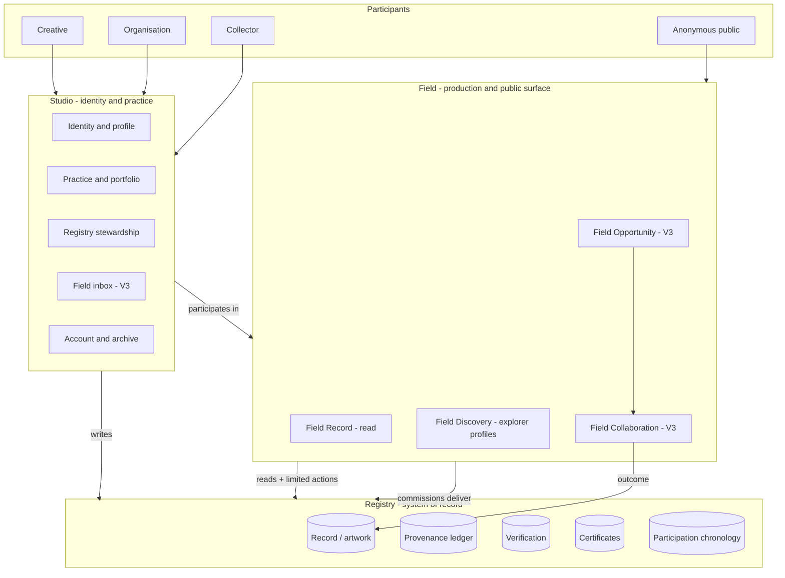
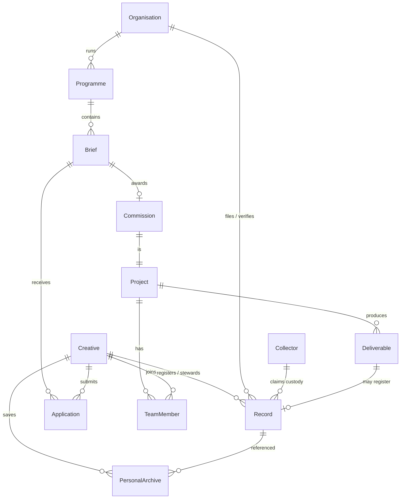
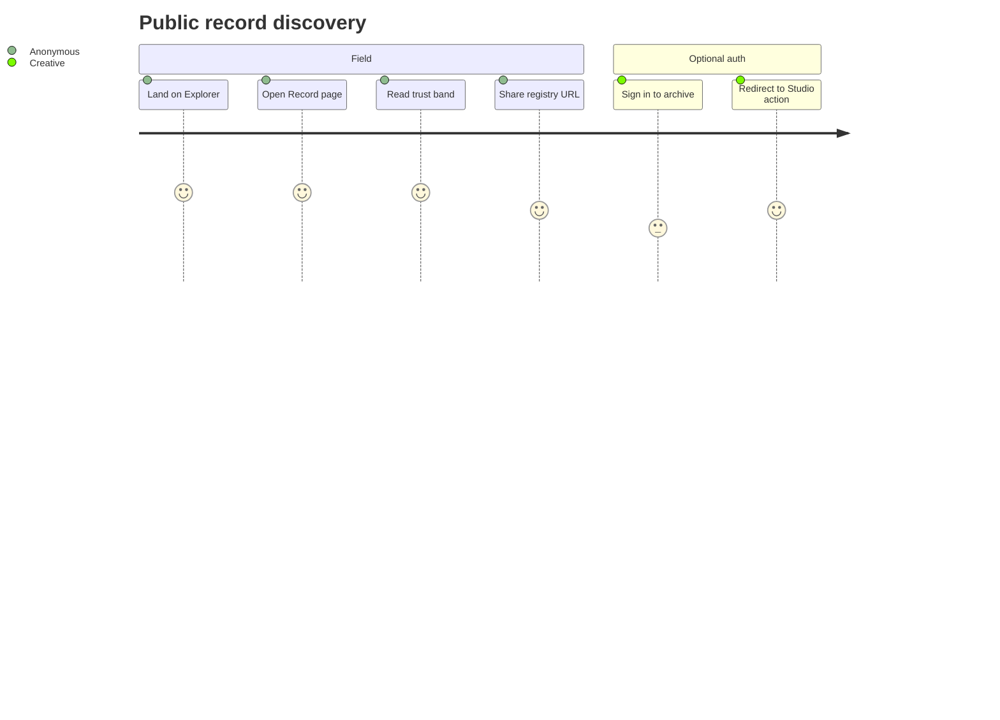
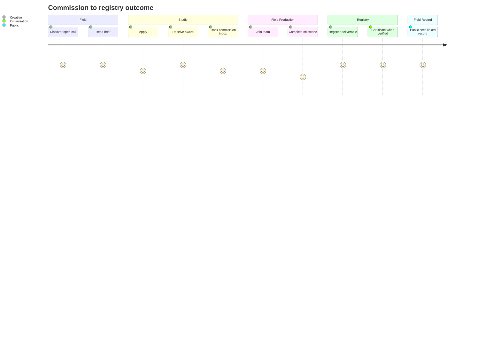
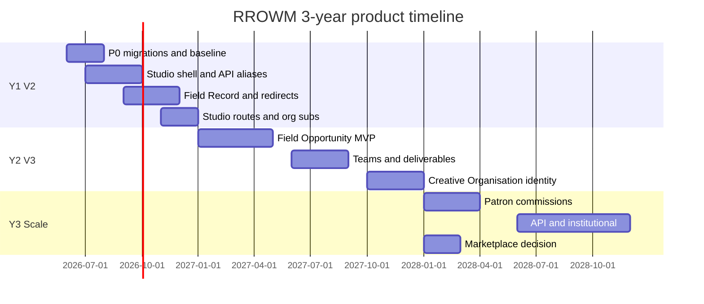
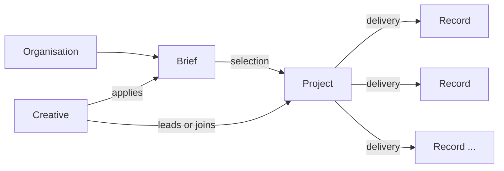
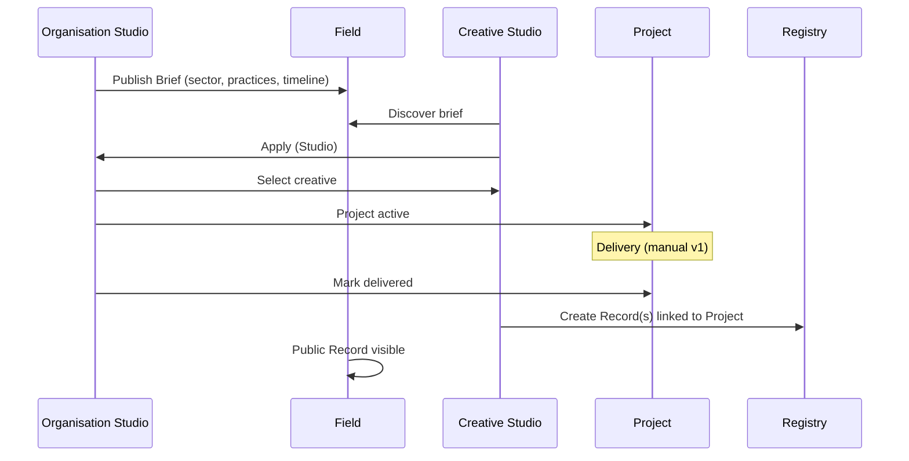
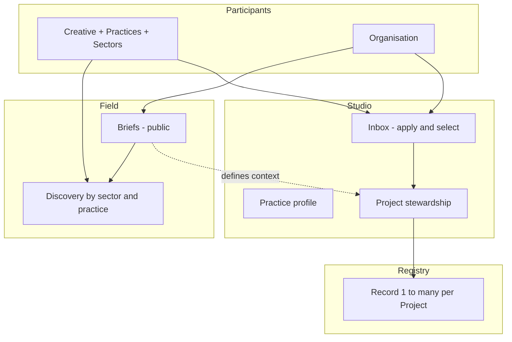

# RROWM Product Blueprint v1.1

**Document status:** APPROVED  
**Frozen:** 31 May 2026  
**Version:** 1.1  
**Horizon:** 2026–2029 (V2 restructure → V3 Field production → identity evolution → scale)  
**Audience:** Founders, product, design, engineering leads  
**Constraint:** Preserve all existing registry functionality; evolve product layers without rewriting the ledger

**Change control:** Amendments to v1.1 require explicit founder approval and a new version number. Phase 1 and later phases must not reinterpret scope without a new blueprint version.

**Composition:** Part I (base blueprint) + Part II (founder amendments v1.1). Where Part II conflicts with Part I, **Part II prevails**.

---

# Part I — Product Blueprint (base)

## Executive summary

RROWM is **infrastructure for cultural memory** organised as three layers:

| Layer | Long-term role | Monetisation posture |
|-------|----------------|----------------------|
| **Registry** | Trust, provenance, verification, enduring record | Indirect — enables premium Field & Studio value |
| **Field** | Public discovery, verification, opportunities, production | Transaction & listing fees; org subscriptions |
| **Studio** | Identity, practice, stewardship, inbox | Seat-based org plans; patron/collector tools |

**North star (3 years):** A creative or organisation can **brief, collaborate, deliver, and register** a work on one platform where the **Registry record is the trusted outcome**, not an afterthought.

**Near-term (V2):** Rename routes and unify Studio chrome — zero ledger change.  
**Mid-term (V3):** Field Opportunity network + Creative / Organisation identity.  
**Long-term:** Multi-discipline production teams, patron commissions, institutional verification marketplace, API/registry-as-service for partners.

---

## 1. Ecosystem map



### Layer responsibilities

| Layer | Owns | Does not own |
|-------|------|--------------|
| **Registry** | Record truth, ledgers, certs, verification state, disputes evidence on record | User profiles, briefs, chat, social graph |
| **Field** | Public read, discovery, verify, opportunities, teams, deliverables (V3) | Private portfolio editing, account deletion |
| **Studio** | Auth identity, practice, stewardship UI, inbox, personal archive, lifecycle | Ledger writes without Registry RPCs |

### Ops plane (outside product layers)

| Surface | Purpose |
|---------|---------|
| `/admin`, `/internal/*` | Platform ops, verify queue, replay debugger |
| Cron jobs | Deletion finalisation, export processing |
| Service role | Anchors, lifecycle, atomic RPCs |

---

## 2. Core objects

### 2.1 Object catalogue

| Object | Definition | Layer home | Current DB | V3 DB |
|--------|------------|------------|------------|-------|
| **Creative** | Individual cultural practitioner | Studio | `actor_profiles` + `artists` | + practice types |
| **Organisation** | Entity that programmes, commissions, verifies | Studio | `actor_profiles` + `galleries` + `gallery_users` | + `organisation_kind` |
| **Collector** | Custodian / patron of record | Studio | `actor_profiles` + `collector_profiles` | unchanged class |
| **Record** | Canonical registry artwork | Registry | `artworks` (+ ledgers) | + optional `field_commission_id` |
| **Project** | Production effort delivering outcome(s) | Field (V3) | — (implicit in commissions) | `field_commissions`, `field_collaborations` |
| **Brief** | Structured production request | Field (V3) | — | `field_briefs` |
| **Programme** | Org-scoped container for briefs / open calls | Field (V3) | — | `field_programmes` (recommended) |

### 2.2 Creative

**Purpose:** Represent a person’s identity and practice — authorship, capabilities, public presence, portfolio, registry stewardship.

| Attribute | V2 (today) | V3 (target) |
|-----------|------------|-------------|
| Account class | `artist` | `creative` |
| Profile | `artists` row (PK = user_id) | + `practice_types[]`, capabilities |
| Public surface | `/artist/[slug]` → Field | `/field/creative/[slug]` |
| Studio home | `/studio` → `/studio/artist` | `/studio/creative` |
| Registry role | Register works, confirm representation, auth invites | Same + team roles on Field projects |

**Supported practices (V3 vision):** artist, filmmaker, curator, photographer, production designer, set designer, fabricator, creative director, spatial designer — as **practice types**, not separate account types.

### 2.3 Organisation

**Purpose:** Entity that runs programmes, publishes briefs, commissions work, files catalogue records, verifies works, manages roster.

| Attribute | V2 | V3 |
|-----------|----|----|
| Account class | `gallery` | `organisation` |
| Profile | `galleries` + `gallery_users` | + `organisation_kind` (gallery, museum, studio, festival, brand, production co.) |
| Public surface | `/institutional-studio/[slug]` | `/field/organisation/[slug]` |
| Studio home | `/institutional-studio-dashboard` | `/studio/organisation` |
| Registry role | Institution filing, verify, representation | Same + brief → commission → record bridge |

**Note:** “Gallery” remains a valid `organisation_kind`, not the whole category.

### 2.4 Collector

**Purpose:** Custody narrative, collection stewardship, ownership claims, optional patronage (V3+).

| Attribute | V2 | V3+ |
|-----------|----|-----|
| Account class | `collector` | `collector` (unchanged) |
| Profile | `collector_profiles` | + patron commission participation |
| Public surface | `/collector-studio/[slug]` if public | `/field/collector/[slug]` |
| Studio home | `/collector-studio` | `/studio/collector` |
| Registry role | Ownership claim, continuity transfer, vault | Patron briefs (optional product line) |

### 2.5 Record

**Purpose:** The enduring registry entry — identity, metadata hash, verification status, participation chronology, link to production outcome.

| Attribute | Detail |
|-----------|--------|
| Identifier | `registry_id` (e.g. `RROWM-…`) — **permanent public key** |
| Truth | `artworks` + append-only ledgers |
| Read model | `artwork_read_model` view for lists |
| Field presentation | `/field/record/[registry_id]` |
| Trust | Verification status, certificate RPC, continuity summary |

**Record ≠ Project:** A project may produce zero or one primary Record; a Record may exist without a Field project (direct Studio registration).

### 2.6 Brief

**Purpose:** Structured request for cultural production — scope, timeline, disciplines, deliverables, compensation band (optional), registry outcome requirement.

| Attribute | V3 |
|-----------|-----|
| Parent | Organisation (Programme optional) |
| States | draft → published → withdrawn |
| Public | Open call listing on Field |
| Applications | Creative applies via Studio |
| Outcome | May require Record registration on delivery |

### 2.7 Programme

**Purpose:** Organisation-scoped umbrella for related briefs — exhibition season, residency, production slate, festival line.

| Attribute | V3 recommendation |
|-----------|-------------------|
| Owner | Organisation |
| Contains | Multiple briefs / open calls |
| Public | Programme page on Field linking to briefs |
| Analytics | Org Studio: programme performance |

*Programme is a V3 conceptual object — recommend `field_programmes` table rather than overloading `galleries`.*

### 2.8 Project

**Purpose:** Active production container — awarded commission or peer collaboration with team, milestones, deliverables.

| Attribute | V3 |
|-----------|-----|
| Types | Commission (org-led), Collaboration (peer-led) |
| Team | `field_project_teams`, `field_team_members` |
| Milestones | `field_milestones`, `field_deliverables` |
| Registry link | Deliverable → `artworks.id` when filed |

**Relationship to existing `market_listings`:** Marketplace sale is a **Registry-adjacent commerce path**; Field Project is **production orchestration**. See §12 contradictions.

---

## 3. Relationships between objects



### Relationship rules

| From | To | Cardinality | Rule |
|------|-----|-------------|------|
| Organisation | Brief | 1:N | Org admin/staff creates |
| Brief | Commission | 1:0..1 | Award creates commission |
| Commission | Project | 1:1 | Project is runtime of commission |
| Project | Record | 0..1 | Nullable until deliverable filed |
| Creative | Organisation | N:M | Roster via invites; per-work representation separate |
| Record | Participation | 1:N | Append-only confirmation events |
| Collector | Record | 0:N | Via ownership ledger, not ownership of Field project |

**Registry participation ≠ Field team membership:** Team roles are production metadata; authorship/institution filing appears in Registry chronology via existing RPCs.

---

## 4. User journeys

### 4.1 Journey map (3-year)

| # | Journey | Primary layer | Phase |
|---|---------|---------------|-------|
| J1 | Discover verified record | Field: Record | V2 |
| J2 | Register as Creative / Organisation / Collector | Studio + Registry | Live |
| J3 | Artist self-register artwork | Studio → Registry | Live |
| J4 | Organisation file catalogue work | Studio → Registry | Live |
| J5 | Verify work + issue certificate | Studio → Registry | Live |
| J6 | Collector claim ownership | Field CTA → Studio → Registry | Live |
| J7 | Provenance continuity transfer | Field invite → Registry | Live |
| J8 | Representation confirm / amend | Studio → Registry | Live |
| J9 | Personal archive work | Studio | Live (needs migration) |
| J10 | Publish open call → apply → award | Field + Studio | V3.0 |
| J11 | Multi-role commission → deliver → register | Field + Studio + Registry | V3.1 |
| J12 | Patron commission (collector) | Field + Studio | V3.3 |
| J13 | Account deactivate / export / delete | Studio | Live |
| J14 | Dispute record integrity | Registry (+ Studio) | Live |

### 4.2 Signature journey — V2 (Field Record)



### 4.3 Signature journey — V3 (Opportunity → Record)



### 4.4 Journey principles

1. **Field never mutates ledger directly** — always Registry API / RPC.
2. **Studio never mimics social feed** — inbox is transactional (applications, invites, stewardship).
3. **Collectors enter through custody**, not production — unless V3 patron line.
4. **Organisations enter through programmes**, not explorer admin.

---

## 5. Revenue opportunities

### 5.1 Revenue model canvas

| Stream | Layer | Buyer | Phase | Notes |
|--------|-------|-------|-------|-------|
| **Organisation subscription** | Studio | Organisation | Live scaffold | `galleries.subscription_status` exists; `GalleryPricingModal` on get-started — **not fully monetised** |
| **Verified organisation tier** | Registry + Field | Organisation | V2+ | `galleries.verified` — premium verify authority, priority Field placement |
| **Open call / brief posting** | Field | Organisation | V3 | Per brief or programme subscription bundle |
| **Commission facilitation fee** | Field | Organisation or split | V3 | % on awarded commission value band (optional) |
| **Registry filing fee** | Registry | Organisation / Creative | V3 optional | Per record beyond free tier |
| **Certificate issuance** | Registry | Participant | Future | Per cert or included in subscription |
| **Marketplace listing** | Field-adjacent | Seller | Live DB | `market_listings`, `market_enquiries`, `complete_market_sale` — **productise or deprecate** |
| **Collector vault / export** | Studio | Collector | Future | Premium storage or enhanced export |
| **API / registry-as-service** | Registry | Partners | Year 3+ | Read API, webhook anchors, white-label verify |
| **Institutional audit / replay** | Registry | Enterprise | Year 2+ | `system_integrity_report`, replay tooling |

### 5.2 Recommended monetisation sequence

| Year | Focus | Rationale |
|------|-------|-----------|
| **Y1 (V2)** | Organisation subscription + verified tier | Builds on existing gallery accounts; no Field DB needed |
| **Y2 (V3.0–3.1)** | Brief/programme posting + commission facilitation | Field Opportunity MVP with clear B2B value |
| **Y2–Y3** | Marketplace decision | Integrate as Field: Commerce **or** narrow to Registry sale completion only |
| **Y3** | API / institutional | High-trust Registry brand enables B2B |

### 5.3 Revenue principles

- **Never sell trust** — verification authority is subscription/credential-bound, not pay-to-verify without attestation.
- **Field monetises motion**; **Registry monetises permanence**; **Studio monetises identity/seats**.
- **No engagement monetisation** — no promoted posts, boosted likes, or algorithmic ads.

---

## 6. Future expansion opportunities

### 6.1 Product expansion (Years 2–3)

| Opportunity | Layer | Description |
|-------------|-------|-------------|
| **Multi-discipline teams** | Field | Full crew templates (film, exhibition, spatial) |
| **Programme seasons** | Field | Recurring org programmes with alumni records |
| **Patron commissions** | Field + Collector Studio | Collector-funded briefs with registry outcome |
| **Residencies & awards** | Field | Brief type templates with jury workflow |
| **Fabrication RFPs** | Field | Technical brief → fabricator matching |
| **Cross-org collaborations** | Field | Co-commission between two organisations |
| **Public programme pages** | Field | Embedded open calls for org websites |
| **Registry continuity API** | Registry | Third-party verify + provenance read |
| **Anchor notarisation** | Registry | `record_anchors` productised for legal/adjacent |
| **Regional Field hubs** | Field | Geo-filtered discovery (discipline + city) |
| **Education / accreditation** | Studio | Institution-verified practice credentials |

### 6.2 Geographic & institutional expansion

- Museum and festival `organisation_kind` templates  
- Multi-language Field briefs (build on existing i18n)  
- Currency and compensation bands in briefs (extend `formatCurrency` patterns)

### 6.3 Platform expansion

- Mobile-optimised Field verify (QR-first)  
- Email programme digests (not social notifications)  
- Webhook events: commission awarded, record verified, ownership transferred  
- Partner embed: Field Record iframe / oEmbed for press

### 6.4 Explicit non-expansion (guardrails)

- Social network (follow graph, feeds, DMs as product core)  
- NFT/blockchain as primary trust model (anchors remain optional ops)  
- Generic freelance marketplace competing with Upwork/Fiverr positioning  
- Replacing legal title transfer — RROWM remains cultural record, not land registry

---

## 7. Screens and routes inventory

### 7.1 Route taxonomy (target state)

#### Marketing & auth (layer-agnostic)

| Route | Purpose | Phase |
|-------|---------|-------|
| `/` | Landing | Live |
| `/about`, `/contact`, `/terms`, `/privacy`, `/disclaimer` | Marketing / legal | Live |
| `/get-started` | Role selection | Live |
| `/signup`, `/signup/complete`, `/login`, `/logout`, `/reset-password` | Auth | Live |
| `/onboarding` | Profile completion | Live |
| `/auth/callback` | OAuth / verify callback | Live |

#### Field: Record (V2 target)

| Route | Maps from | Phase |
|-------|-----------|-------|
| `/field/explorer` | `/registry` | V2.1 |
| `/field/record/[registry_id]` | `/registry/[id]`, `/artwork/[id]` | V2.1 |
| `/field/verify/[registry_id]` | `/verify/[id]` | V2.1 |
| `/field/certificate/[registry_id]` | `/certificate/[id]` (auth) | V2.1 optional |
| `/field/creative/[slug]` | `/artist/[slug]` | V2.1 |
| `/field/organisation/[slug]` | `/institutional-studio/[slug]`, `/gallery/[slug]` | V2.1 |
| `/field/collector/[slug]` | `/collector-studio/[slug]` | V2.1 |

#### Field: Opportunity (V3)

| Route | Purpose |
|-------|---------|
| `/field/open-calls` | Public listing |
| `/field/open-calls/[id]` | Brief detail |
| `/field/programmes/[slug]` | Org programme page |
| `/field/commissions/[id]` | Party-visible commission status (auth) |

#### Studio (V2 target)

| Route | Maps from | Role |
|-------|-----------|------|
| `/studio/creative` | `/studio` | Creative |
| `/studio/collector` | `/collector-studio` | Collector |
| `/studio/organisation` | `/institutional-studio-dashboard` | Organisation |
| `/studio/account` | `/account` | All |
| `/studio/archive` | `/personal-archive` | All |
| `/studio/creative/inbox` | — | V3 Creative |
| `/studio/organisation/programmes` | — | V3 Organisation |
| `/studio/collector/works/[registry_id]` | `/collector-studio/artwork/[id]` | Collector |

#### Invite & continuity (transitional)

| Route | Purpose |
|-------|---------|
| `/authenticate-record` | Artwork auth invite |
| `/provenance/accept` | Provenance transfer |
| `/disputes/[id]` | Dispute detail |

#### Ops

| Route | Purpose |
|-------|---------|
| `/admin` | Admin login / dashboard |
| `/internal/verify` | Verify queue |
| `/internal/replay-debugger` | Integrity replay |

### 7.2 Screen count summary

| Layer | Live screens | V2 add/merge | V3 add |
|-------|--------------|--------------|--------|
| Marketing & auth | ~15 | 0 | 0 |
| Field | ~8 public | +6 merged routes | +5 opportunity |
| Studio | ~12 private | +4 route aliases | +6 inbox/programme |
| Ops | 3 | 0 | 0 |
| **Total** | ~38 | ~10 refactored | ~11 new |

### 7.3 Redirect policy

Maintain **301 redirects** from all live routes for ≥2 release cycles (documented in V2 roadmap).

---

## 8. Database ownership map

### 8.1 Ownership by layer

| Layer | Owns tables | Reads tables | Must not write |
|-------|-------------|--------------|----------------|
| **Registry** | `artworks`, `ownership_events`, `value_events`, `verification_events`, `certificates`, `ownership_claims`, `provenance_transfers`, `disputes`, `dispute_evidence`, `artwork_representation_*`, `artwork_confirmation_events`, `representation_amendment_requests`, `gallery_artist_invites`, `artwork_authentication_invites`, `record_anchors`, `sale_intents` | — | — |
| **Field (V3)** | `field_briefs`, `field_brief_applications`, `field_commissions`, `field_collaborations`, `field_project_teams`, `field_team_members`, `field_milestones`, `field_deliverables`, `field_programmes`, `field_opportunity_saves`, `field_notifications` | Registry tables (read), `galleries`, `artists` | Ledger tables directly |
| **Studio** | `actor_profiles`, `artists`, `galleries`, `gallery_users`, `collector_profiles`, `activity_events`, `artwork_archives`, `account_audit_log`, `data_export_requests`, `account_action_rate_limits`, `collector_vault_items` | Registry + Field (read) | Ledger except via RPC |
| **Auth** | Supabase `auth.users` | — | — |

### 8.2 Shared / bridge columns (V3)

| Column | Table | Owner | Purpose |
|--------|-------|-------|---------|
| `field_commission_id` | `artworks` | Registry | Nullable link to Field outcome |
| `artwork_id` | `field_deliverables` | Field | Post-filing link |
| `surface` | `activity_events` | Studio | Optional Field/Studio tag |

### 8.3 Views & derived data

| Object | Layer | Rule |
|--------|-------|------|
| `artwork_read_model` | Registry (derived) | Studio + Field read; never write |
| Public cert status RPCs | Registry | Field read only |

### 8.4 Migration backlog (pre-V2)

**Must apply before V2 launch:**

- `20260531120000` account lifecycle  
- `20260531140000` integrity hardening  
- `20260531150000` audit followup  
- `20260531160000` + `20260531160100` personal archive  

**Must author:**

- Baseline DDL for core registry tables  
- `register_artwork_atomic` in repo  

---

## 9. API ownership map

### 9.1 Namespace target

| Namespace | Layer | Responsibility |
|-----------|-------|----------------|
| `/api/registry/*` | Registry | All ledger mutations, verification, representation, provenance, disputes, certificates |
| `/api/studio/*` | Studio | Account, archive, practice profile (V3), inbox (V3) |
| `/api/field/*` | Field | Public read BFF (optional), briefs, applications, commissions, teams (V3) |
| `/api/field/invites/preview` | Field | Aggregated invite previews |
| `/api/admin/*` | Ops | Admin session operations |
| `/api/cron/*` | Ops | Scheduled jobs |
| `/api/contact` | Marketing | Contact form |

### 9.2 Current → target mapping (selected)

| Current route | Target | Layer |
|---------------|--------|-------|
| `/api/issue-certificate` | `/api/registry/certificates/issue` | Registry |
| `/api/collector/ownership-claim` | `/api/registry/ownership/claim` | Registry |
| `/api/provenance-transfer/*` | `/api/registry/provenance/*` | Registry |
| `/api/representation/*` | `/api/registry/representation/*` | Registry |
| `/api/artwork-authentication/*` | `/api/registry/authentication/*` | Registry |
| `/api/disputes/*` | `/api/registry/disputes/*` | Registry |
| `/api/personal-archive/*` | `/api/studio/archive/*` | Studio |
| `/api/account/*` | `/api/studio/account/*` | Studio |
| `/api/invite/accept` | `/api/registry/invites/accept` | Registry |
| `/api/invite/preview` | `/api/field/invites/preview` | Field |
| `/api/gallery/send-artist-invite` | `/api/registry/invites/roster/send` | Registry |
| **Deprecated** `/api/representation/record-institution-filing` | remove V2.1 | — |

### 9.3 RPC vs HTTP rule

| Operation | Path |
|-----------|------|
| Ledger integrity | SECURITY DEFINER RPC only |
| File upload (vault, dispute evidence) | HTTP + storage |
| Field brief publish | HTTP → RPC (V3) |
| Account lifecycle | HTTP → RPC |

### 9.4 Cross-cutting

| Concern | Applies to |
|---------|------------|
| CSRF (`/api/registry/csrf`, `/api/account/csrf`) | Registry + Studio mutators |
| Rate limits | Registry + Field + Studio |
| Service role | Registry RPCs, lifecycle, cron |

---

## 10. Design ownership map

### 10.1 Design system ownership

| Token file | Primary layer | Notes |
|------------|---------------|-------|
| `styles/system-design.ts` | Shared | Colour, motion, glass, controls |
| `styles/workspace-design.ts` | Studio | Nav, cards, modals, atmosphere |
| `styles/narrative-layout.ts` | Marketing + Field marketing bands | Hero, about, explorer framing |
| `app/globals.css` | Shared | Atmosphere classes, role accents |

### 10.2 Atmosphere by layer

| Class | Layer | Use |
|-------|-------|-----|
| `ds-page-environment` | Field (explorer, marketing) | Full glossy wash |
| `ds-workspace-environment` | Studio default | Quiet workspace |
| `ds-silver-environment` | Studio continuity + Field provenance expand | Certificates, ownership, ledger |
| `rrowm-grad-studio/artworks/continuity` | Studio sections | Subtle section shift |
| Explorer emerald hero | Field: Record only | Trust-adjacent discovery |

### 10.3 Component ownership

| Component family | Layer | Examples |
|------------------|-------|----------|
| `WorkspaceShell`, `StudioShell` | Studio | Sidebar, activity, footer |
| `RegistryExplorer*`, `PublicRegistryRecordView` | Field: Record | Explorer, record |
| `*WorkspaceHero`, dashboard sections | Studio | Artist, collector, org heroes |
| `GalleryPublic*`, artist public | Field: profiles | Public org/creative pages |
| `PersonalArchive*`, `PrivacyDataSection` | Studio | Archive, lifecycle |
| `ModalShell`, `liquid-glass-*` | Shared | Modals all layers |
| `CollectorStudioActivityPreview` | Studio | Ledger + activity merge |
| Field brief cards (V3) | Field | New component family |

### 10.4 Typography & motion (canonical)

| Element | Rule |
|---------|------|
| Serif | Field headlines, Studio section titles |
| Sans 14px | Studio labels, Field filters |
| Mono 10px | Registry IDs everywhere |
| Motion | 220–420ms, `cubic-bezier(0.22, 1, 0.36, 1)`, no bounce |
| Reduced motion | Mandatory degrade path |

### 10.5 Design QA ownership

| Checkpoint | Owner |
|------------|-------|
| New screen uses tokens only | Design + eng review |
| Layer chrome correct (no Studio sidebar on Field) | Product review |
| Trust signal hierarchy on record pages | Product + design |
| i18n EN/DE/FR/JA | Localization pass per release |

---

## 11. Three-year execution timeline



| Quarter | Milestone | Blueprint section |
|---------|-----------|-------------------|
| Q2 2026 | P0 complete; registry smoke green | §8.4 |
| Q3 2026 | Studio shell unified | §10, §7 Studio |
| Q4 2026 | Field: Record live; redirects | §7 Field |
| Q1 2027 | V2 gate; org subscription productised | §5 |
| Q2 2027 | Field open calls MVP | §2 Brief, §4 J10 |
| Q3 2027 | Project teams | §2 Project |
| Q4 2027 | Creative / Organisation identity | §2.2, §2.3 |
| 2028 | Patron line, API, marketplace resolution | §5, §6, §12 |

---

## 12. Architectural contradictions and overlaps

### 12.1 Critical (resolve in V2)

| Issue | Contradiction | Resolution |
|-------|---------------|------------|
| **Dual public record URLs** | `/registry/[id]` vs `/artwork/[id]` — share links, SEO, trust | Merge → `/field/record/[id]`; 301 redirects |
| **Studio shell on public browse** | Field spec says no sidebar; `SignedInCatalogueShellLayout` on `/registry` | Remove in V2.1; header link to Studio |
| **Missing baseline migrations** | Registry not reproducible from repo | P0 baseline DDL + `register_artwork_atomic` |
| **Client-only auth on Studio** | Security gap vs architecture trust story | Server auth guard V2.0 |
| **Artist vs Creative naming** | Blueprint uses Creative; DB uses `artist` | V2 copy only; V3 enum migration with dual-read |

### 12.2 Structural (resolve in V3)

| Issue | Contradiction | Resolution |
|-------|---------------|------------|
| **Project vs Commission vs Brief** | Three names, one workflow | Brief = intent; Commission = contract; Project = runtime team container — document in API |
| **Programme undefined in DB** | Blueprint object without table | Add `field_programmes` in V3.0 schema design |
| **Marketplace vs Field Opportunity** | `market_listings` vs briefs/commissions — both “commercial” | **Decision required:** (A) Market = sale of existing Record; Field = production of new Record. Deprecate listing UI or integrate as Field: Commerce lane |
| **Gallery vs Organisation** | Table `galleries`, vision “Organisation” | Extend with `organisation_kind`; view alias `organisations` |
| **Record filing via two paths** | Direct Studio register vs Field deliverable | Deliverable filing calls same RPC; sets `field_commission_id` |
| **`sale_intents` invisible** | DB trigger signal, no product surface | Studio Ownership section owns UX; document as Registry internal |

### 12.3 Experience overlaps (manage, don’t merge)

| Overlap | Layers | Rule |
|---------|--------|------|
| **Personal archive on public record** | Field UI + Studio data | Field shows count + CTA; mutation Studio API only |
| **Activity vs notifications** | Studio activity + Field notifications (V3) | Activity = past ledger/account events; notifications = actionable inbox items |
| **Public profile vs Studio practice** | Field profile vs Studio settings | Field = public projection; Studio = edit source |
| **Certificate page auth-gated** | Field vs Studio | Public status on Field verify; full cert doc authenticated |
| **Collector “studio” naming** | Studio layer vs old URL `/collector-studio` | Redirect to `/studio/collector`; Field public at `/field/collector/[slug]` |

### 12.4 Technical debt overlaps

| Item | Risk | Owner |
|------|------|-------|
| `app/studio/page.tsx` monolith | Refactor breaks stewardship | Studio stream V2.0 |
| Three activity implementations | Inconsistent UX | Design ownership §10 |
| `record-institution-filing` orphan API | Confusion vs atomic register | Deprecate V2.1 |
| `archive_events` unused table | Schema noise | V3 implement or drop |
| Dual admin (`rrowm_admin_session` vs `is_admin`) | Ops confusion | Document in ops runbook — not product merge |

### 12.5 Vision tension (founder decisions needed)

| Decision | Options | Recommendation |
|----------|---------|----------------|
| **Marketplace future** | Productise / narrow to sale completion / deprecate | Narrow: keep `complete_market_sale` for Record transfer; move listing UX under Field: Commerce or sunset |
| **Verification monetisation** | Subscription vs per-verify fee | Subscription-bound verify authority for orgs; no pay-to-stamp without attestation |
| **Collector patron briefs** | V3.3 vs never | Defer until Organisation briefs prove workflow |
| **Chat in collaborations** | Add DMs vs email + notifications | Notifications + email only (aligns with anti-social guardrails) |
| **Record URL immutability** | Keep `registry_id` in URL forever | Yes — never slug-only canonical record |

---

## 13. Blueprint governance

### 13.1 Document hierarchy

```
RROWM Product Blueprint (this document)
├── Architecture: Studio / Field / Registry
├── Experience Spec: typography, motion, journeys
├── Implementation Roadmap: phases, streams, QA gates
├── Registry Contract: tables, RPCs, RLS (engineering doc)
└── Deployment runbooks: lifecycle, personal archive, migrations
```

### 13.2 Change control

| Change type | Requires |
|-------------|----------|
| Ledger schema change | Registry review + replay tests |
| New Field table | V3 gate + RLS review |
| Public URL change | Redirect plan + SEO review |
| Revenue feature | Blueprint §5 update |
| New practice type | Creative object + Field filters only — no new account class |

### 13.3 Success metrics (3-year)

| Metric | Layer |
|--------|-------|
| Registry records filed (cum.) | Registry |
| Verified record % | Registry |
| Organisation active subscriptions | Studio / revenue |
| Open calls published → commissions awarded | Field |
| Commissions → registry outcomes filed | Field → Registry |
| Field explorer → record view conversion | Field |
| Studio weekly active stewards | Studio |
| Integrity report pass rate | Registry |

---

## 14. Appendix — object quick reference

| Object | ID key | Primary UI home |
|--------|--------|-----------------|
| Creative | `user_id` / `artists.id` | `/studio/creative` |
| Organisation | `galleries.id` | `/studio/organisation` |
| Collector | `user_id` | `/studio/collector` |
| Record | `registry_id` | `/field/record/[registry_id]` |
| Brief | `field_briefs.id` (V3) | `/field/open-calls/[id]` |
| Programme | `field_programmes.slug` (V3) | `/field/programmes/[slug]` |
| Project | `field_commissions.id` (V3) | Studio inbox + commission detail |

---

# Part II — Founder Amendments (v1.1)

**Document status (Part II):** Founder Amendments — incorporated and APPROVED as v1.1

## Summary of changes

| Amendment | Change | Impact |
|-----------|--------|--------|
| **1. Project first-class** | Project sits alongside Brief, Programme, Record — not under Commission | Object model, DB design, Opportunity Loop outcome |
| **2. Practice object** | Practice is its own entity, linked to Creative | Matching foundation without new account types |
| **3. Cultural Sector taxonomy** | Sectors + capabilities on Creative; sector/practices on Brief | Field discovery and selection logic |
| **Focus reset** | V3 MVP = **Opportunity Loop only** | Defer teams, collaborations, programmes, patron, API product |

---

## 1. Revised core object hierarchy

### 1.1 Equal core objects (frozen conceptual model)

```
Participants          Production & context        Outcome
─────────────         ─────────────────────       ───────
Creative              Brief                       Record
Organisation          Programme
Collector             Project
                      Practice (linked to Creative)
                      Sector (taxonomy)
```

**Project is connective tissue** — the container for delivered work that may produce **one or many Records**.

| Object | One-line definition |
|--------|---------------------|
| **Creative** | Authenticated person; holder of Practices; applicant and team member |
| **Organisation** | Entity that briefs, selects, and accepts delivery |
| **Collector** | Custodian class; **out of Opportunity Loop v1** |
| **Practice** | Declared discipline of work (artist, production designer, curator, …) |
| **Sector** | Context of cultural production (film, public art, museums, …) |
| **Brief** | Organisation’s stated need (practices needed, sector, location, budget band, timeline) |
| **Programme** | Optional grouping of briefs — **conceptual only until post-loop validation** |
| **Project** | Awarded work in progress; may yield many Records |
| **Record** | Registry entry; enduring trust artifact |

### 1.2 Project elevation — why and how

**Old model (blueprint v1):**  
Brief → Commission → Project → Record (Project nested under Commission)

**Amended model:**



| Scenario | Project | Records |
|----------|---------|---------|
| Film | One production | Many (assets, stills, props — as needed) |
| Exhibition | One show | Many works |
| Public realm activation | One activation | Many documented elements |
| Festival | One edition / commission | Many |
| Single artwork commission | One project | One record |

**Naming cleanup:**

| Term | Role in amended model |
|------|------------------------|
| **Brief** | Intent published on Field |
| **Application** | Creative response to Brief (transitional object, not core) |
| **Project** | First-class state after selection — “work underway” |
| **Commission** | Optional **label** for project type (`project_kind = commission`) — not a parent object |
| **Record** | Registry outcome(s) linked to Project |

**Do not build “Commission” as a separate core object in V3 MVP.** Use **Project** with status: `draft | open | selecting | active | delivered | closed`.

---

## 2. Practice object (Amendment 2)

### 2.1 Definition

**Practice** = a declared discipline through which a Creative works.  
Practices are **not account types**. One Creative holds many Practices.

```
Creative: Jane Smith
  Practices:
    - Artist
    - Production Designer
    - Curator
  Sectors:
    - Film
    - Museums
    - Public Realm
  Capabilities:
    - Spatial design
    - Large-format photography
    - Exhibition curation
```

### 2.2 Object vs taxonomy

| Layer | What it is | V3 MVP |
|-------|------------|--------|
| **Practice** | Core object (instance linked to Creative) | Lookup table + M:N link |
| **Sector** | Taxonomy value (context) | Lookup table + tags on Creative & Brief |
| **Capability** | Free-form or curated tags on Creative | Simple tags on profile; refine later |

**V3 schema direction (reserved, not built until loop validated):**

- `practice_types` (lookup): artist, filmmaker, curator, photographer, production designer, set designer, fabricator, creative director, spatial designer, …
- `creative_practices` (M:N): `user_id`, `practice_type_id`, optional primary flag
- `cultural_sectors` (lookup): see §3
- `creative_sectors` (M:N)
- `creative_capabilities` (tags or normalized later)

### 2.3 Why separate from Creative metadata

| Need | Practice object enables |
|------|-------------------------|
| Field brief matching | “Production designer needed” → creatives with that practice |
| Search / explorer (future) | Filter by practice without role explosion |
| Teams (later) | Assign **practice role** on project without new accounts |
| Recommendations (later) | Same Creative, different practice contexts |

**V2:** Copy-only “Creative (Artist)”.  
**V3 MVP:** Practice + Sector on profile and brief — **required for Opportunity Loop matching**, not optional polish.

---

## 3. Cultural Sector taxonomy (Amendment 3)

### 3.1 Purpose

Opportunities and creatives meet by **context**, not job title.

**Sector** answers: *Where in the cultural economy does this work live?*

### 3.2 Initial sector list (founder-approved seed)

| Sector | Example brief contexts |
|--------|------------------------|
| Public Art | Commissions, permanence, civic work |
| Film | Production, crew, assets |
| Hospitality | Site-specific, interiors, brand collaboration |
| Retail | Flagships, experiential |
| Festivals | Editions, temporary works |
| Museums | Exhibitions, acquisitions, interpretation |
| Culture | Broad institutional / NGO |
| Education | Schools, universities, learning programmes |
| Residential | Private commissions, collections |
| Commercial Property | Lobbies, developments |
| Public Realm | Street, transit, parks |
| Heritage | Conservation, interpretation, adaptive reuse |

*Expandable via admin-curated lookup — not user-generated chaos in v1.*

### 3.3 Where sectors live

| Object | Fields (conceptual) |
|--------|---------------------|
| **Creative profile (Studio)** | `practices[]`, `sectors[]`, `capabilities[]` |
| **Brief (Field)** | `practices_needed[]`, `sector`, `location`, `budget_band`, `timeline`, `description` |
| **Project** | Inherits sector from brief; may refine |
| **Record** | Inherits project/sector as **metadata only** — not ledger truth |

### 3.4 Matching logic (MVP — rule-based, not ML)

**Opportunity Loop v1 matching:**

1. Brief published with `practices_needed` + `sector` (+ optional location).
2. Field open listing filtered by sector/practice.
3. Studio inbox shows briefs matching **any** of creative’s declared practices **and** sector overlap (or sector = “Culture” as wildcard — product decision).
4. Organisation selects from applicants — human judgment first; no algorithmic ranking.

**Explicitly not in loop v1:** recommendations engine, “For you” feed, ML matching.

---

## 4. Revised Opportunity Loop (the only V3 validation target)

### 4.1 Loop definition

```
Organisation creates Brief (Field + Studio)
        ↓
Creative applies (Studio inbox ← Field)
        ↓
Organisation selects Creative (Studio)
        ↓
Project becomes active (first-class object)
        ↓
Work delivered (Project → delivered)
        ↓
Record(s) created (Registry RPC, linked to Project)
```

### 4.2 Minimum viable objects for loop

| Object | Required for loop v1? |
|--------|------------------------|
| Creative | ✓ |
| Organisation | ✓ |
| Practice | ✓ (matching) |
| Sector | ✓ (matching) |
| Brief | ✓ |
| Project | ✓ |
| Record | ✓ (outcome) |
| Programme | ✗ defer |
| Collector | ✗ out of scope |
| Team / Collaboration | ✗ defer |
| Patron commission | ✗ defer |

### 4.3 Minimum states

**Brief:** `draft | published | closed`  
**Application:** `submitted | selected | not_selected` (supporting object)  
**Project:** `active | delivered | closed`  
**Record:** existing registry lifecycle (unverified → verified → cert optional)

**Selection moment:** Application `selected` → create **Project** (not “Commission”).

### 4.4 Loop journey (single diagram)



**V1 delivery:** Manual “mark delivered” + manual “create record from project” — no milestones, no team invites, no file deliverable pipeline.

---

## 5. What moves out of near-term scope (founder reset)

The blueprint v1 included these in V3 sequencing. **Amended priority: defer until Opportunity Loop is validated in production.**

| Capability | Previous phase | Amended |
|------------|----------------|---------|
| Project teams | V3.1 | **Post-loop** |
| Collaborations (peer-led) | V3.1 | **Post-loop** |
| Programmes (container) | V3.0 | **Post-loop** (briefs only; optional programme_id nullable later) |
| Patron / Collector commissions | V3.3 | **Post-loop** |
| Registry / Field API product | Year 3 | **Post-loop** |
| Multi-record batch tooling | Implied V3.1 | **Post-loop** (but schema: Project 1:N Record from day one) |
| Notifications platform | V3 | Minimal: application received / selected emails only |
| Marketplace (`market_listings`) | Open decision | **Explicitly out of loop v1** — separate decision track |

**Still in scope for V2 (unchanged):** Studio / Field / Registry restructure, Field Record merge, Studio shell, migrations, registry preservation.

---

## 6. Revised ecosystem map



**Collector** remains in blueprint but **outside** the validation loop and **outside** V3 MVP build.

---

## 7. Revised database ownership (V3 MVP only)

### 7.1 New tables (Opportunity Loop v1)

| Table | Owner layer | Purpose |
|-------|-------------|---------|
| `practice_types` | Studio / shared lookup | Practice taxonomy |
| `cultural_sectors` | Field / shared lookup | Sector taxonomy |
| `creative_practices` | Studio | M:N Creative ↔ Practice |
| `creative_sectors` | Studio | M:N Creative ↔ Sector |
| `creative_capabilities` | Studio | Tags (simple) |
| `field_briefs` | Field | Brief |
| `field_brief_applications` | Field | Apply / select |
| `field_projects` | Field | **First-class Project** |
| `field_projects_records` | Bridge | Project ↔ `artworks.id` (1:N) |

**Not in loop v1:** `field_programmes`, `field_project_teams`, `field_collaborations`, `field_milestones`, `field_deliverables`, `field_notifications` (beyond email triggers).

### 7.2 Registry link

| Rule | Detail |
|------|--------|
| Project → Record | Nullable until filed; **one Project, many Records** |
| Ledger | Still only Registry RPCs create `artworks` |
| Metadata | `artworks` may store `field_project_id` + sector/practice as JSON metadata — not provenance |

---

## 8. Revised API ownership (V3 MVP)

| Namespace | Loop v1 endpoints |
|-----------|-------------------|
| `/api/studio/practice` | CRUD practices, sectors, capabilities on profile |
| `/api/field/briefs` | Create, publish, close (org) |
| `/api/field/briefs/public` | List/filter by sector, practice |
| `/api/studio/opportunities/applications` | Apply, list mine |
| `/api/studio/opportunities/inbox` | Org: review applicants |
| `/api/field/projects` | Create on select; mark delivered |
| `/api/registry/artworks/register-from-project` | Create record(s) linked to project |

**Defer:** teams, collaborations, programmes API, public API product.

---

## 9. Revised 3-year timeline (amended)

| Period | Focus |
|--------|--------|
| **2026 H2 — V2** | Studio / Field / Registry restructure; **no Opportunity DB** |
| **2027 H1 — Loop v1** | Practice + Sector taxonomies; Brief; Apply; Select; **Project**; single Record link; manual delivery |
| **2027 H2 — Loop v2** | Multi-record per project; richer brief fields; basic Field discovery filters |
| **2028 — Post-loop** | Teams, collaborations, programmes — **only if loop metrics hit** |
| **2028+ — Scale** | API, patron, marketplace decision, recommendations |

### Loop validation metrics (gate for post-loop work)

| Metric | Gate |
|--------|------|
| Briefs published | ≥ N orgs (founder sets N) |
| Applications per brief | ≥ median 3 |
| Selection rate | > 0 |
| Projects delivered | ≥ 10 |
| Records created from projects | ≥ 10 |
| Time brief → record | Tracked; improving |

**No teams feature until gate passed.**

---

## 10. Blueprint sections to update on freeze

When merging v1.1 into the master blueprint, replace or patch:

| Section | Change |
|---------|--------|
| §2 Core objects | Add Practice, Sector; elevate Project; demote Commission to project_kind |
| §3 Relationships | Project 1:N Record; Creative M:N Practice; Brief → Project via selection |
| §4 User journeys | Single hero journey = Opportunity Loop; demote team/collab journeys |
| §5 Revenue | Loop v1: org subscription + brief posting fee optional; defer commission % |
| §6 Expansion | Mark teams/programmes/API as post-loop |
| §7 Routes | Add `/field/open-calls`, `/studio/.../inbox`, `/studio/.../projects/[id]`; defer programme routes |
| §8 Database | Table list per §7 above |
| §12 Contradictions | Resolve “Commission vs Project” → **Project wins**; “Programme required” → **no** for loop v1 |

---

## 11. Resolved contradictions (from amendments)

| Tension | Resolution |
|---------|------------|
| Project under Commission | **Project is first-class**; commission is a type label |
| Practice as metadata | **Practice is an object** (lookup + link) |
| Matching without taxonomy | **Sector + Practice on Brief and Creative** — required for loop v1 |
| Blueprint breadth vs focus | **Opportunity Loop only** for V3 build; rest documented as post-loop |
| Film → many records | **Project 1:N Record** from schema design day one |
| Collector in opportunity network | **Excluded** from loop v1 |
| Programme in MVP | **Deferred**; briefs stand alone |

---

## 12. Frozen principles (v1.1)

1. **Registry** remains ledger truth — Project never writes provenance directly.  
2. **Project** is the connective tissue between Field production and Registry outcomes.  
3. **Practice** and **Sector** are first-class matching primitives — not afterthoughts.  
4. **Validate the Opportunity Loop** before teams, programmes, patron, or API product.  
5. **V2** still ships first — restructure without Opportunity DB.  
6. **No new account types** — Creative / Organisation / Collector; richness via Practice.  
7. **No social graph** — apply, select, deliver, record.

---

*Part II amendments are incorporated into Product Blueprint v1.1 (APPROVED, frozen 31 May 2026).*
